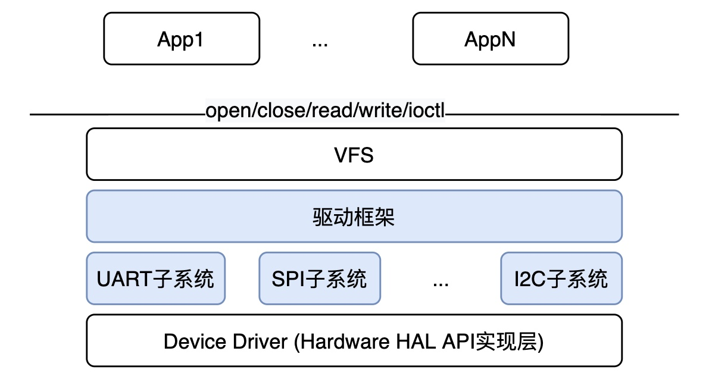

# 介绍
驱动子系统组件组, 主要由以下几部分组成：
* 驱动核心框架: 基于Bus-Device-Driver的核心设备驱动模型
* 字符驱动核心框架: 字符设备核心驱动层，负责连接设备驱动和驱动核心框架，提供简化的API接口给驱动调用，对驱动隐藏驱动核心框架实现细节
* 驱动子系统: ADC/DAC/GPIO/I2C/IRQ/PWM/QSPI/SPI/TIMER/UART/WDG及Wi-Fi等
* 驱动子系统单元测试组件: 利用VFS方式测试各驱动子系统基本功能的测试组件


# 特性
* 面向对象的设计理念：核心设备驱动模型采用Bus-Device-Driver分离的架构，用C语言结合面向对象的设计理念进行设计和实现。
* 自动链接加载功能：设计了驱动启动级别，驱动程序所需要的初始化函数只需要用特定的宏定义进行声明到合适的启动级别，则系统(内核或APP)会自动读驱动进行加载
* 全新的驱动服务访问方式：通过VFS设备节点的方式对驱动使用者提供服务，降低部分开发者的学习成本。
* 灵活的驱动程序的加载模式：既可以位于内核态，也可以和应用程序位于同一进程，还可以放在用户态和应用程序不同进程里。关于通过VFS方式访问驱动程序的方法请参考components/drivers/test/README.md
* 精简的设备及驱动注册API：为了降低新开发驱动开发成本或其它RTOS系统移植到AliOS Things的移植难度，对驱动开发者隐藏了设备驱动模型的实现细节，提供精简的设备及驱动注册API。
* 双态统一的字符设备驱动核心框架：既能单独运行在内核态或用户态，也可以同时运行在内核态和用户态。同VFS组件配合工作，支持通进程、跨进程及SYSCALL三种方式的设备文件访问。

# 目录
```sh
main_driver/
├── aos.mk          #AliOS Things makefile文件
├── Config.in       #AliOS Things menuconfig配置文件
├── README.md
├── include         #驱动子系统头文件位置
├── core            #Bus-Device-Driver核心框架 
├── devicevfs       #字符驱动核心框架
├── adc             #ADC核心驱动（VFS方式）
├── dac             #DAC核心驱动（VFS方式）
├── flash           #Flash核心驱动（VFS方式）
├── gpio            #GPIO核心驱动（VFS方式）
├── i2c             #I2C核心驱动（VFS方式）
├── irq             #中断子系统
├── platform        #u_platform_bus虚拟总线驱动实现层
├── pwm             #PWM核心驱动（VFS方式）
├── qspi            #QSPI核心驱动（VFS方式）
├── ramdrv          #ram driver 驱动实现层 - for example and test purpuse
├── spi             #SPI核心驱动（VFS方式）
├── test            #各核心驱动测试模块
├── timer           #Timer核心驱动（VFS方式）
├── uart            #串行口核心驱动（VFS方式）
├── wdg             #watchdog核心驱动（VFS方式）
└── wifi            #Wi-Fi VFS驱动

```

# 依赖
- vfs
- uspace_aos

# 使用
* 所有驱动子系统都是命名方式均为u_xxx, 如u_gpio, u_spi, u_pwm, ...
* 在需要通过VFS的方式访问驱动提供的服务时，只需在对应的app/kernel的Config.in中通过select AOS_COMP_U_XXX的方式进行选择即可。
* 需要注意的是每个驱动子系统依赖于芯片厂实现对应硬件模块的驱动（components/drivers/include/aos/hal/xxx.h声明的硬件模块HAL API对应的实现），所以在选择AOS_COMP_U_XXX的时候也需要选择AOS_MCU_V_XXX_DRV 或AOS_BOARD_V_XXX_DRV (下面一节中建议的硬件驱动模块使用的编译选项命名规则)

## 硬件驱动程序组件命名建议(aos.mk, Config.in)
芯片厂硬件设备驱动以v_xxx_drv的形式命名
* 如果是GPIO驱动则为v_gpio_drv
* 如果是FLASH驱动则为v_flash_drv

芯片厂驱动需编译成功能独立，固定名称的lib, 如下
* GPIO驱动HAL API实现模块中的aos.mk中NAME设定为v_gpio_drv，对应的Config.in中组件编译选项设置为AOS_BOARD_V_GPIO_DRV或AOS_MCU_V_GPIO_DRV
* FLASH驱动HAL API实现模块中的aos.mk中NAME设定为v_flash_drv，对应的Config.in中组件编译选项设置为AOS_BOARD_V_FLASH_DRV或AOS_MCU_V_FLASH_DRV
* 至于使用AOS_MCU_还是AOS_BOARD_为前缀，以此模块源代码所处位置为依据，如果位于vendor/<project>/mcu，则以AOS_MCU_为前缀；如果位于vendor/<project>/board下则以AOS_BOARD_为前缀

* GPIO驱动模块中的aos.mk
```
NAME := v_gpio_drv

$(NAME)_MBINS_TYPE := share
$(NAME)_VERSION    := 1.0.1
$(NAME)_SUMMARY    := configuration for board haas100
MODULE             := gpio
...
```
* Config.in
```
config AOS_MCU_V_GPIO_DRV
    select AOS_MCU_V_COMMON_DRV
    select AOS_MCU_V_REG_DRV
    select AOS_BOARD_V_PARTITION_DRV
    bool "aos_mcu_v_gpio_drv"
    help
        gpio haas1000.
...
```

## 如何将一个驱动（以GPIO为例）放入到用户态中运行
需要将GPIO驱动放到用户态的时候只需要在本进程的Config.in中选择AOS_MCU_V_GPIO_DRV和AOS_COMP_U_GPIO即可
```
config AOS_APP_MAIN_DRIVER
    bool "main_driver"
    ...
    select AOS_MCU_V_GPIO_DRV
    select AOS_COMP_U_GPIO
    ...
```

## 编译指令
如果选择的
aos make <project>@<board>-mk -c config && aos make MBINS=<types> {MBINS_APP=<ld_script>}
<project> - 为驱动所在应用程序名称
<board>   - 硬件板对应的board名称
<types>   - 编译kernel请填kernel; 除kernel外，其它app请填写app
{MBINS_APP=<ld_script>} - 可选项, 编译kernel不需要填写此栏位；编译app需要填写, <ld_script>则要填成对应的连接脚本名称，如果编译main_driver则指定<ld_script>driver, 这样编译系统变会按照driver.ld.S连接脚本中的规则进行二进制image的链接动作

# 参考
关于对接驱动框架，请参考“如何基于现有驱动框架开发一个新驱动”章节的描述
关于如何使用用户态驱动，请参考components/drivers/test/README.md

# 如何基于现有驱动框架开发一个新驱动

对于开发者，基于字符设备驱动核心框架实现一个新的驱动程序，可以参考components/drivers目录下的各个子系统实现，主要需要以下几步：

### 1. 实现HAL层API为独立组件
芯片厂硬件设备驱动在aos.mk中以v_xxx_drv的形式命名，Config.in组件编译选项以AOS_MCU_还是AOS_BOARD_为前缀
    * 以此模块源代码所处位置为依据，如果位于vendor/<project>/mcu，则以AOS_MCU_为前缀；如果位于vendor/<project>/board下则以AOS_BOARD_为前缀
在Config.in中选择此驱动依赖的其它组件
更多关于组件的概念及实现方法请参考: https://help.aliyun.com/document_detail/161105.html?spm=a2c4g.11186623.6.620.7fd85134DawtV9

以下介绍如何将驱动对接到设备驱动框架中：

#### 1.1 添加头文件
使用AliOS Things驱动框架需要添加以下头文件

```
#include <devicevfs/devicevfs.h>
```

#### 1.2 添加并实现VFS接口实现
根据驱动的应用场景，添加相应VFS接口。例如，open、close、read、write、ioctl等接口。函数原型见vfs.h中struct file_ops结构体。

```
struct file_ops {
    int     (*open)(inode_t *node, file_t *fp);                          /* 打开设备 */
    int     (*close)(file_t *fp);                                        /* 关闭设备 */
    ssize_t (*read)(file_t *fp, void *buf, size_t nbytes);               /* 从设备读取数据 */
    ssize_t (*write)(file_t *fp, const void *buf, size_t nbytes);        /* 向设备发送数据 */
    int     (*ioctl)(file_t *fp, int cmd, unsigned long arg);            /* 向设备发送控制指令 */
    int     (*poll)(file_t *fp, int flag, poll_notify_t notify, void *fd, void *arg);  /* 向设备注册轮询回调 */
    ...
};

typedef struct file_ops subsys_file_ops_t;
```

实现所需函数后，声明并填充subsys_file_ops_t结构体变量。以GPIO设备为例，subsys_file_ops_t结构体变量定义如下。
```
subsys_file_ops_t gpio_device_fops = {
    .open = gpio_device_open,
    .close = gpio_device_close,
    .read = gpio_device_read,
    .write = gpio_device_write,
    .ioctl = gpio_device_ioctl,
    .poll = NULL,
    .lseek = NULL,
};
```
#### 1.3 添加设备信息
需添加要子设备struct subsys_dev结构体变量，定义见devicevfs.h, 关于she被私有参数user_data的使用可以参考components/drivers/ramdrv/ramdrv_core.c中vfs_ramdrv_drv_init对ramdrv_device_init及中的使用方法。

```
struct subsys_dev {
    int permission;             /* 设备权限，预留，默认填0即可 */
    bool delay_init;            /* 延迟初始化标志，默认填false，如需在open的时候再进行设备初始化，将此flag设置为true */
    enum SUBSYS_BUS_TYPE type;  /* 设备类型，默认设置为BUS_TYPE_PLATFORM */
    void *user_data;            /* 设备私有参数 */
    char *node_name;            /* 设备节点名称，如node_name="spi0", 则设备节点全路径名称为“/dev/spi0” */
};
```
以GPIO设备为例，struct subsys_dev结构体变量定义如下。
```
struct subsys_dev g_gpio_device = {
    .user_data = NULL,
    .type = BUS_TYPE_PLATFORM,
    .permission = 0,
    .node_name = "gpio"
};
```

#### 1.4 添加子设备驱动
需添加要子设备struct subsys_drv结构体，定义及说明详见devicevfs.h。
```
struct subsys_drv {
    char *drv_name;

    /* for legacy drivers */
    int (*init)(struct u_platform_device *_dev);
    int (*deinit)(struct u_platform_device *_dev);
    int (*pm)(struct u_platform_device *dev, u_pm_ops_t state);

    /* for linux-like drivers */
    int (*probe)(struct u_platform_device *);
    int (*remove)(struct u_platform_device *);
    void (*shutdown)(struct u_platform_device *);
    int (*suspend)(struct u_platform_device *, int /*pm_message_t */state);
    int (*resume)(struct u_platform_device *);
};
```

实现所需函数后，声明并填充struct subsys_drv结构体变量。以GPIO设备为例，结构体变量定义如下。
```
struct subsys_drv gpio_device_drv = {
    .drv_name = "gpio",
    .init = gpio_device_init,
    .deinit = gpio_device_deinit,
    .pm = gpio_device_pm,
};
```

#### 1.5 呼叫aos_dev_reg进行设备注册
aos_dev_reg中会将此设备及驱动注册到设备驱动模型中，并且创建名称为/dev/<subsys_drv.drv_name>的设备节点。在VFS的open/close/read/write接口中通过node->i_arg获取设备私有参数user_data。
