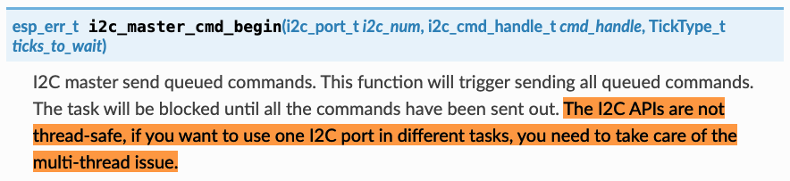

# I2C Manager for ESP32

**Fully thread-safe I2C bus communication ESP-IDF component.**

&nbsp;


## The Problem

### It's a mess

The ESP32's I2C drivers work, but they are built for one piece of code to open, use and close a port. Currently configuring components that talk to peripherals on an I2C bus involves providing the same SDA and SDC pins and clock speeds again and again. Everyone's code ends up duplicating the same string of low-level commands to talk to the ESP32 I2C driver. What's needed is a hardware abstraction layer (HAL) that can just read and write bytes to I2C connected hardware, plain and simple.

But we need more than that: when components actually want to use the same I2C bus, they will get errors when the port is already open. People sometimes end up editing component code to ignore the error from `i2c_driver_install` in all but the first component initialized.

### "The Multi-Thread Issue"

An I2C bus in a modern piece of hardware is shared by any number of chips inside. Once the components ignore the error in opening the port, things often work. They might be talking a few bytes to a power management IC, set a backlight brightness, all from the same task, and that was it. But in other cases, there might be a touch panel and a 3D accelerometer on the same bus. These are both components you may want to read many times a second. However, according to Espressif's official ESP-IDF documentation:

&nbsp;

[](https://docs.espressif.com/projects/esp-idf/en/latest/esp32/api-reference/peripherals/i2c.html#_CPPv420i2c_master_cmd_begin10i2c_port_t16i2c_cmd_handle_t10TickType_t)

&nbsp;

So what we need is not just hardware abstraction, but also a way to prevent different ESP-IDF components (or tasks within one component) from reading or writing corrupted I2C data by trying to use the I2C port at the same time.


&nbsp;


## I2C Manager

### Simplest Usage

Clone this repository in your components directory, use menuconfig to enable and configure one or both the I2C ports:


Then in your own code do something like:

```c
#include "i2c_manager.h"

uint8_t buffer[10];
i2c_manager_read(I2C_NUM_0, 0x23, 0x42, &buffer, 10);
i2c_manager_write(I2C_NUM_0, 0x13, 0x37, &buffer, 10);
```

This example reads ten bytes via the first I2C port from the chip at I2C address `0x23`, register `0x42` and then writes them to the chip at `0x13` at register `0x37`. You could now have ten different tasks reading and writing to the same I2C bus using I2C Manager and the FreeRTOS scheduler would make them all wait nicely for their turn at the port.

That is it, all there is to it. As you can see there is no initialization needed: the first time someone accesses an I2C port it will be set up automatically.


&nbsp;

### Timeouts and pullups

As you can see in the screenshot above, the port setup for I2C manager allows for the usual GPIO pins for the SDA and SCL signals as well as the clock frequency in Hz. The additional settings allow you to to set how soon peripherals on the bus must respond before the read or write calls time out as well as how long another call must maximally wait before overriding the lock on a port. Finally you can specify whether or not the ESP32's internal pull-up resistors should be used. You can safely leave all these values at their defaults.


&nbsp;

### Read and write without specifying a register

In most cases, I2C uses 7-bit addresses and an 8-bit register value. You do not need to do anything special in that case. On some ICs you read or write without specifying a register. In that case, use `I2C_NO_REG` as the register value.


&nbsp;

### 10-bit addresses and 16-bit registers

Sometimes you'll see 8-bit values for the address, usually with a separate address for read and write. Although this is how the byte is actually sent in the I2C protocol (the address is shifted left and a read/write bit is added), documenting it this way is deeply wrong and the address should be interpreted as 7-bit address by dividing the lower number by two.

I2C addresses can also be 10-bit values with some ICs. To signal the use of 10-bit addresses, bitwise-OR the address value you send to `i2c_manager_read` or `i2c_manager_write` with `I2C_ADDR_10`. Similarly, to use 16-bit register values, bitwise-OR the register value with `I2C_REG_16`.


&nbsp;

### I2C Manager emulates other I2C abstraction APIs

I'm aware of two other hardware abstraction layers for I2C: Mika Tuupola's platform-agnostic `I2C HAL`, with an ESP-specific [esp_i2c_helper](https://github.com/tuupola/esp_i2c_helper) and [i2cdev](https://esp-idf-lib.readthedocs.io/en/latest/groups/i2cdev.html) written by Ruslan V. Uss.

I2C Manager offers a more complete set of features than either of these, but they do come with the advantage of being available on other hardware platforms and quite a few drivers have been written that make use of them.

But if you want thread-safety and no errors when opening I2C ports, really only one abstraction layer can be in charge of managing access. That's why I2C Manager emulates the APIs for both these other abstractions, so any software written for them can also be used with I2C Manager, it all "just works".

#### I2C HAL


Mika Tuupola [(@tuupola)](https://github.com/tuupola) has written quite a few "platform agnostic I2C drivers" for various ICs. To abstract I2C communication, he defines a way of providing a pointer to a struct that holds pointers to functions to read and write to I2C. To make his software use I2C Manager could not be simpler. Wherever you would provide a pointer in his examples, simply provide `i2c_hal(0)` for port 0 or `i2c_hal(1)` for port 1. That's it. So for instance to talk to the AXP192 Power Management IC using his [driver](https://github.com/tuupola/axp192), you would do:

```c
#define I2C_0	i2c_hal(0)

#include <i2c_manager.h>
#include "axp192.h"

float cbat;
axp192_read(I2C_0, AXP192_COULOMB_COUNTER, &cbat);
printf("cbat: %.2fmAh", cbat);
```

When you do this, everything is thread-safe. I2C Manager replaces Mika's [`esp_i2c_helper`](https://github.com/tuupola/esp_i2c_helper) component, and as a bonus is slightly easier to use in your own code because you do not have to define or populate the HAL struct yourself.

_(Note that I2C HAL does not support 10-bit addresses or 16-bit registers.)_

#### i2cdev

Another existing solution for abstracting I2C ports is **[i2cdev](https://esp-idf-lib.readthedocs.io/en/latest/groups/i2cdev.html)**. Its author, Ruslan V. Uss ([@UncleRus](https://github.com/UncleRus)), has created a [large number of drivers](https://github.com/UncleRus/esp-idf-lib/tree/master/components) for various ICs. The ones that use I2C will say `#include <i2cdev.h>`. If you would like to use one or more of his drivers, simply do not use his version of i2cdev and enable 'i2cdev compatibility' in the I2C Port Settings. Our version of i2cdev will pipe the communication through I2C Manager.

_(Note that i2cdev does not support 10-bit I2C addresses.)_


&nbsp;

### Using I2C Manager from another ESP-IDF Component

#### One Way: Depending On I2C Manager

If your new driver is an ESP-IDF component that always needs to talk via I2C, the cleanest and easiest thing to do is to make your component depend on I2C Manager. This is done by adding `PRIV_REQUIRES i2c_manager` to your `idf_component_register` statement in `CMakeLists.txt` (for ESP-IDF 4.x) and/or adding `COMPONENT_DEPENDS := i2c_manager` to `component.mk` (for ESP-IDF 3.x). Then tell users to clone this repository to their `components` directory, put `#include "i2c_manager.h"` in the code (and not the header file) and talk to the I2C port as in the example at the top of this README.

* Advantage: People that include your component's .h file(s) don't need to think about anything: you could maybe ask what port they want to use in your `Kconfig` file, and otherwise everything just works.

* Disadvantage: Your component now depends on I2C Manager. That means it needs to be installed even if your component only talks to I2C in some configurations and not in others. Imagine a display driver that can work with tons of displays and touch interfaces, only some of which use I2C. But ESP-IDF does not allow for conditional dependencies, so everyone has to install I2C Manager.

> Note: if your code is generic and has applications outside of the ESP32 platform, you may want to consider writing it "platform agnostic" and providing an I2C HAL or i2cdev interface. See the sections above for more details.

&nbsp;


#### Other Way: Integrating I2C Manager Inside Your Component

[LVGL - Light and Versatile Graphics Library](https://github.com/lvgl/lvgl) is a graphical interface library that I can recommend. I2C Manager has been integrated in the [ESP32 driver package](https://github.com/lvgl/lvgl_esp32_drivers) `lvgl_esp_drivers`. This is an example of the procedure outlined below, because this is the case as described above: lots of display and touch drivers, and only some need to talk to hardware via I2C.

To integrate I2C Manager inside your component:

<dl>

<dt>Step 1</dt>

<dd>
Copy only the inner `i2c_manager` directory from this repository (so that's `i2c_manager/i2c_manager` to the root of your component.
</dd>

<dt>Step 2</dt>

<dd>
Uncomment the "#define I2C_OEM" in the `i2c_manager.h` file within that directory to provide a very short, lower-case-only name your component. So if your component is called `XYZ Driver`, you might say

 `#define I2C_OEM xyz`
 </dd>

<dt>Step 3</dt>

<dd>
Make sure i2c_manager.c gets compiled when your component gets built, even though it's in a sub-directory. This is done by adding "i2c_manager/i2c_manager.c" to the "SRCS" directive of the "idf_component_register" command (in ESP-IDF 4.x) and/or adding "./i2c_manager" to `COMPONENT_SRCDIRS` in "component.mk" (for ESP-IDF 3.x).

> _Note: It's important that this `i2c_manager` directory is **not** added to the include directories for your component. Your code should include it, but your component's users should not._
</dd>

<dt>Step 4</dt>

<dd>
Add the following line to the file your component's users will include:

`void xyz_i2c_locking(void* leader);`

(where 'xyz' is the short string chosen in step 2)
</dd>
<dt>Step 5</dt>

<dd>
Add the following inside your component's Kconfig menu:

```
menu "I2C Port Settings"
	depends on !HAVE_I2C_MANAGER

	rsource "i2c_manager/Kconfig"

endmenu
```
</dd>

</dl>

And voila: now I2C Manager is integrated inside the component, which now has built-in I2C support without external dependencies. To use it, use `xyz_i2c_read` where you would otherwise use `i2c_manager_read` and the same for `xyz_i2c_write`. The menuconfig will show the settings for both I2C ports. You may want to include a configuration option in your Kconfig file to determine which I2C port your component uses, and you could optionally make the showing of this selection and the menu above conditional on your component actually needing I2C communication.

**Making things thread-safe:** To make sure I2C calls are thread-safe when others use I2C ports, users would put I2C Manager in the components directory, and tell your component to use I2C Manager's locking. In the main program, after including both `i2c_manager.h` and your component's header file (see step 4 above), this is done like this:

  `xyz_i2c_locking(i2c_manager_locking());`

When I2C Manager is installed, the individual I2C port settings menus with components that have integrated I2C Manager will disappear, there will only be the one port settings menu for I2C Manager.

* Advantages: If you integrate I2C Manager like this, there are no external dependencies and everything just works.

* Disadvantages: While any tasks within your component are thread-sage relative to one another, users still have to install I2C Manager and tell your component to play nice with it (like described above) to get thread-safety between components.


&nbsp;

### I2C Manager Function Reference

_(Note that these functions would be prefixed with `xyz_i2c_` instead of `i2c_manager_` if your code is using a version of I2C Manager that is built into a component called `xyz`.)_

&nbsp;

#### `i2c_manager_read` and `i2c_manager_write`

```c
esp_err_t i2c_manager_read(i2c_port_t port, uint16_t addr, uint32_t reg, 
                           uint8_t *buffer, uint16_t size);
```

```c
esp_err_t i2c_manager_write(i2c_port_t port, uint16_t addr, uint32_t reg, 
                            const uint8_t *buffer, uint16_t size);
```

Straightforward: read or write `size` bytes between `buffer` and register `reg` of the chip at I2C address `address`. Most likely these are the only functions you will ever need to call, everything else happens automatically. See the example all the way at the beginning of this text for an example of how to use them.

&nbsp;

#### `i2c_manager_locking`

```c
void* i2c_manager_locking();
```

You will only need this if you use a component that has I2C Manager integrated (see above) together with other code that uses I2C Manager as a separate component. This returns a pointer to the two semaphore handles that make up the mutex locking mechanism for I2C manager. Never mind if that doesn't mean anything to you: simply provide this pointer to the `xyz_i2c_locking` function of the component and their I2C communication will play nice with everyone else's.


&nbsp;

> * Note: you will most likely never need any functions below this note. They are listed for completeness only.

&nbsp;


#### `i2c_manager_init`

```c
esp_err_t i2c_manager_init(i2c_port_t port);
```

You can call `i2c_manager_init` for a port if you like and you can call it as often as you like. It will just do nothing and return if the port is already open. In fact, this is what happens at every `read` or `write` call, so there's really no reason for you to be calling this yourself.

&nbsp;

#### `i2c_manager_close`

```c
esp_err_t i2c_manager_close(i2c_port_t port);
```

You can call this if you really insist on unloading the I2C driver, but the next call to read or write on the port is going to cause it to open again.

&nbsp;

#### manual locking

```c
esp_err_t i2c_manager_lock(i2c_port_t port);

esp_err_t i2c_manager_unlock(i2c_port_t port);

esp_err_t i2c_manager_force_unlock(i2c_port_t port);
```

These are also functions you will likely never need to call. But in the unlikely event that you need to do something unusual with the I2C port that involves your own low-level code, you can call `i2c_manager_lock` before you do you own thing, and `i2c_manager_unlock` after you are done to make sure that none of the other code that is using I2C Manager can interfere. `i2c_manager_force_unlock` can free up a lock that was set by code that didn't release it, maybe because it terminated unexpectedly.

If you are going to write code that uses the lock and unlock calls, make sure that nothing unexpected can happen that causes your code to not release the lock, and make sure only the actual handling of the port happens between lock and unlock.
