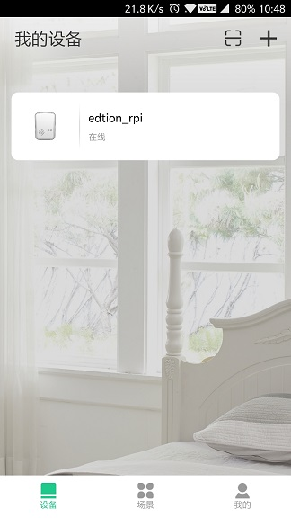
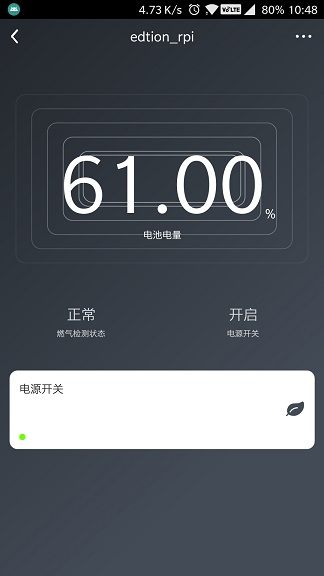

## linkkitapp

### Content
- [linkkitapp](#linkkitapp)
    - [Content](#content)
    - [Overview](#overview)
    - [Requirements](#requirements)
    - [Build](#build)
    - [Run](#run)

### Overview

linkkitapp example will connect Alibaba's [Living Link](https://living.aliyun.com/#/). Living Link is platform service which provides customers with a smart devices developerment management platform, especially for smart life area. 

The service includes online device definition, device debugging,device encryption, cloud API, APP development SDK kits, operation management and data analytics, coving the whole lifecycle from smart device development, app development, cloud development and operation management.  

The platform provides services on domestic sites and global sites,to improve device performance of connectivity worldwide.

linkkitapp support some usefull service such as **fota**, **device online**, **device control**, **ywss**.

For more linkkitapp details please refer to [AliOS Things Linkkit Application.zh](https://github.com/alibaba/AliOS-Things/wiki/AliOS-Things-Linkkit-Application.zh)

### Requirements

* register an account on [Living Link](https://living.aliyun.com/#/), create an product, and create an device.

* get TSL string, refer to [TSL](https://living.aliyun.com/doc#mvtil0.html).
* get `product secret`, `product name`, `device name`, `device secret`, refer to [Device activation code](https://living.aliyun.com/doc#mvtil0.html).
* install the [Demo app](https://living.aliyun.com/doc#muti-app.html) on you phone(android or ios).

### Build
before building linkkitapp, you need to modify file: `framework/protocol/linkkit/iotkit/sdk-encap/imports/iot_import_product.h` to your `product secret`, `product name`, `device name`, `device secret`, like this:

```c
#define PRODUCT_KEY             "a1BDCKKSpdu"
#define PRODUCT_SECRET          "Rp0aCxyRnd2ecrCX"
#define DEVICE_NAME             "MVwo1x7hB2pyEbXlLkzE"
#define DEVICE_SECRET           "OKHWuIaMzwtJAjUzPRLG1rcYxFo43akU"
```

and modify file: `example/linkkitapp/linkkit_app.c` to your `TSL string`:

```c
const char TSL_STRING[] = "......"
```
> `TSL_STRING` needs escape & compress json string, check [JSON压缩转义工具](https://www.sojson.com/yasuo.html).

then build linkkitapp:

```sh
aos make linkkitapp@mk3060
```

download `out/linkkitapp@mk3060/binary/linkkitapp@mk3060.ota.bin` and power on board.

### Run

on [Living Link](https://living.aliyun.com/#/) you can find device online:


and device console displays:


configure network using [Demo app](https://living.aliyun.com/doc#muti-app.html), and Demo app displays like this:

 
 
For more linkkitapp details please refer to [AliOS Things Linkkit Application.zh](https://github.com/alibaba/AliOS-Things/wiki/AliOS-Things-Linkkit-Application.zh).