# 股票涨停报警器
&emsp;&emsp;
下图是本案例的四步导学。
<div align="center">

</div>

## 1、简介
### 1.1、背景
&emsp;&emsp;
一个人的精力是有限的，不可能随时监控所有的股票，但在瞬息万变的股市中，错过一秒也许就会错失大好良机。本项目通过监听股票报价，在监测到涨停信号时，将信号通过物联网平台发送到设备端，通过LCD屏幕显示和蜂鸣器报警的方式通知用户查看相关涨停信息。本案例采用ESP32开发板结合LCD显示屏、蜂鸣器、以及阿里云物联网平台，只需4步，就可以搭建简单的信号接收显示报警器功能。

### 1.2、准备

1. ESP32开发板         一套
2. LCD液晶屏           一个
3. 喇叭模块            一个
4. 连接线              若干

涉及到的硬件购买链接如下，仅供参考，不负责商家发货的品质保障等问题！

| 名称 | 数量 | 参考链接 |
| --- | --- | --- |
| ESP32开发板 | 1套 | [ESP32开发板一套](https://haas.iot.aliyun.com/solution/detail/hardware?spm=a2cpu.b17028610.0.0.6c2360b1yDodxD&versionId=800C9562896F994200000001&dataId=800C9562896F9942)|
| LCD液晶屏 | 1个 | [LCD液晶屏一个](https://detail.tmall.com/item.htm?spm=a230r.1.14.22.3c8238c8IHj65w&id=42062870711&ns=1&abbucket=13) |
| 喇叭模块 | 1个 | [喇叭模块](https://item.taobao.com/item.htm?spm=a230r.1.14.34.cb1113fbeFCXyP&id=13007292704&ns=1&abbucket=13#detail) |
| 连接线 | 若干 | [母对母杜邦线](https://detail.tmall.com/item.htm?id=14466195609&ali_refid=a3_430582_1006:1104520036:N:MsF9mE9KLTC2IibWJh+K1A==:21c5b519e28c4b0cd17ec4383141281f&ali_trackid=1_21c5b519e28c4b0cd17ec4383141281f&spm=a230r.1.14.1&skuId=3108214440213) 请选用10cm长即可 |

&emsp;&emsp;
硬件连线图如下图所示：
<div align="center">

</div>
<br>

## 2、云端开发
### 开通公共实例
&emsp;&emsp;
对于第一次使用物联网平台的读者，需要开通实例以使用物联网平台的功能。这里可以使用免费的公共实例进行开发。

&emsp;&emsp;
在[物联网平台](https://iot.console.aliyun.com/lk/summary/new)中，左上角选择“华东2-上海”，点击“公共实例”，即可开通。开通后点击“公共实例”，即可进入[控制台](https://iot.console.aliyun.com/lk/summary/new)进行产品创建。


### 创建产品（设备模型）
&emsp;&emsp;
进入[公共实例控制台](https://iot.console.aliyun.com/lk/summary/new)，点击“创建产品”按钮，即可进入[新建产品页面](https://iot.console.aliyun.com/product)。


&emsp;&emsp;
进入[新建产品页面](https://iot.console.aliyun.com/product)，设定“产品名称”，这里我们命名为“**股票涨停报警器**”，读者也可以根据自己的喜好来命名。在“所属品类”中，选择“自定义品类”。

&emsp;&emsp;
产品的节点类型选择“直连设备”，数据格式选择“ICA标准数据格式”，检验类型和认证方式选择默认设定即可。开发者可根据自己的需求在“产品描述”页面添加针对此产品的描述。

&emsp;&emsp;
对于 ESP32 等搭载 Wi-Fi 的设备而言，联网方式选择“Wi-Fi”。

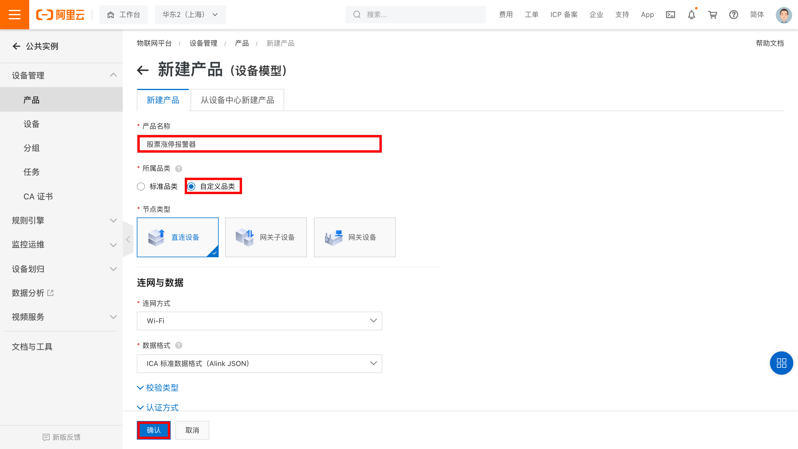

&emsp;&emsp;
点击“确认”按钮，即可完成产品创建。

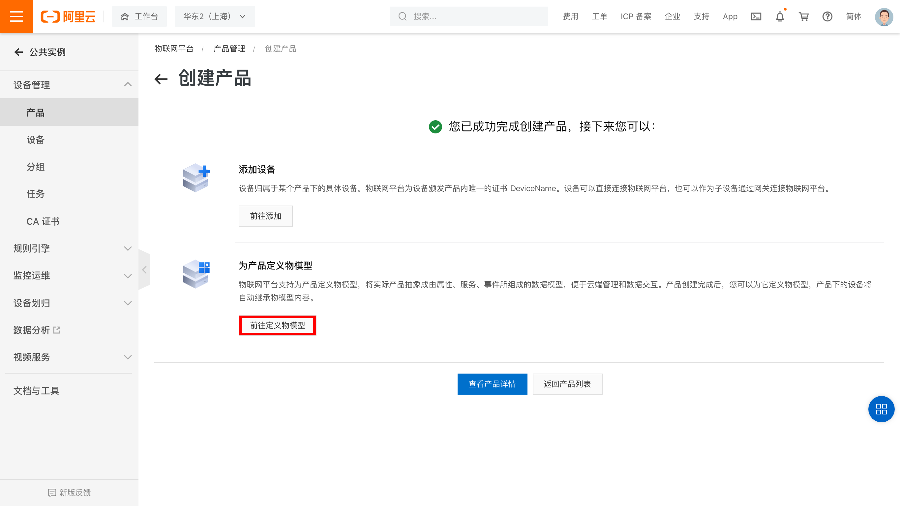

&emsp;&emsp;
点击“前往定义物模型”

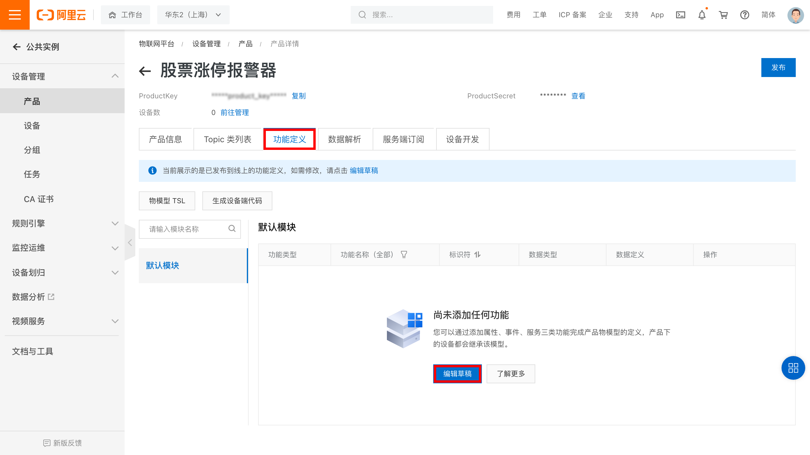

### 定义产品功能（物模型）
&emsp;&emsp;
开发者可以使用准备好的[物模型文件](./things_model.json)来进行快速导入。点击左上角“快速导入”，选择物模型文件并上传，就能够生成案例对应的物模型。

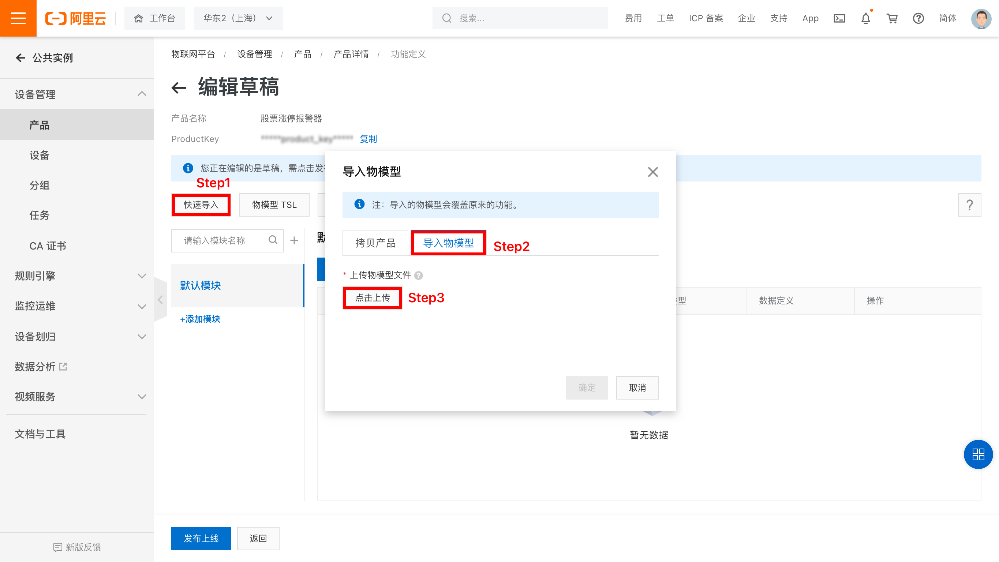

&emsp;&emsp;
生成后的效果如下：
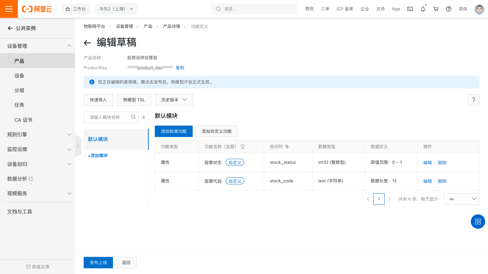

&emsp;&emsp;
定义好物模型后，需要发布物模型上线，并发布产品，以使变更生效。

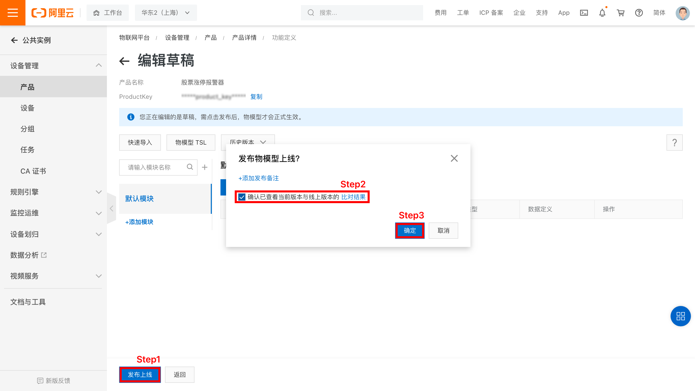

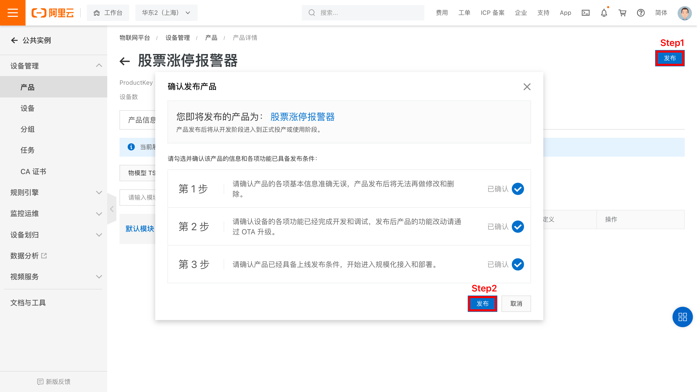

&emsp;&emsp;
产品及其物模型创建完成后就可以创建这个产品的设备了。

### 创建设备及获取三元组
&emsp;&emsp;
点击左侧栏中“设备“，在筛选框中选择要添加设备的产品，点击“添加设备”。这里这里我们命名为“**test_device**”，开发者也可以根据自己的喜好来命名。

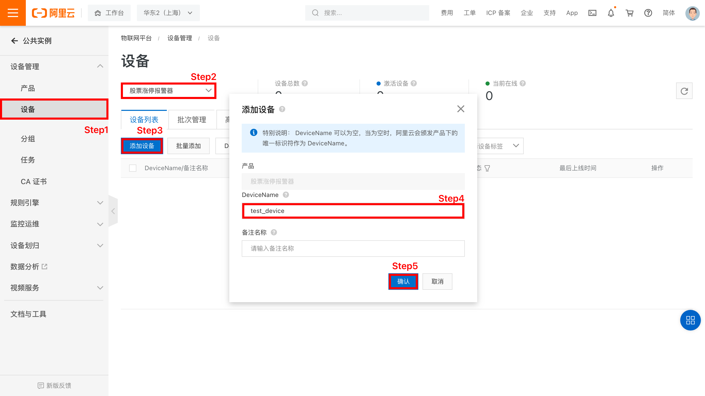

&emsp;&emsp;
开发者也可以选择“批量添加”，一次性添加多个设备，并生成随机的DeviceName。

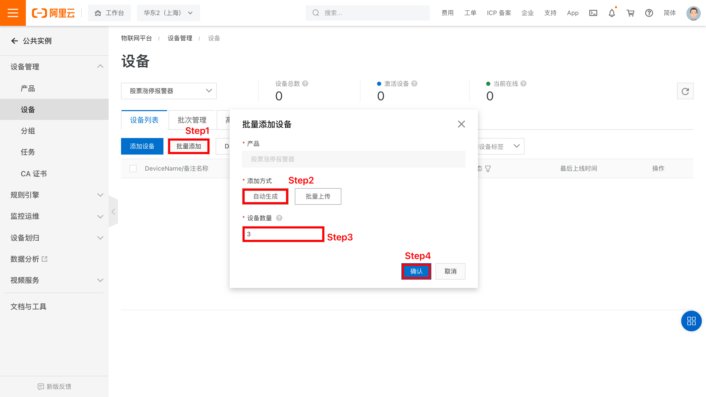

&emsp;&emsp;
生成的设备如下。

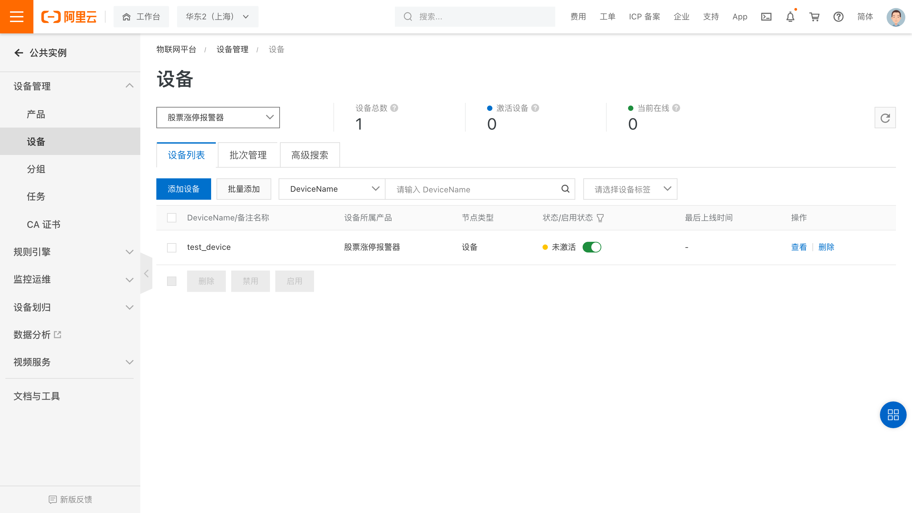

点击前往“查看”按钮，就可以看到此设备的详细信息了。
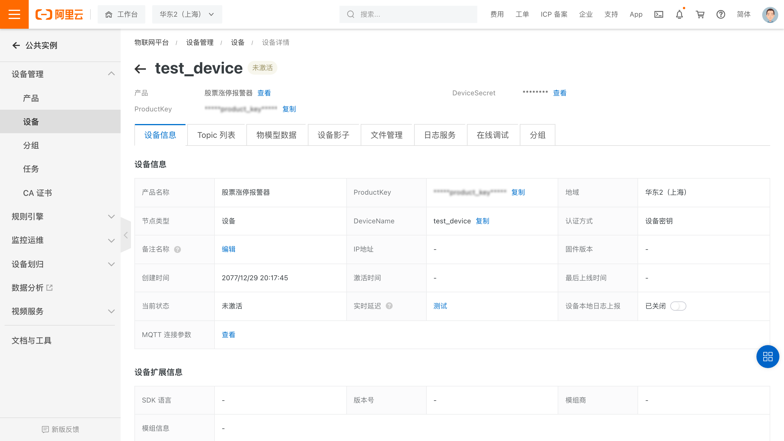

&emsp;&emsp;
点击右上角的“查看”按钮，就能看到设备的三元组信息了。
三元组是物联网设备端和物联网云端设备相关联的唯一标识符，在设备端连接云端的时候会使用三元组信息和云端进行鉴权，鉴权通过之后云端会认为设备已激活并上线。

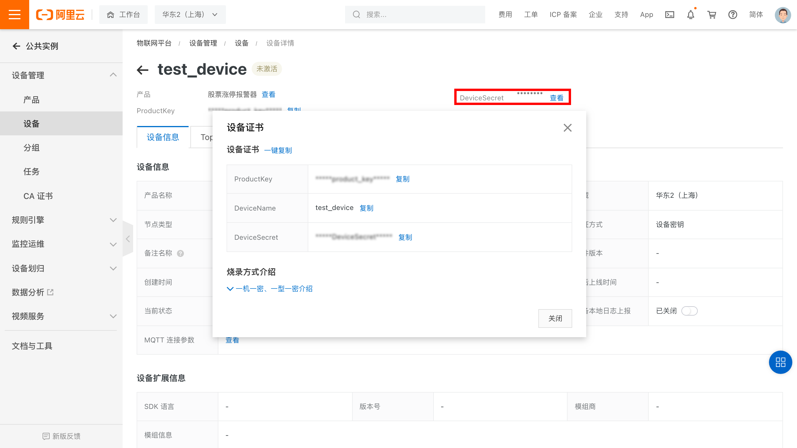

&emsp;&emsp;
再次前往物联网平台的设备信息页面，若设备运行正确，此时应该可以看到设备名右侧的状态由“未激活”变为“在线”。
选中“实时刷新”，可以看到数据实时从设备上报到物联网平台。设备上云成功。

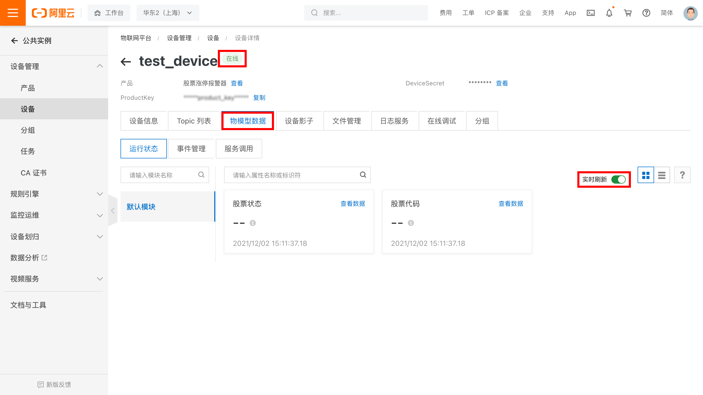

## 4、设备端开发

### 4.1、开发环境准备
&emsp;&emsp;
在进行下一步之前请确保ESP32中已经烧录了HaaS Python固件并且其开发环境已经搭建完毕。详情请参考[ESP32开发环境](../../../startup/ESP32_startup.md)的说明。
<br>

### 4.2、创建解决方案

&emsp;&emsp;
如下图所示，在Haas Studio中创建项目。先选择左侧的“开发板型号”再从右侧的案例中选择“股票涨停报警器”案例点击“立即创建”即可。

<div align="center">

</div>
<br>

1. **修改路由器名称及密码**

&emsp;&emsp;
修改工程里main.py中SSID和PWD的值为开发者实际要连接的路由器的名称及密码（请注意名称和密码都需要放在''符号中间）。

```python
# Wi-Fi SSID和Password设置
SSID='Your-AP-SSID'
PWD='Your-AP-Password'
```

&emsp;&emsp;
修改完成之后connect_wifi函数就会连接开发者自己设定的路由器。

2. **修改设备的三元组信息**

&emsp;&emsp;
按照创建产品、设备步骤获取三元组信息，填入main.py中：
```python
# HaaS设备三元组
productKey = "Your-ProductKey"
deviceName  = "Your-devicename"
deviceSecret  = "Your-deviceSecret"
```

&emsp;&emsp;
最后点击VSCode中HaaS Studio工程底部的部署运行或串口，选择对应的端口编号烧录程序。详细烧录方法请参考：[ESP32开发环境](../../../startup/ESP32_startup.md)的说明。烧录后串口执行log如下：

```log
api_beep 0
GPIO init done
Wi-Fi is connecting...
Wi-Fi is connecting...
Wi-Fi is connecting...
Wi-Fi is connected
IP: xxx.xxx.xxx.xxx
NTP start...
NTP done
establish tcp connection with server(host='xxx.cn-shanghai.aliyuncs.com', port=[443])
tcp_connect: can only connect from state CLOSED
success to establish tcp, fd=54
link platform connected
{'code': 0, 'params_len': 43, 'msg_id': 623310719, 'params': '{"stock_status":1,"stock_code":"600000.SH"}'}
set value : 1 600000.SH
600000.SH
start alarm
api_beep 440
api_beep 0
```

## 5、端云连调
### 5.1、通过 OpenAPI 操作物模型修改
&emsp;&emsp;
云端通过[OpenAPI地址](https://next.api.aliyun.com/api/Iot/2018-01-20/SetDeviceProperty?lang=PYTHON&tab=DEMO&sdkStyle=dara)填写其中的IotInstanceId，ProductKey，DeviceName，Items字段，点击发起调用即可完成物模型修改的请求，我们模拟发送股票涨停信号中包括两个字段 stock_code、stock_status，填入Items字段，json格式例如：
```
{"stock_status":1, "stock_code":"600000.SH"}
```

<div align="center">

</div>
<br>
&emsp;&emsp;
如上图，SDK示例标签，可以查看各种语言的SDK调用示例，通过自行编写股票涨停信号发生器，并通过该 OpenAPI SDK 调用方式可以方便的修改设备对应的物模型，完成云端到设备端的 MQTT 通讯。

### 5.2、实际运行效果
&emsp;&emsp;
实际运行效果如下图，当服务端程序发出股票涨停信号时，设备端收到物模型修改，设备控制LCD显示相关股票代码，并控制喇叭发出警报音 5秒钟。
<div align="center">

</div>
<br>

## 6、后记
&emsp;&emsp;
笔者这里实现了软件和硬件的开发，实际产品还需要完善股票数据获取和信号生成逻辑，读者完成此案例之后可以尝试进一步完善。
