# 敲击手势检测
&emsp;&emsp;
下图是本案例除硬件连线外的3步导学，每个步骤中实现的功能请参考图中的说明。
<div align="center">

</div>
<br>

## 1、简介
&emsp;&emsp;
手势识别是物联网智能感知领域里的一项重要技术，通过检测手势动作，可以将之映射成不同的指令，用于智能家居场景的各种控制，实现智能交互。本案例通过识别敲击（Tap）的手势动作，并将手势动作上报至云端，管理者可实时查看手势动作的识别记录。

&emsp;&emsp;
本案例旨在实现对“敲击手势动作（Tap）”的识别，可以设置敲击动作的参数，例如一个手势对应几次敲击动作、每个敲击动作的检测阈值、每两个敲击动作之间的最长时间间隔等。手势识别成功后，将手势识别结果上报至云端，做到实时记录。

<br>

## 1.1、背景知识

&emsp;&emsp;
当前，越来越多的电子设备开始支持手势识别功能，手势识别旨在识别人类的物理运动或“手势”，以实现智能交互。例如，在电子设备前以特定的模式挥手可以让它执行特定的功能。通过手势识别，与物联网相结合，可以实现对设备的控制，创造智能生活场景。手势识别也打开了智能交互的新大门，用户可以定义自己的手势交互，用手指触控未来。

<br>

### 1.2、准备

本案例需要[M5StackCore2 开发板一套（内置 MPU6886 传感器）](https://haas.iot.aliyun.com/solution/detail/hardware?versionId=800C84FAF561DF6A00000001&dataId=800C84FAF561DF6A)。

<br>

## 2、物联网平台开发


&emsp;&emsp;
对于第一次使用物联网平台的读者，需要开通实例以使用物联网平台的功能。这里可以使用免费的公共实例进行开发。

&emsp;&emsp;
在[物联网平台](https://iot.console.aliyun.com/lk/summary/new)中，左上角选择“华东 2-上海”，点击“公共实例”，即可开通。

<div align="center">

</div>

开通物联网平台功能之后，需要完成下面的 3 个步骤完成云端设备的设定：

1. 创建云端产品
2. 创建产品属性（物模型）
3. 创建云端设备（获取三元组）

<br>

### 2.1、创建产品（设备模型）

&emsp;&emsp;
进入[公共实例控制台](https://iot.console.aliyun.com/lk/summary/new)，点击“创建产品”按钮，即可进入[新建产品页面](https://iot.console.aliyun.com/product)。

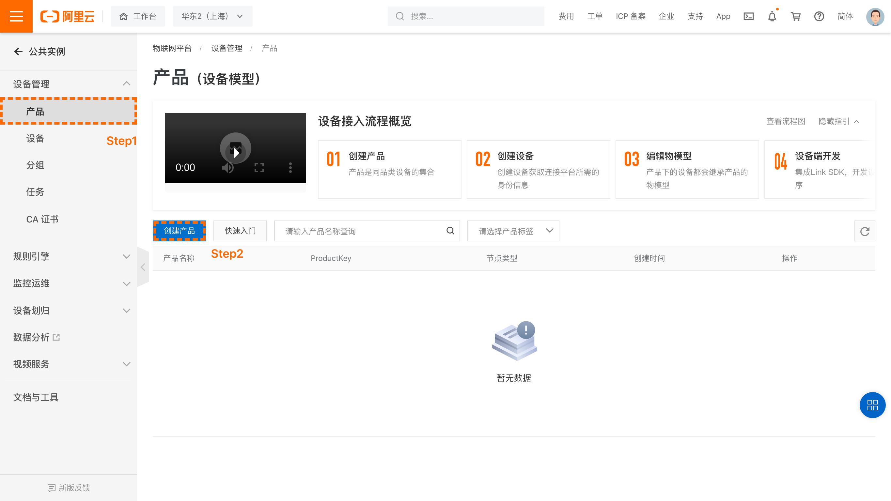

&emsp;&emsp;
进入[新建产品页面](https://iot.console.aliyun.com/product)，设定“产品名称”，这里我们命名为“**敲击手势检测系统**”，读者也可以根据自己的喜好来命名。在“所属品类”中，选择“自定义品类”。

&emsp;&emsp;
产品的节点类型选择“直连设备”，数据格式选择“ICA 标准数据格式”，检验类型和认证方式选择默认设定即可。开发者可根据自己的需求在“产品描述”页面添加针对此产品的描述。

&emsp;&emsp;
对于 M5StackCore2 等搭载 Wi-Fi 的设备而言，联网方式选择“Wi-Fi”。

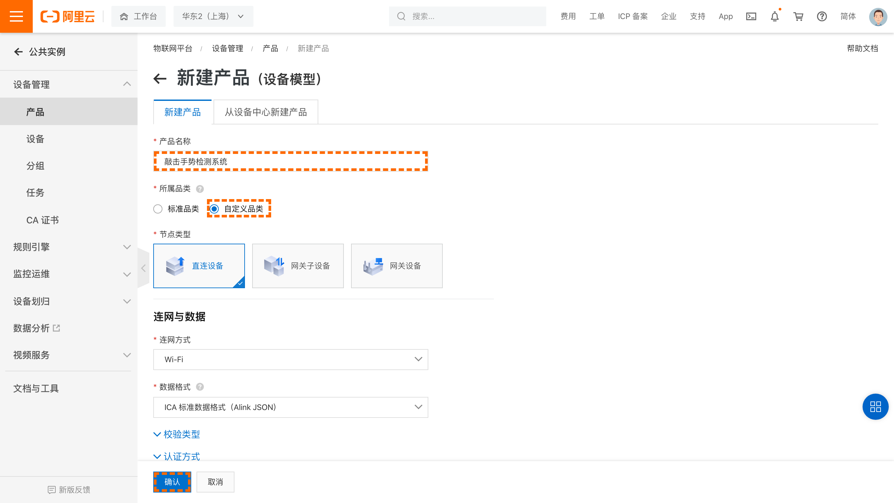

&emsp;&emsp;
点击“确认”按钮，即可完成产品创建。

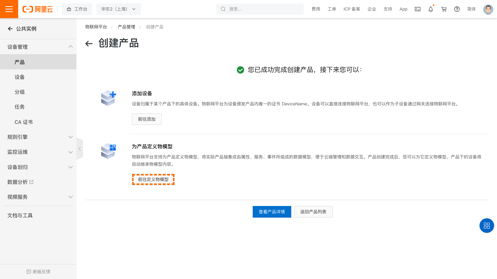

&emsp;&emsp;
点击“前往定义物模型”。
<br>

### 2.2、定义产品功能（物模型）

&emsp;&emsp;
点击功能定义，再点击编辑草稿。


&emsp;&emsp;
开发者可以使用准备好的[物模型文件](https://hli.aliyuncs.com/o/config/tap_detect_model/model.zip)来进行快速导入。点击左上角“快速导入”，选择物模型文件并上传，就能够生成案例对应的物模型。

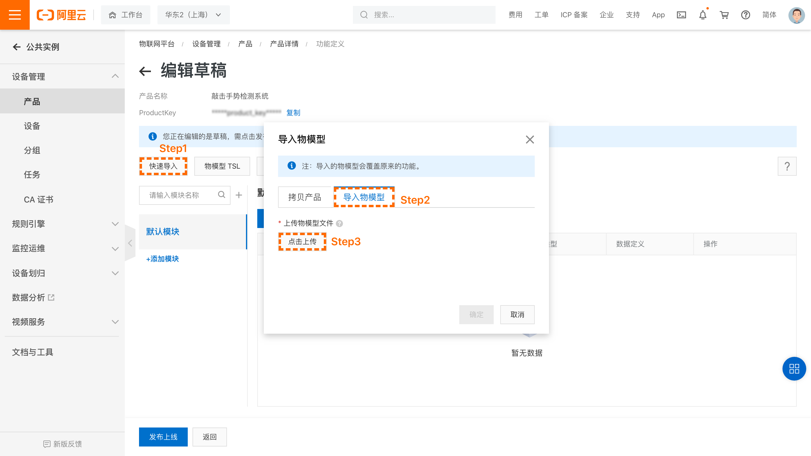

&emsp;&emsp;
生成后的效果如下：
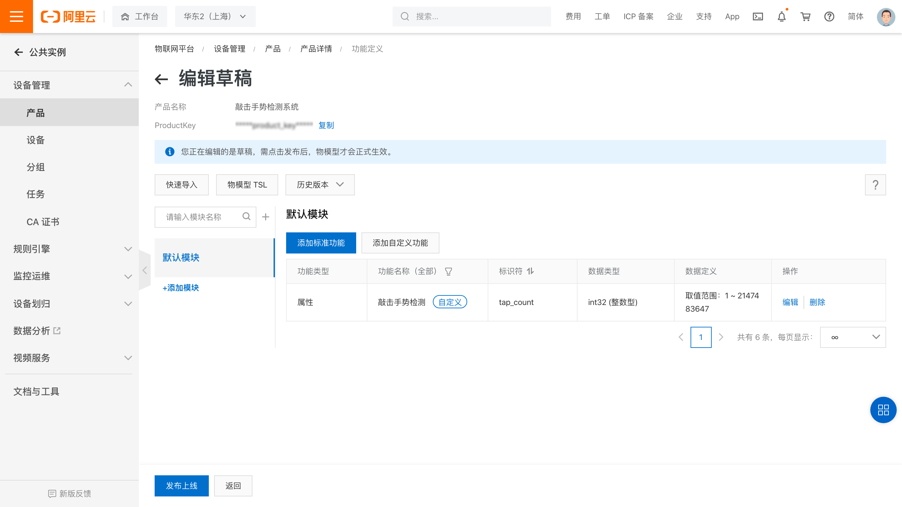

&emsp;&emsp;
定义好物模型后，需要发布物模型上线，并发布产品，以使变更正式生效。

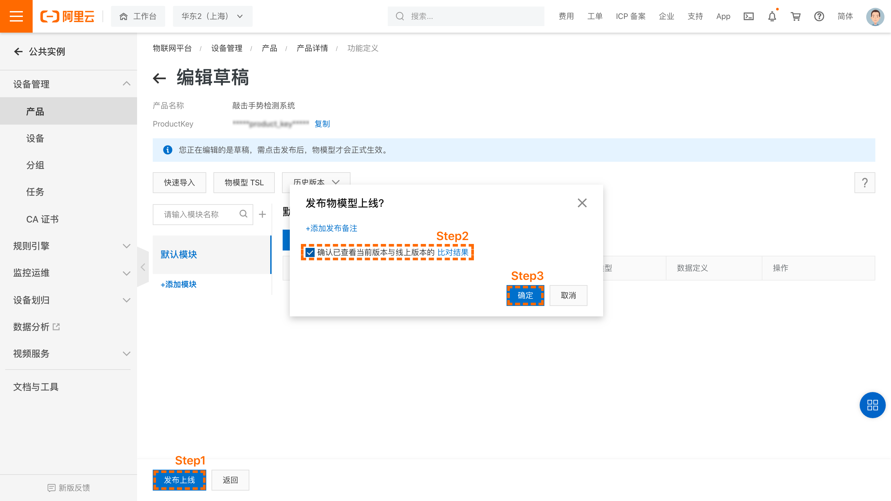

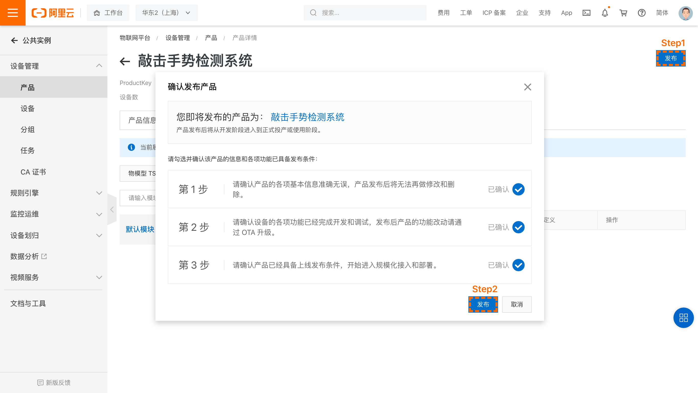

&emsp;&emsp;
产品及其物模型创建完成后就可以创建这个产品的设备了。

### 2.3、创建设备及获取三元组

&emsp;&emsp;
点击左侧栏中“设备“，在筛选框中选择要添加设备的产品，点击“添加设备”。这里这里我们命名为“**test_device**”，开发者也可以根据自己的喜好来命名。

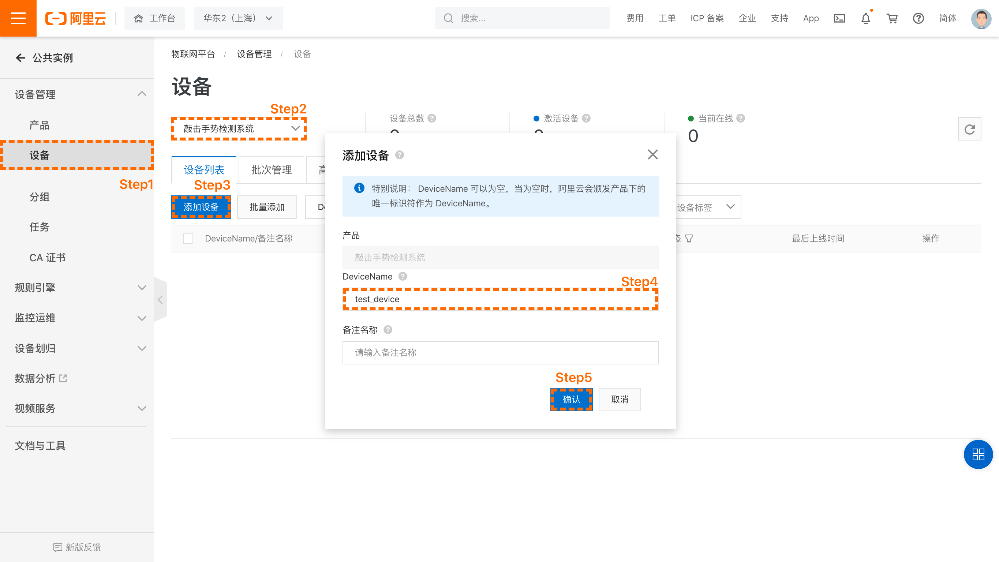

&emsp;&emsp;
开发者也可以选择“批量添加”，一次性添加多个设备，并生成随机的 DeviceName。

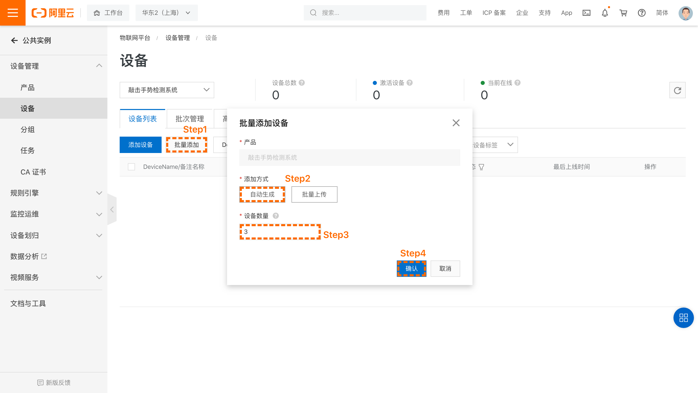

&emsp;&emsp;
生成的设备如下。

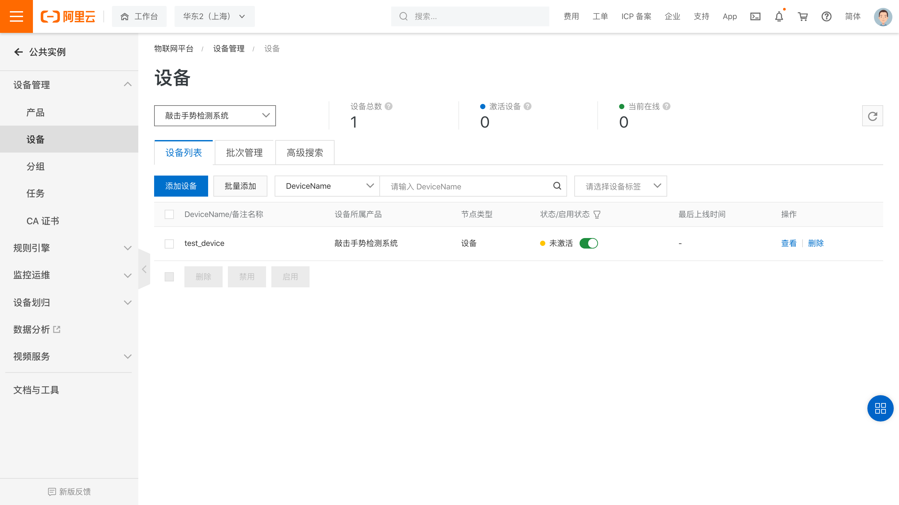

&emsp;&emsp;
点击前往“查看”按钮，就可以看到此设备的详细信息了。
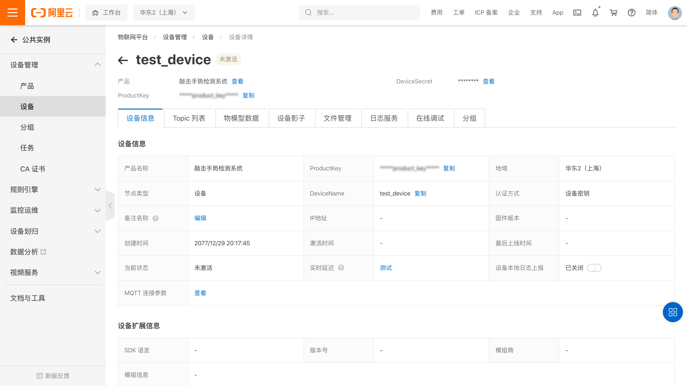

&emsp;&emsp;
点击右上角的“查看”按钮，就能看到设备的三元组信息了。
三元组是物联网设备端和物联网云端设备相关联的唯一标识符，在设备端连接云端的时候会使用三元组信息和云端进行鉴权，鉴权通过之后云端会认为设备已激活并上线。

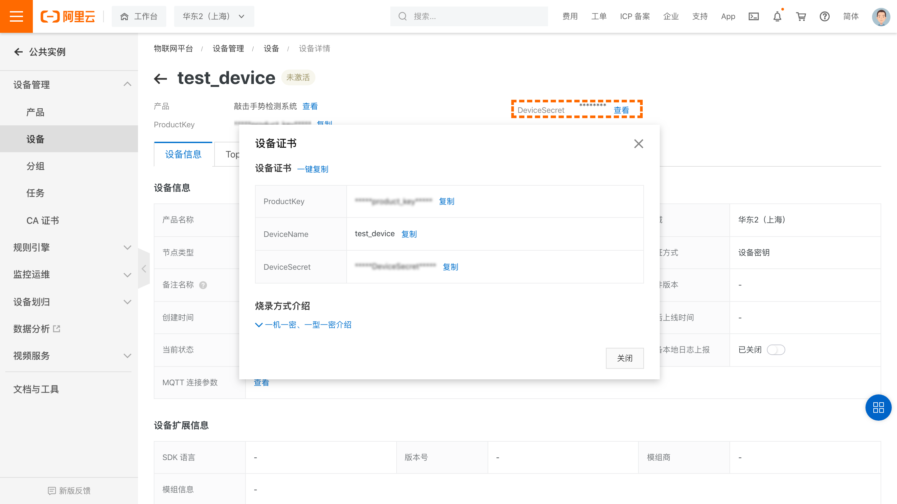
<br>

## 3、设备端开发

### 3.1、开发环境

&emsp;&emsp;
在进行下一步之前请确保 M5StackCore2 开发环境已经搭建完毕。详情请参考[M5StackCore2 开发环境](../../../startup/M5StackCore2_startup.md)的说明。
<br>

### 3.2、创建解决方案
&emsp;&emsp;
如下图所示，在Haas Studio中创建项目。先选择左侧的“开发板型号”再从右侧的案例中选择“敲击手势检测”案例点击“立即创建”即可。

<div align="center">

</div>
<br>

1. **修改路由器名称及密码**

&emsp;&emsp;
修改main.py中 SSID 和 PWD 的值为读者实际要连接的路由器的名称及密码（请注意名称和密码都需要放在''符号中间）。

```python
# Wi-Fi SSID和Password设置
SSID='Your-AP-SSID'
PWD='Your-AP-Password'
```

&emsp;&emsp;
修改完成之后 connect_lp 函数就会连接读者自己设定的路由器。

2. **修改设备的三元组信息**

&emsp;&emsp;
将在阿里云物联网平台申请的设备三元组信息，填入main.py中：

```python
# HaaS设备三元组
productKey = "Your-ProductKey"
deviceName  = "Your-devicename"
deviceSecret  = "Your-deviceSecret"
```

3. **设置手势动作检测参数**

&emsp;&emsp;
在main.py里，通过 Motion() 构造函数的第一个参数可以设定是"single_tap"（单击手势）还是"double_tap"（双击手势）。调用 enable(sensitivity) 函数可以设置手势动作检测参数，如果不传参数，则 enable() 函数将使用默认参数。

```python
# 设置手势检测的参数
motionObj = motion.Motion("double_tap", get_data, tap_detected) # 目前支持double_tap（双击手势）和single_tap（单击手势）检测

# 使能action检测，并以Dictionary格式传入灵敏度参数
sensitivity = { "ACCELERATION_UP_THREADHOLD" : 30 }
motionObj.enable(sensitivity)
```

4. **使能手势动作检测**

&emsp;&emsp;
调用 motionObj.enable(sensitivity) 函数后，会使能手势动作检测detect_action()函数，如果识别到手势动作，会上传识别结果到云端。

```python
# 手势识别主循环
def detect_action(self):
    while(self.enableDetection == True):
        isDetected = self.detectAction.detect()                  # 检测Action是否产生
        if (isDetected == True):                                 # Action被检测到
            print(self.action, "detected!")
            if (hasattr(self, 'onActionDetected')):
                self.onActionDetected()
        utime.sleep_us(10)
```

## 4、运行程序

### 4.1、设备端
1. **推送脚本**

&emsp;&emsp;
推送此工程到 M5StackCore2 设备上，如下图所示。

<div align="center">

</div>

2. **推送脚本时的日志**

&emsp;&emsp;
推送过程中的日志输出如下图所示。如果需要选择串口号，请选择“/dev/cu.wchusbserial53190134851 'USB Single Serial'”，直接输入串口号前面的数字即可。

<div align="center">

</div>

3. **敲击 M5StackCore2**

&emsp;&emsp;
用手指敲击 M5StackCore2 的屏幕 n 次，n 与 motionObj = motion.Motion("n_tap", get_data, tap_detected) 初始化函数的 "n_tap" 参数对应。目前 "n_tap" 参数可取的值有 "single_tap" 和 "double_tap"，对应单击手势检测和双击手势检测。

<div align="center">

</div>

4. **程序运行时的日志**

&emsp;&emsp;
设备上通过串口打印的信息如下，当打印“Now you can start tap detection!”后，即可开始敲击手势动作的检测。打印“double_tap detected!”表示识别到一次“敲击手势动作（Tap）”。

<div align="center">

</div>

<br>

## 4.2、云端查看

&emsp;&emsp;
进入阿里云官网，用阿里云账号[登录物联网平台](https://iot.console.aliyun.com/devices/)查看状态

<div align="center">

</div>

<br>

&emsp;&emsp;
到此为止，敲击手势检测系统案例就已经完成了。如果想学习更多实验，请参考[HaaS 案例实践详解](https://gitee.com/haasedu/haasedu/tree/release_2.0)。
