# 体重秤
## 简介
&emsp;&emsp;
此案例设计的体重秤是一种可以自动连接阿里云的智能称重设备，您可以通过手机端应用查看体重数据。在设定身高后，还可查看自己的体重指数，以及系统根据体重指数向您推送的健康建议。

## 准备
&emsp;&emsp;
硬件列表
* Haas EDU K1开发板一个  
* HX711电子秤传感器一个  
* 杜邦连接线若干  

Haas EDU K1开发板与转接板、步进电机及电子秤传感器之间的硬件连线
<table>
    <tr>
        <td align="center">硬件</td>
        <td align="center">HX711电子秤传感器</td>
        <td align="center">Haas EDU K1开发板</td>
    </tr>
    <tr>
        <td align="center" rowspan="4">端口标识</td>
        <td align="center">GND</td>
        <td align="center">GND</td>
    </tr>
    <tr>
        <td align="center">VCC</td>
        <td align="center">3.3V</td>
    </tr>
    <tr>
        <td align="center">SCK</td>
        <td align="center">P02</td>
    </tr>
    <tr>
        <td align="center">DT</td>
        <td align="center">P03</td>
    </tr>
    <tr>
        <td align="center" rowspan="1">硬件说明</td>
        <td align="center" >-</td>
        <td> <a align="center" href="https://haas.iot.aliyun.com/solution/detail/hardware?versionId=800C5AB3B8A4A88800000001&dataId=800C5AB3B8A4A888" target="_blank">快速开始详细端口定义</td>
    </tr>
</table>

### 硬件连线图
&emsp;&emsp;
硬件连线图如下所示：
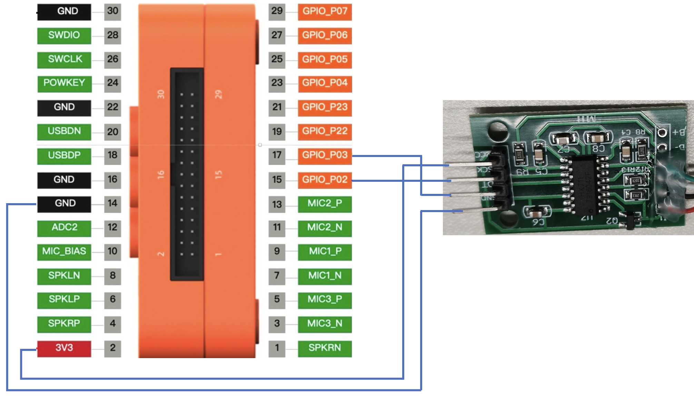


## 物联网平台开发

&emsp;&emsp;
整个过程包含以下4个步骤：

1. 开通公共实例
2. 创建产品（设备模型）
3. 定义产品功能（物模型）
4. 创建设备及获取三元组

### 开通公共实例
&emsp;&emsp;
对于第一次使用物联网平台的读者，需要开通实例以使用物联网平台的功能。这里可以使用免费的公共实例进行开发。

&emsp;&emsp;
在[物联网平台](https://iot.console.aliyun.com/lk/summary/new)中，左上角选择“华东2-上海”，点击“公共实例”，即可开通。开通后点击“公共实例”，即可进入[控制台](https://iot.console.aliyun.com/lk/summary/new)进行产品创建。


### 创建产品（设备模型）
&emsp;&emsp;
进入[公共实例控制台](https://iot.console.aliyun.com/lk/summary/new)，点击“创建产品”按钮，即可进入[新建产品页面](https://iot.console.aliyun.com/product)。


&emsp;&emsp;
进入[新建产品页面](https://iot.console.aliyun.com/product)，设定“产品名称”，这里我们命名为“**体重秤**”，读者也可以根据自己的喜好来命名。在“所属品类”中，选择“自定义品类”。

&emsp;&emsp;
产品的节点类型选择“直连设备”，数据格式选择“ICA标准数据格式”，检验类型和认证方式选择默认设定即可。开发者可根据自己的需求在“产品描述”页面添加针对此产品的描述。

&emsp;&emsp;
对于搭载 Wi-Fi 的设备而言，联网方式选择“Wi-Fi”。

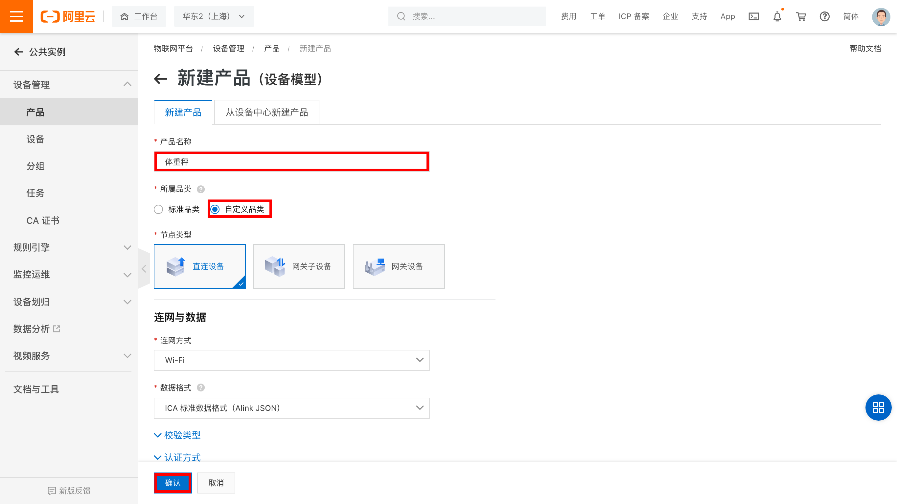

&emsp;&emsp;
点击“确认”按钮，即可完成产品创建。


&emsp;&emsp;
点击“前往定义物模型”

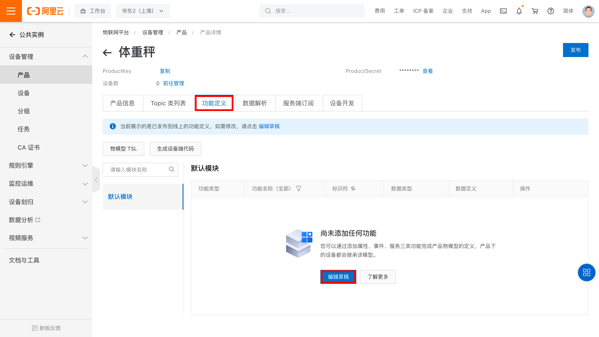

### 定义产品功能（物模型）
&emsp;&emsp;
进入功能定义，点击编辑草稿，选择添加自定义功能，依次添加“体重”“健康状态”“体重指数”“健康建议”“身高”五个功能项，如下所示：
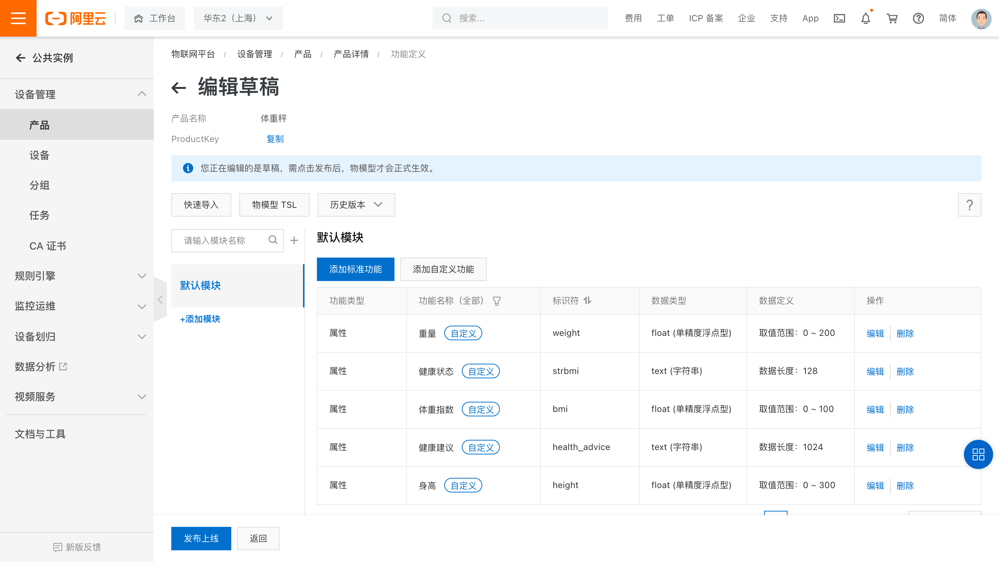

&emsp;&emsp;
定义好物模型后，需要发布物模型上线，并发布产品，以使变更生效。

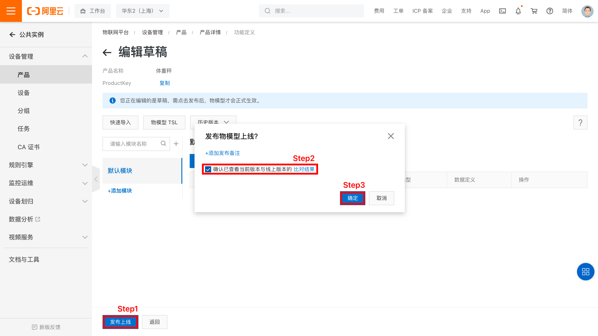
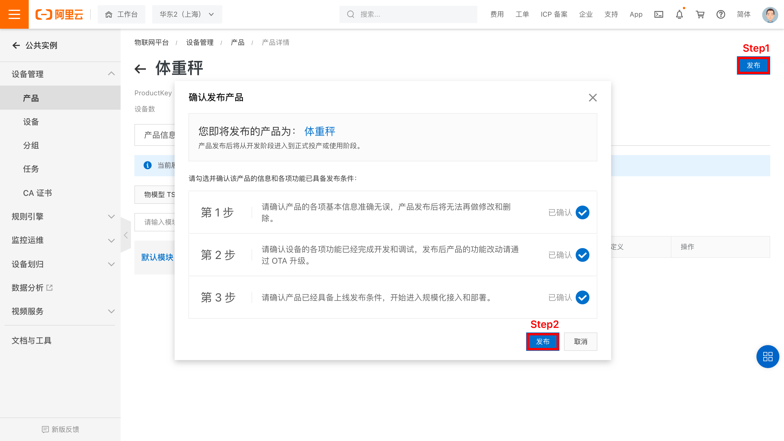

&emsp;&emsp;
产品及其物模型创建完成后就可以创建这个产品的设备了。

### 创建设备及获取三元组
&emsp;&emsp;
点击左侧栏中“设备“，在筛选框中选择要添加设备的产品，点击“添加设备”。这里这里我们命名为“**weight_scale**”，开发者也可以根据自己的喜好来命名。

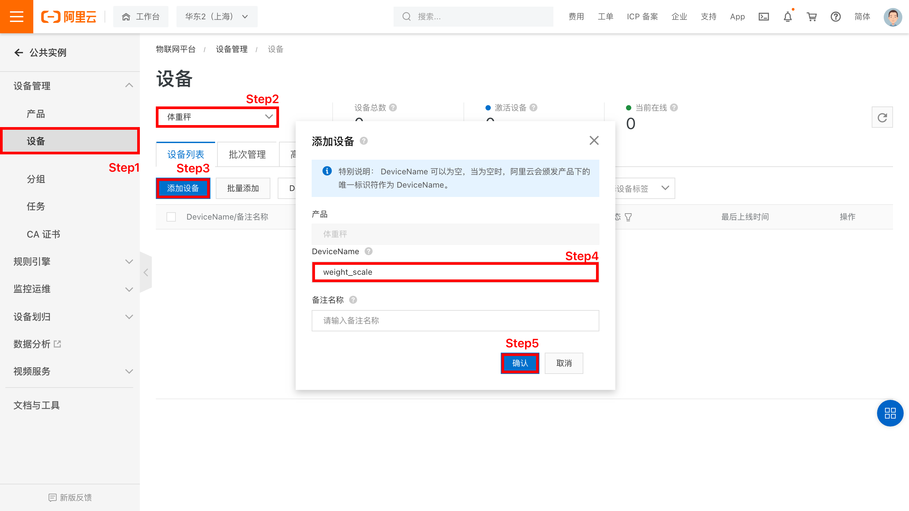

&emsp;&emsp;
开发者也可以选择“批量添加”，一次性添加多个设备，并生成随机的DeviceName。


&emsp;&emsp;
生成的设备如下。

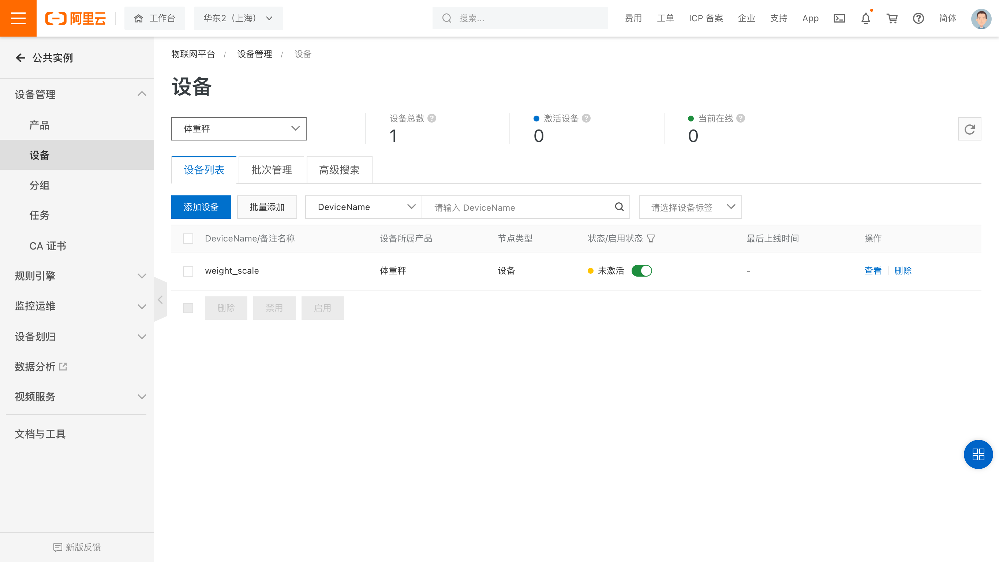

&emsp;&emsp;
点击前往“查看”按钮，就可以看到此设备的详细信息了。
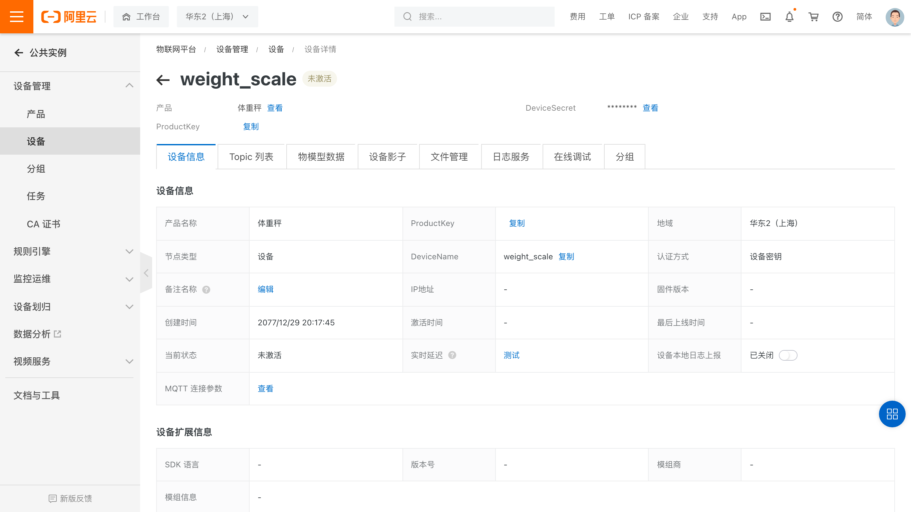

&emsp;&emsp;
点击右上角的“查看”按钮，就能看到设备的三元组信息了。三元组是物联网设备端和物联网云端设备相关联的唯一标识符，在设备端连接云端的时候会使用三元组信息和云端进行鉴权，鉴权通过之后云端会认为设备已激活并上线。


&emsp;&emsp;
再次前往物联网平台的设备信息页面，若设备运行正确，此时应该可以看到设备名右侧的状态由“未激活”变为“在线”。
选中“实时刷新”，可以看到数据实时从设备上报到物联网平台。设备上云成功。

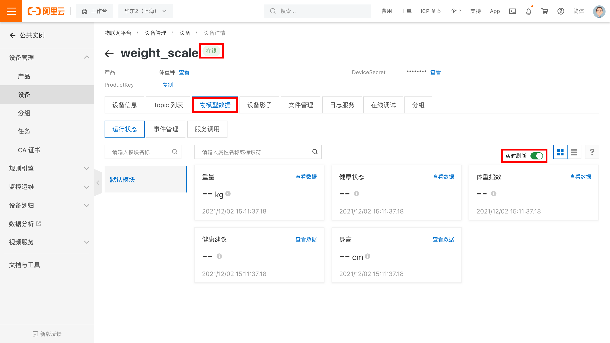

## 设备端开发
### 开发环境
&emsp;&emsp;
在进行下一步之前请确保HaaS EDU K1开发环境已经搭建完毕。详情请参考[HaaS EDU K1开发环境](https://haas.iot.aliyun.com/haasapi/index.html?spm=a2cpu.b16145223.0.0.665960b1PR2nSt#/Python/docs/zh-CN/startup/HaaS_EDU_K1_startup)的说明。

### 创建解决方案

&emsp;&emsp;
如下图所示，在Haas Studio中新建一个helloworld的python工程，开发板选择“HaaS EDU k1”。设定好工程名称（“weight_scale”）及工作区路径之后，点击确定。

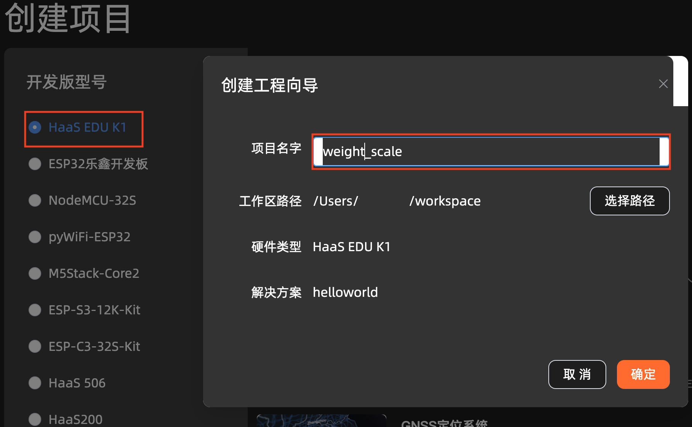

&emsp;&emsp;
将[全部代码](./code/)文件复制并覆盖刚刚创建的工程目录下的原有文件，之后对代码进行如下修改。

1. **填写Wi-Fi名称及密码**

&emsp;&emsp;
在main.py中，填写可用的Wi-Fi名称及密码。

``` python
# wifi连接的的ssid和pwd定义
wifi_ssid = "请填写您的路由器名称"
wifi_password = "请填写您的路由器密码"
```

2. **修改设备端三元组**

&emsp;&emsp;
在main.py中，填写创建的设备三元组信息。关于设备三元组的获取，请参考[创建设备及获取三元组](./README.md "创建设备及获取三元组")中的步骤。

``` python
# 三元组信息
productKey     = "产品key"
deviceName     = "设备名称"
deviceSecret   = "设备密钥"
```

## 物联网应用开发

&emsp;&emsp;
IoT Studio 提供了应用快速开发的能力，可以很方便地与物联网平台进行联动。本节的开发工作也将围绕 IoT Studio展开。

### 新建“普通项目”

&emsp;&emsp;
打开IoT Studio官网，在项目管理中新建一个空白项目，如下图所示，将此项目命名为“**体重秤**”,开发者也可以根据自己的喜好来命名。


### 关联产品与设备

&emsp;&emsp;
为了使本项目能够获取到目标设备的信息，我们首先需要将该项目和我们在前一节创建的产品“体重秤”及设备“weight_scale”绑定。

&emsp;&emsp;
在项目控制台，点击左侧的“产品”，点击“关联物联网平台产品”。此时可以看见我们创建的“体重秤”，点击选中。
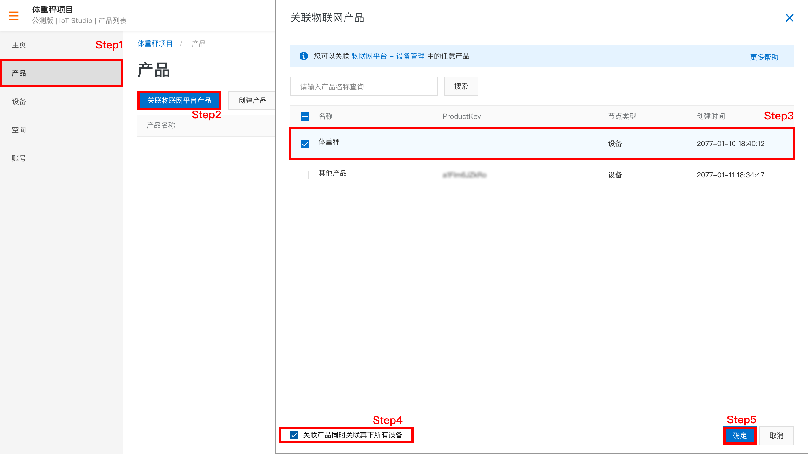

&emsp;&emsp;
在项目控制台，点击左侧的“设备”，点击“关联物联网平台设备”。此时可以看见我们创建的“weight_scale”，点击选中。
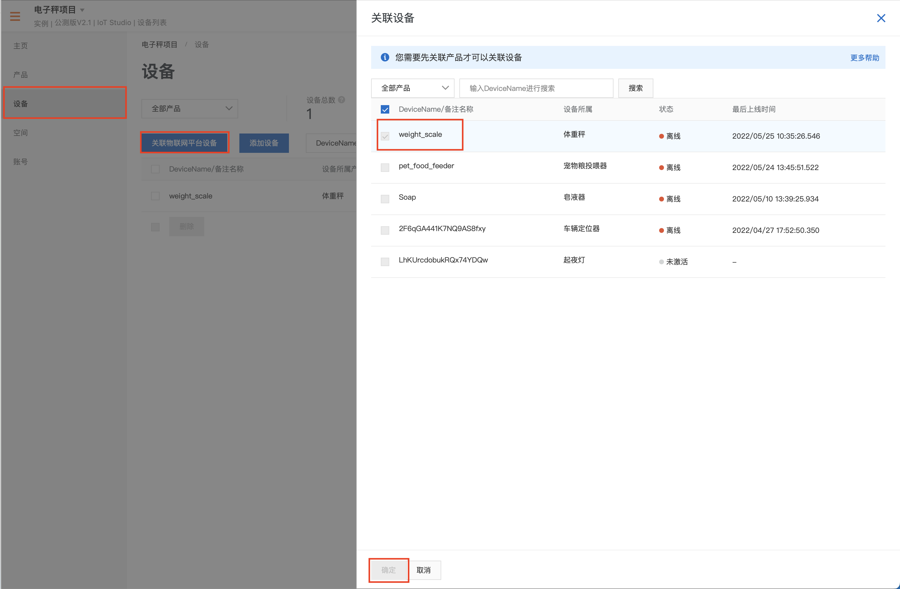

### 创建“移动应用”
&emsp;&emsp;
点击移动应用，选择新建输入应用名称“体重秤”点击确定
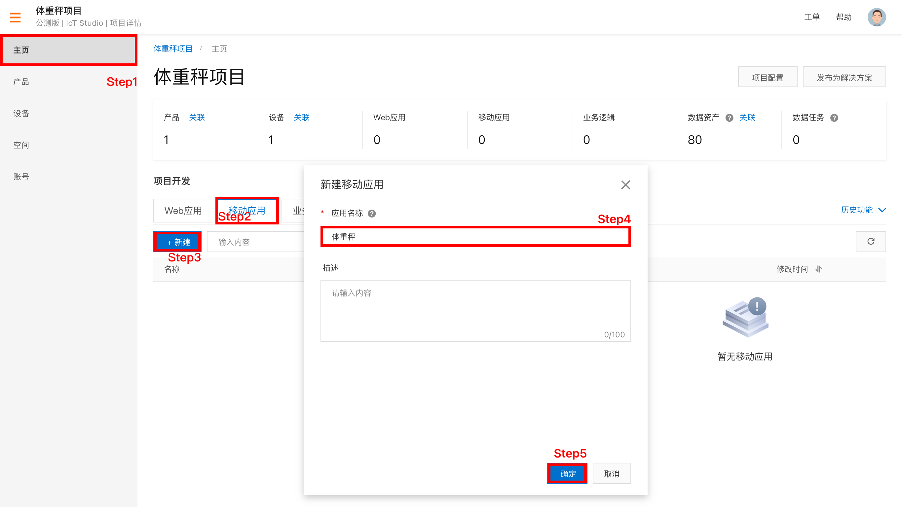

&emsp;&emsp;
点击创建完成的应用进入编辑页面，使用“空气质量优”模版创建页面
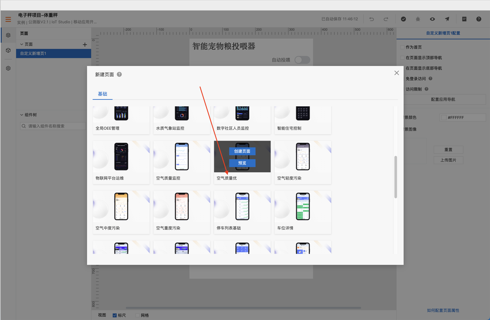

&emsp;&emsp;
编辑应用页面

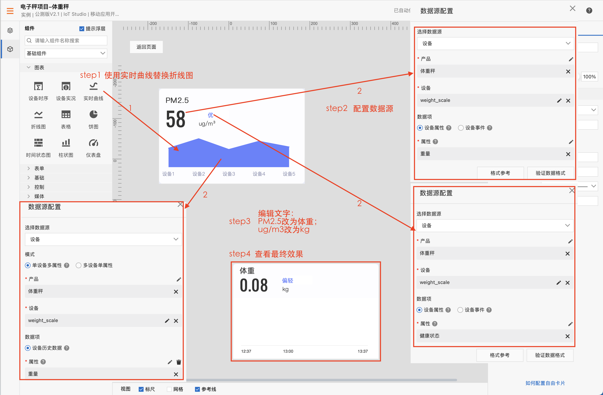
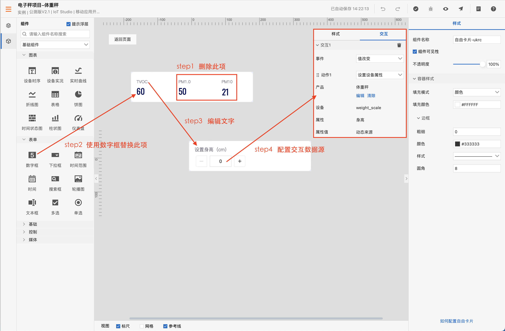
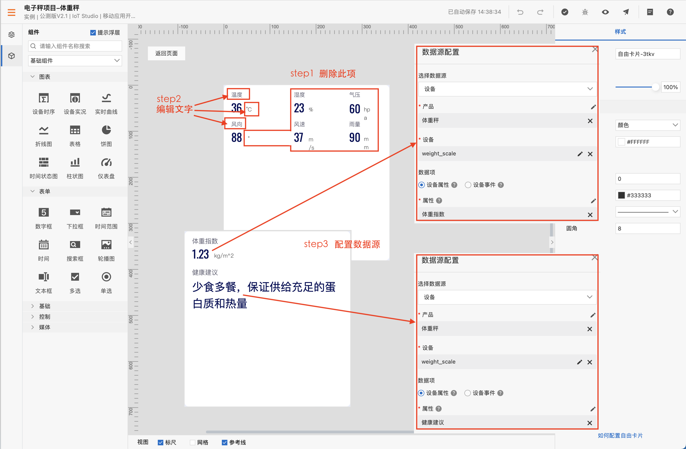

&emsp;&emsp;
最终效果图
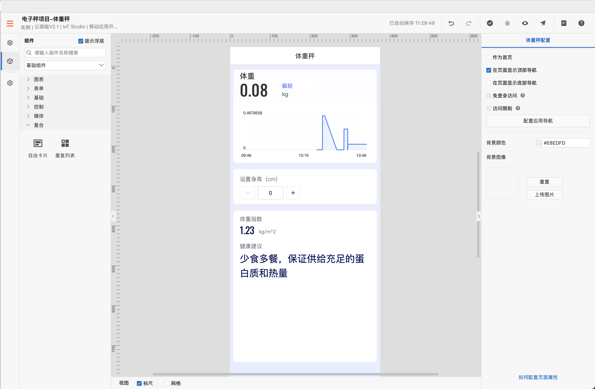

&emsp;&emsp;
效果预览
<div align="center">
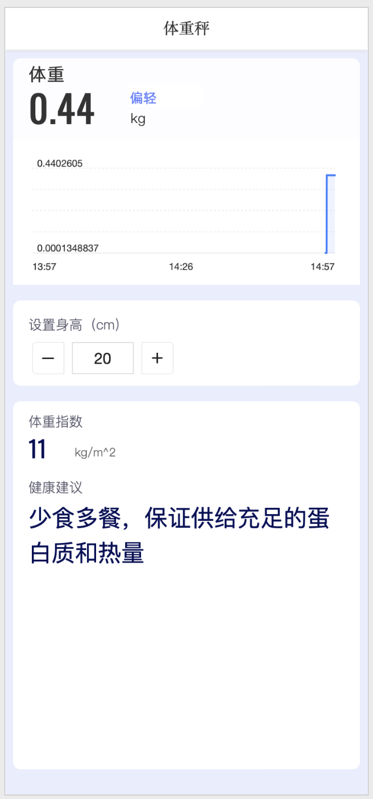
</div>