# WS2812 RGB灯带
&emsp;&emsp;
本案例将从以下几个步骤进行展开：


1. 使用NeoPiexl库点亮WS2812
2. 在物联网平台创建云产品并将设备连接上云
3. 设备端实现灯效
4. 使用 IoT Studio 实现移动应用

在硬件连线完成之后我们建议您先使用“一分钟上云体验”功能预先体验本案例的实际运行效果。

## 准备

&emsp;&emsp;
需要准备如下硬件：

* ESP32开发板
* 外置5V电源（可选）
* WS2812灯带
* 杜邦线若干

&emsp;&emsp;
其中，WS2812灯带与ESP32的连接如下：

| WS2812 | ESP32  | 外置电源 |
| :----: | :----: | :------: |
|  VCC   |   -    |    5V    |
|  DIN   | GPIO19 |    -     |
|  GND   |  GND   |   GND    |

>由于灯带需要的功率较大，ESP32的板上5V供电很可能无法支持正常点亮灯带，因此建议使用外置电源为灯带供电，同时要求ESP32与外置电源共地。

其中，外置5V电源建议使用淘宝上常见的“USB转TTL模块”，其一般都会具备5V的电源输出。如下图红框与白框所示。

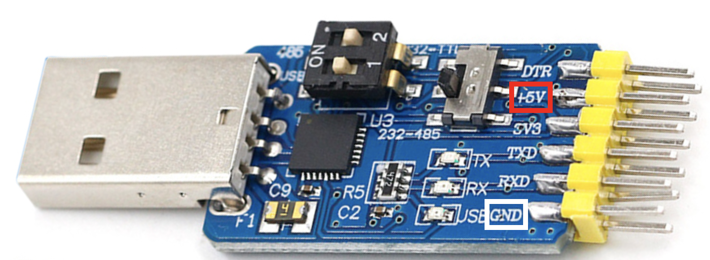

整体接线如下图所示：

其中，灯带上一般会暴露出一个三线（红，白，绿）的接线端子，以及两根单独的红线和白线。

红线代表VCC，白线代表GND，绿线则是数据线。在接线时，一定要注意绿色线连接的是灯带的 **DIN** 端，这是数据的输入端。


若手头没有可以输出5V的模块，也可以尝试将多余的USB线剪开，一般而言，黑色线为GND，红色线为VCC（5V），再参考上图进行连接。连接时请注意，裸露的线头使用胶带缠绕并避免接触，以防短路。

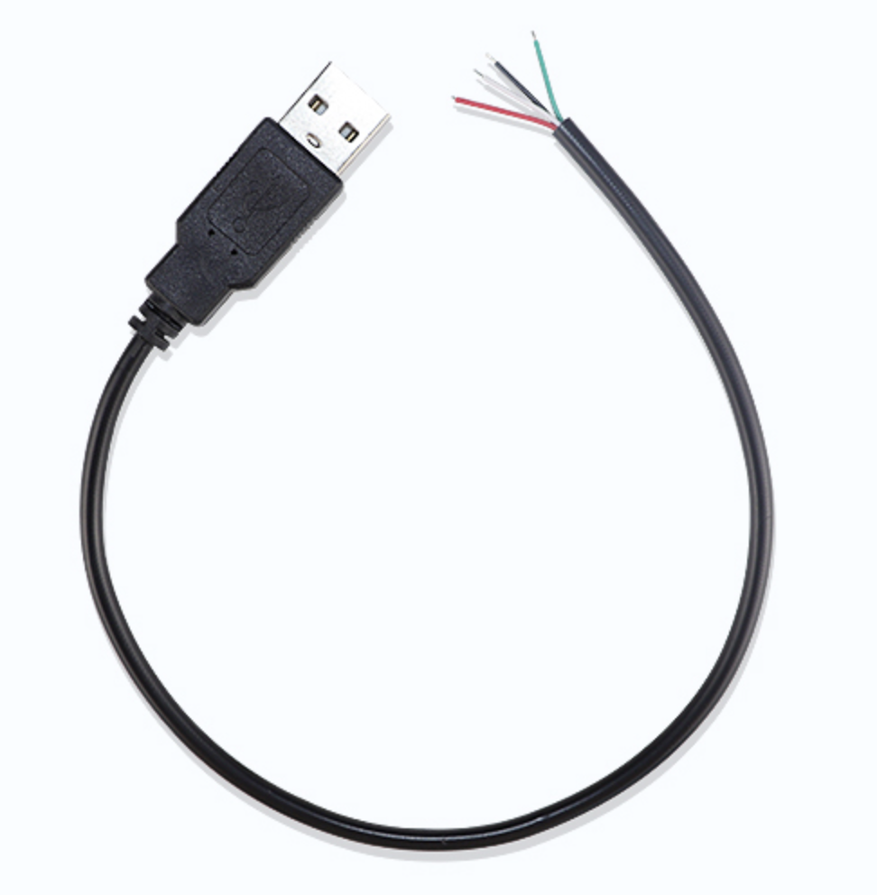

## 一分钟上云体验

- 打开“支付宝”扫描下图二维码


- 在完成上面的“硬件连线”步骤之后，点击“体验案例”按钮，即可立即体验本案例的实际运行效果。

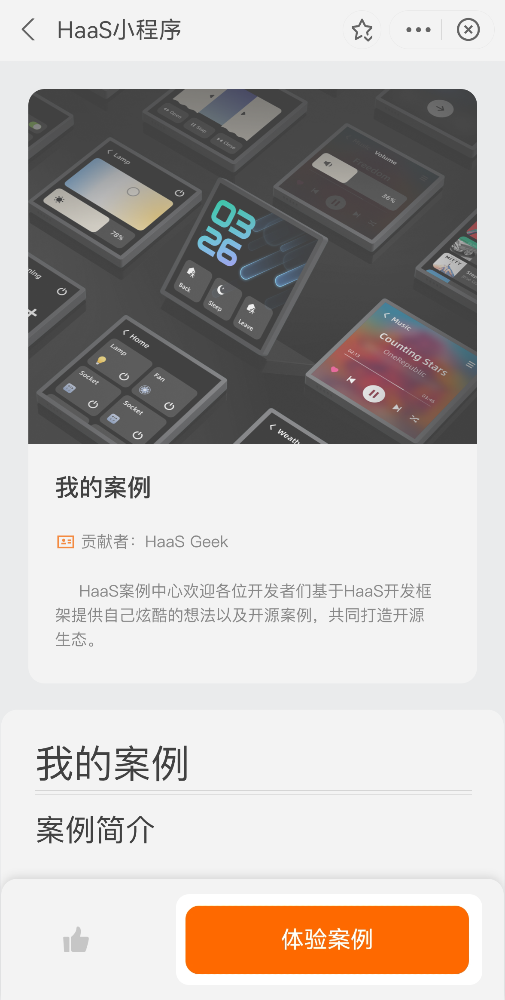

## NelPixel 接口使用
该模块为 WS2818 / NeoPixel LED提供驱动程序。

你可以在完成硬件连接后，进入交互模式下，输入以下指令，来尝试操作灯带。

```python
from machine import Pin
from neopixel import NeoPixel

pin = Pin(19, Pin.OUT)  # 在本案例中，使用GPIO19驱动灯带
np = NeoPixel(pin, 8)   # 创建一个包含8颗Led的NeoPixel对象
np[0] = (255, 255, 255) # 将第一颗LED置为白色 (255, 255, 255)
np.write()              # 将颜色写入硬件
r, g, b = np[0]         # 获取第一颗灯珠的颜色
```

了解这个库如何使用后，你可以开始进行和云端一体的开发。

## 物联网平台开发

&emsp;&emsp;
整个过程包含以下4个步骤：

1. 开通公共实例
2. 创建产品（设备模型）
3. 定义产品功能（物模型）
4. 创建设备及获取三元组

### 开通公共实例
&emsp;&emsp;
对于第一次使用物联网平台的读者，需要开通实例以使用物联网平台的功能。这里可以使用免费的公共实例进行开发。

&emsp;&emsp;
在[物联网平台](https://iot.console.aliyun.com/lk/summary/new)中，左上角选择“华东2-上海”，点击“公共实例”，即可开通。开通后点击“公共实例”，即可进入[控制台](https://iot.console.aliyun.com/lk/summary/new)进行产品创建。

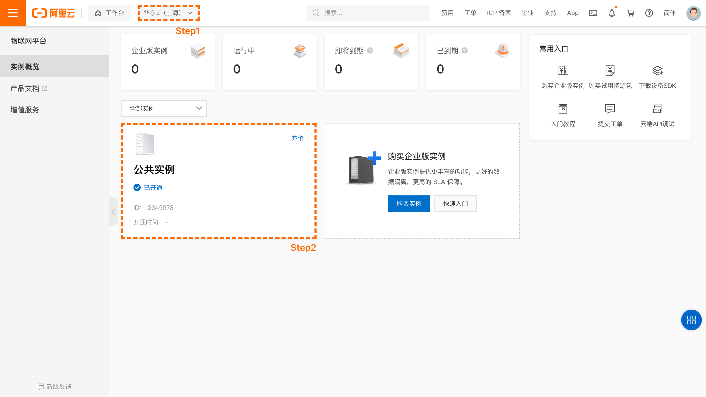

### 创建产品（设备模型）
&emsp;&emsp;
进入[公共实例控制台](https://iot.console.aliyun.com/lk/summary/new)，点击“创建产品”按钮，即可进入[新建产品页面](https://iot.console.aliyun.com/product)。


&emsp;&emsp;
进入[新建产品页面](https://iot.console.aliyun.com/product)，设定“产品名称”，这里我们命名为“**RGB灯带**”，读者也可以根据自己的喜好来命名。在“所属品类”中，选择“自定义品类”。

&emsp;&emsp;
产品的节点类型选择“直连设备”，数据格式选择“ICA标准数据格式”，检验类型和认证方式选择默认设定即可。开发者可根据自己的需求在“产品描述”页面添加针对此产品的描述。

&emsp;&emsp;
对于 ESP32 等搭载 Wi-Fi 的设备而言，联网方式选择“Wi-Fi”。

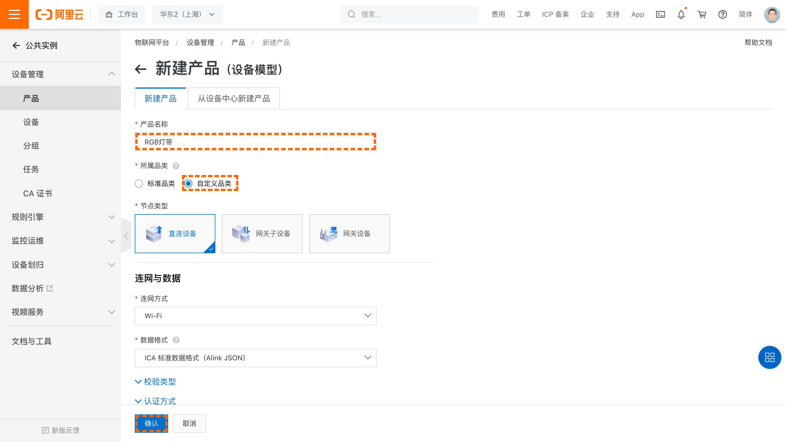

&emsp;&emsp;
点击“确认”按钮，即可完成产品创建。

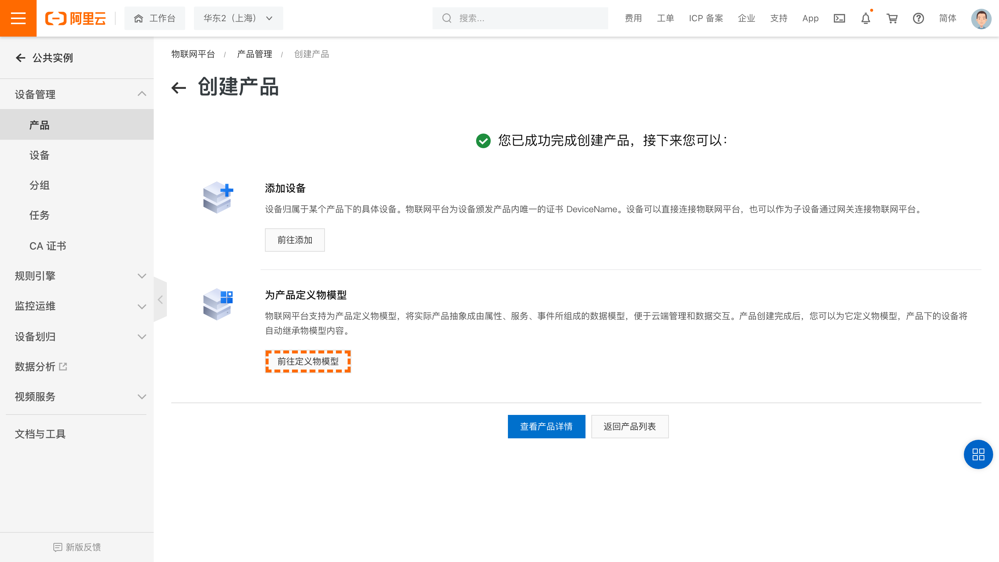

&emsp;&emsp;
点击“前往定义物模型”

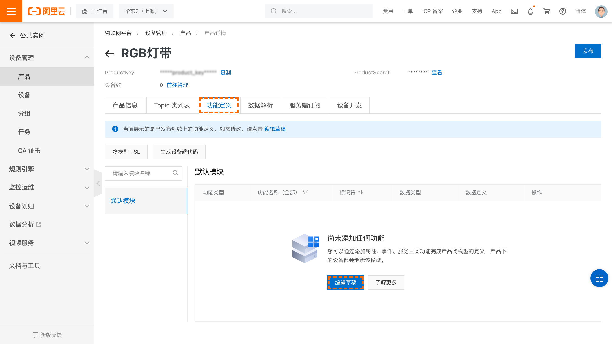

### 定义产品功能（物模型）
&emsp;&emsp;
开发者可以使用准备好的物模型文件来进行快速导入。点击左上角“快速导入”，选择物模型文件并上传，就能够生成案例对应的物模型。

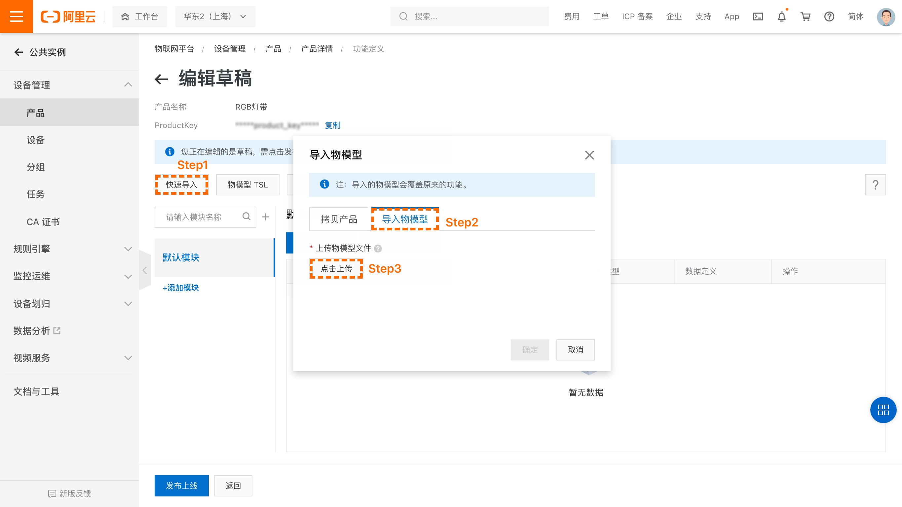

&emsp;&emsp;
生成后的效果如下：


&emsp;&emsp;
定义好物模型后，需要发布物模型上线，并发布产品，以使变更生效。

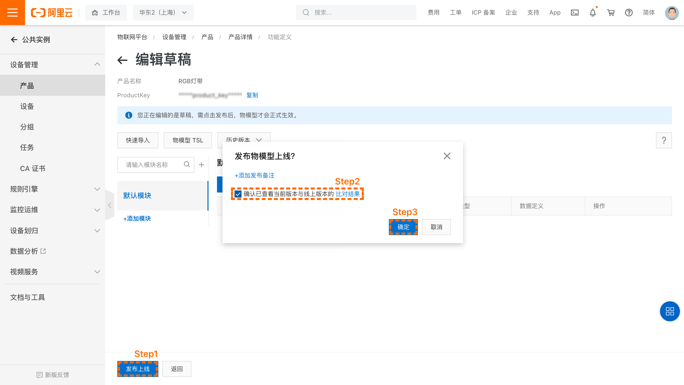

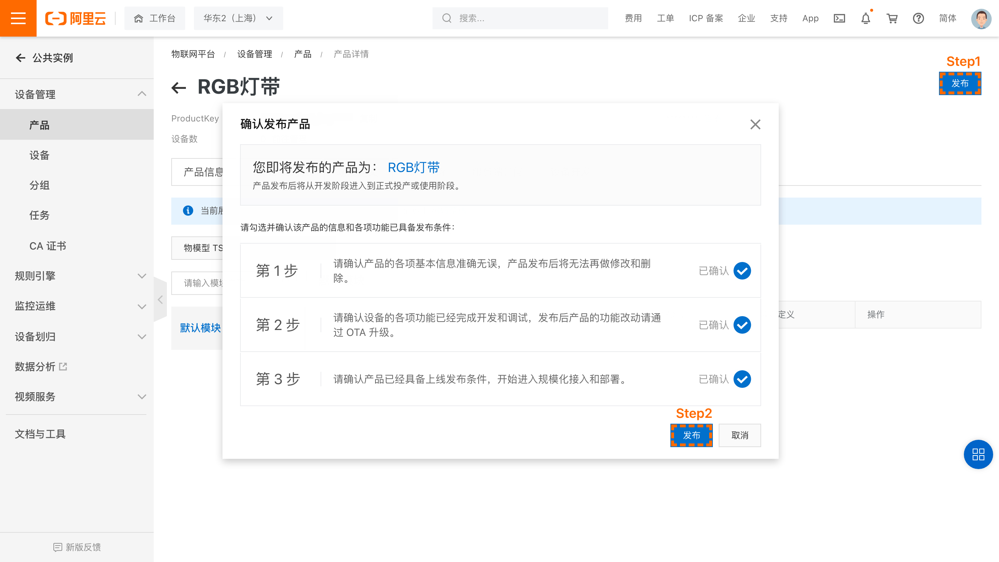

&emsp;&emsp;
产品及其物模型创建完成后就可以创建这个产品的设备了。

### 创建设备及获取三元组
&emsp;&emsp;
点击左侧栏中“设备“，在筛选框中选择要添加设备的产品，点击“添加设备”。这里这里我们命名为“**test_device**”，开发者也可以根据自己的喜好来命名。


&emsp;&emsp;
开发者也可以选择“批量添加”，一次性添加多个设备，并生成随机的DeviceName。

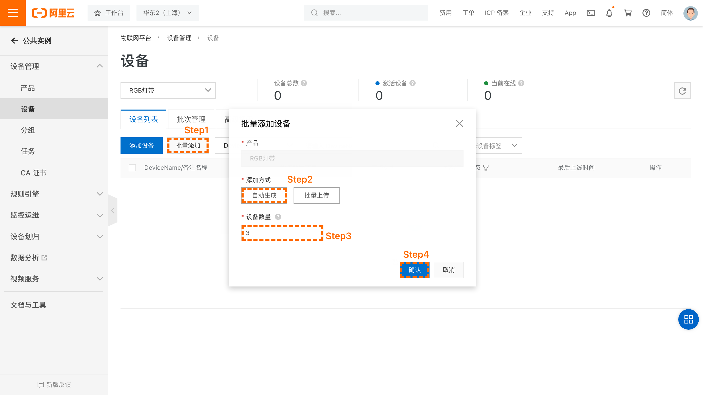

&emsp;&emsp;
生成的设备如下。


点击前往“查看”按钮，就可以看到此设备的详细信息了。
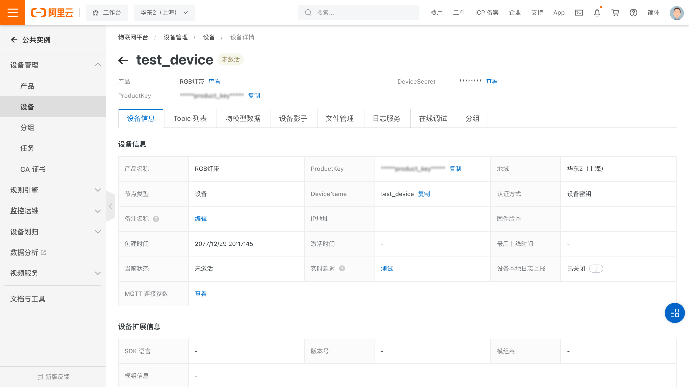

&emsp;&emsp;
点击右上角的“查看”按钮，就能看到设备的三元组信息了。
三元组是物联网设备端和物联网云端设备相关联的唯一标识符，在设备端连接云端的时候会使用三元组信息和云端进行鉴权，鉴权通过之后云端会认为设备已激活并上线。


## 设备端开发

### 开发环境
&emsp;&emsp;
在进行下一步之前请确保ESP32开发环境已经搭建完毕。详情请参考[esp32开发环境](../../../../startup/ESP32_startup.md)的说明。

### 创建解决方案

&emsp;&emsp;
如下图所示，打开 **HaaS Studio - 快速开始** 后，新建一个基于helloworld的Python轻应用。

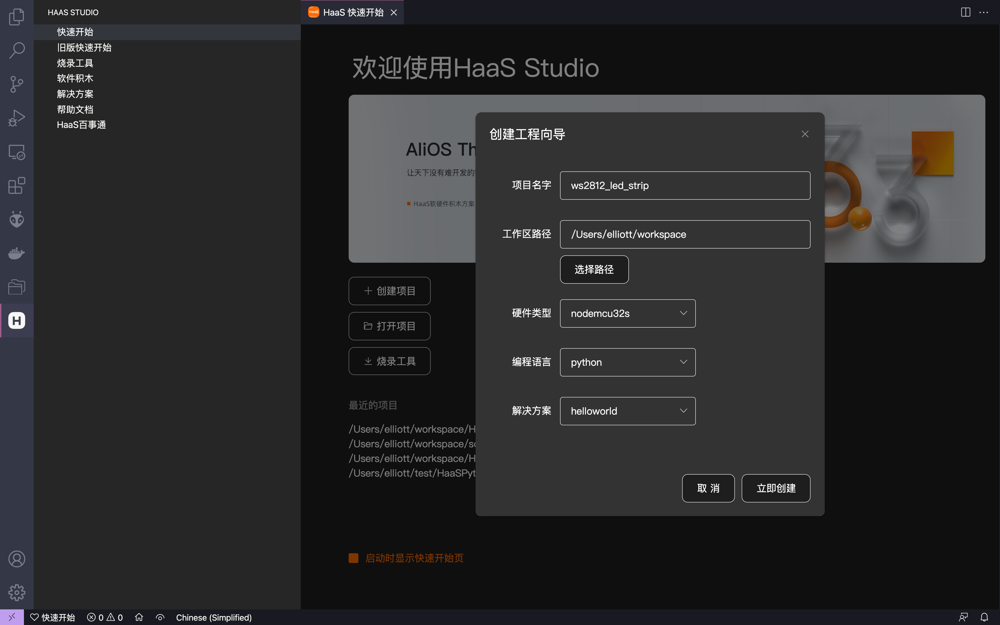

&emsp;&emsp;
如下图所示，打开VS Code之后在新建一个基于helloworld的python工程，设定好工程名称（“ws2812_led_strip”）及工作区路径之后，硬件类型选择ESP32，点击立即创建，创建一个Python轻应用的解决方案。

&emsp;&emsp;
将获取定位数据的全部[代码](./code/)文件复制并覆盖刚刚创建的工程目录下。如下图代码区所示：

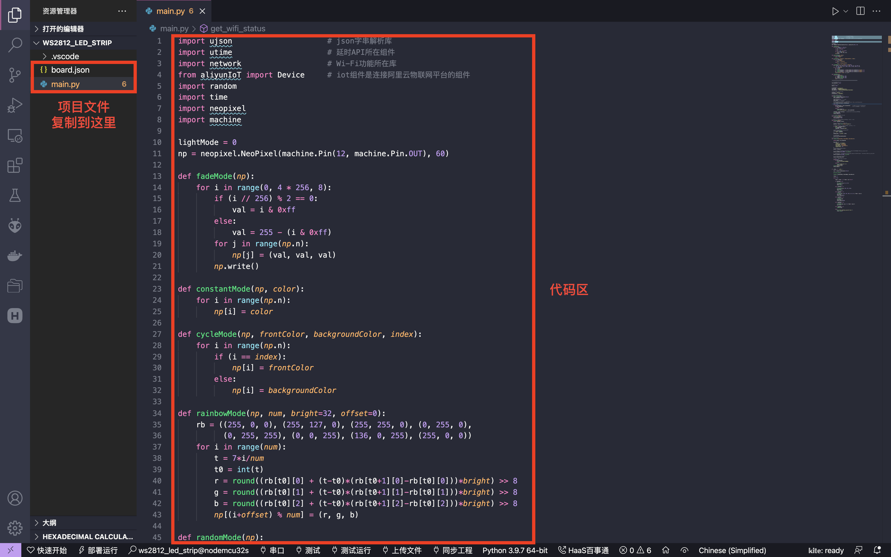

> Python脚本的详细说明请参考脚本内嵌的文字版注释

&emsp;&emsp;
之后，在代码中填入对应的信息

1. **填写Wi-Fi名称及密码**

&emsp;&emsp;
在[main.py](./code/main.py)中，填写可用的Wi-Fi名称及密码。

``` python
# wifi连接的的ssid和pwd定义
wifiSsid = "请填写您的路由器名称"
wifiPassword = "请填写您的路由器密码"
```

2. **修改设备端三元组**

&emsp;&emsp;
在[main.py](./code/main.py)中，填写创建的设备三元组信息。关于设备三元组的获取，请参考[创建设备及获取三元组](./README.md "创建设备及获取三元组")中的步骤。

``` python
# 三元组信息
productKey     = "产品key"
deviceName     = "设备名称"
deviceSecret   = "设备密钥"
```

## 运行结果

### 在物联网平台上查看设备数据
&emsp;&emsp;
再次前往物联网平台的设备信息页面，若设备运行正确，此时应该可以看到设备名右侧的状态由“未激活”变为“在线”。


### 在物联网平台上在线调试设备
点击左侧侧边栏，进入 **监控运维 - 在线调试** ，选择对应的产品和设备，更改设备属性并下发。

当看到灯带模式发生变化时，即说明设备上云成功！

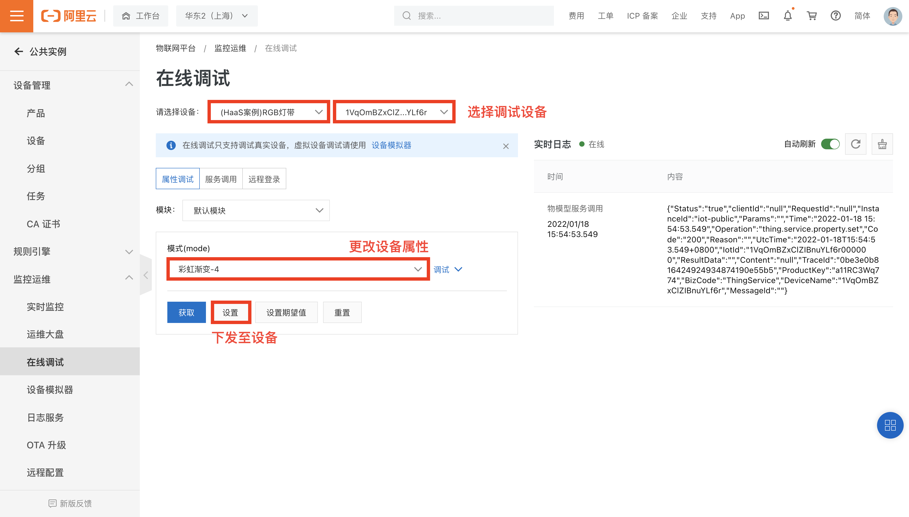


## 物联网应用开发

&emsp;&emsp;
IoT Studio 提供了应用快速开发的能力，可以很方便地与物联网平台进行联动。本节的开发工作也将围绕 IoT Studio展开。

### 新建“普通项目”
&emsp;&emsp;
打开[IoT Studio官网](https://studio.iot.aliyun.com/)，在项目管理中新建一个空白项目，如下图所示，将此项目命名为“RGB灯带遥控器”。

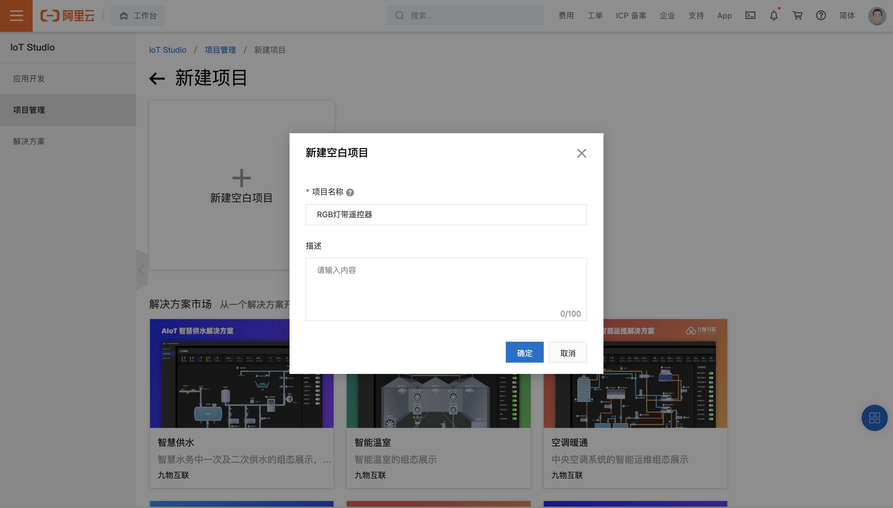


### 关联产品
&emsp;&emsp;
为了使本项目能够获取到目标设备的定位信息，我们首先需要将该项目和我们在前一节创建的产品“RGB灯带”绑定。

&emsp;&emsp;
在项目控制台，点击左侧的“产品”，点击“关联物联网平台产品”。此时可以看见我们创建的“RGB灯带”。点击选中，并勾选“关联产品同时关联其下所有设备”，以便该项目可以访问到所有设备的定位信息。

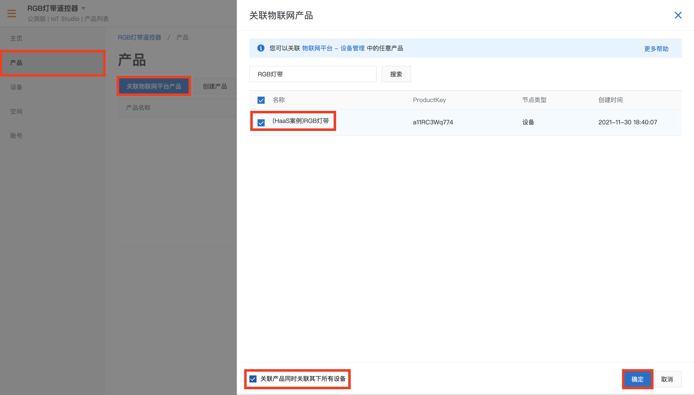


### 创建“移动应用”

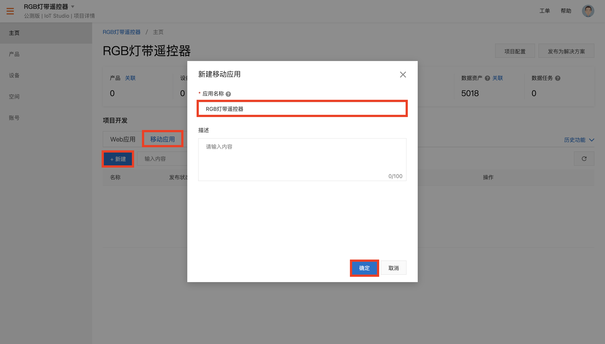


### 界面开发及交互配置
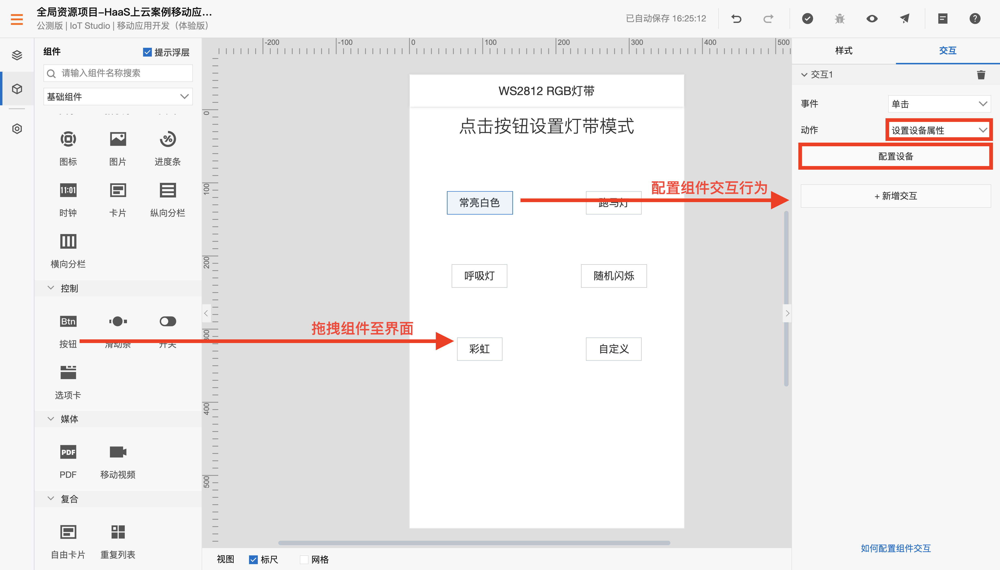

按下图所示，为每一个按钮配置交互行为，当点击特定按钮时，设置设备物模型标签为对应值。
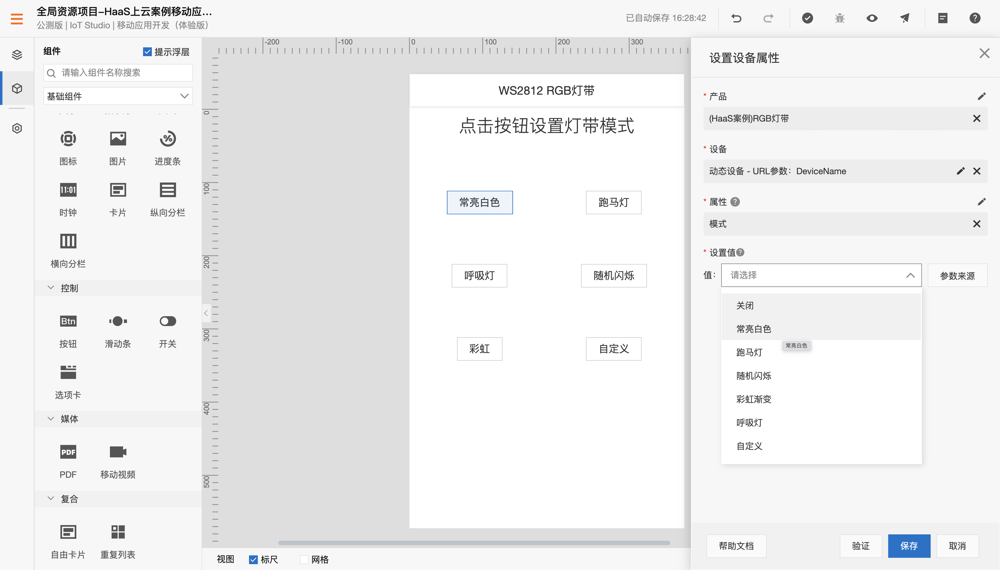

### 预览及发布应用

点击右上角按钮预览或发布，即可在手机上使用应用，可以实现随时随地远程控制啦。

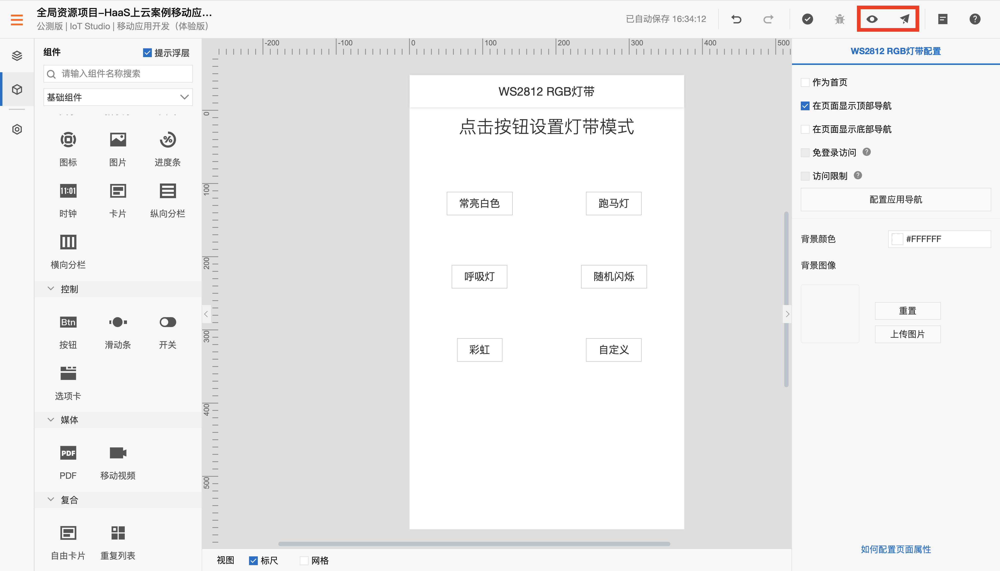
