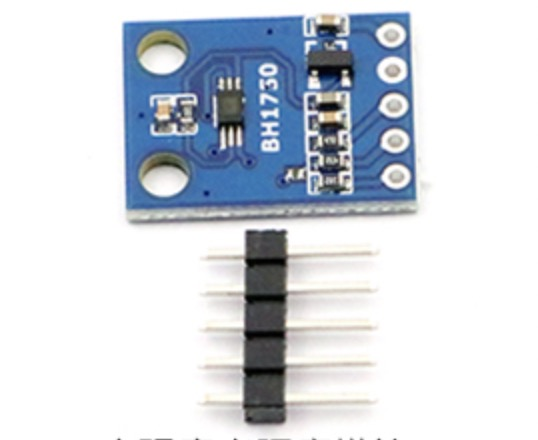
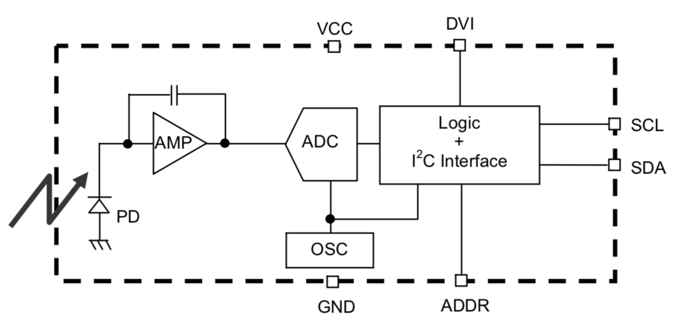
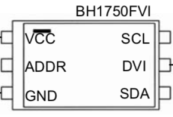

# 数字光强传感器 - BH1750

## 一、产品简介
BH1750 是罗姆（ROHM）半导体集团出品的数字光强传感器，也称作光敏传感器。广泛应用于移动手机、LCD电视、电脑PC、掌上游戏机、数码相机、数码摄像机、汽车导航、PDA、LCD显示屏幕等等。

<div align="center">

</div>

## 二、技术参数
* I2C总线接口，支持快速或标准模式（F/S模式）
* 近似人眼的光谱反应能力
* 光照度到数字信号的转换器
* 宽范围和高分辨率（1-65535lx）
* 通过断电达到低电流
* 50Hz / 60Hz 光噪声抑制功能
* 1.8v逻辑输入接口
* 不需要任何外围电路
* 光源依赖性小。（例如，可用于白炽灯、荧光灯、卤素灯、白光 LED、太阳光）
* 可选择 2种 I2C 从地址
* 红外线影响很小
* WSOF6I 封装 2.6mm * 1.6mm

## 三、软件接口
注：获取值单位为勒克斯 （lux，法定符号lx）是照度（luminance）的单位。

### BH1750(i2cObj) - 创建BH1750驱动对象
* 函数原型：
> drv = BH1750(i2cObj)

* 参数说明：

|参数|类型|必选参数？|说明|
|-----|----|:---:|----|
|i2cObj|I2C|是|调用此函数前需确保i2cObj对象已经处于open状态|

* 返回值：
BH1750对象成功，返回BH1750对象；BH1750对象创建失败，抛出Exception

* 示例代码：

```python
from driver import I2C               # 驱动库
import bh1750                        # BH1750温湿度传感器驱动库

# 初始化I2C类型的设备
i2cObj = I2C()
i2cObj.open("bh1750")                # 按照board.json中名为"bh1750"的设备节点的配置参数（主设备I2C端口号，从设备地址，总线频率等）初始化I2C类型设备对象
print("BH1750 inited!")

drv = bh1750.BH1750(i2cObj)  # 初始化BH1750传感器
```

* 输出：
```log
bh1750 inited!
```

### getLuminance - 获取照度值

* 函数功能：
发起测量请求，等待测量完成后（24ms），获取照度值并返回

* 函数原型：
> drv.getLuminance()

* 参数说明：
无

* 返回值：
成功返回光强测量结果（数据类型：浮点型；单位：照度）；失败抛出Exception

* 示例：

```python
ret = drv.getLuminance()
print("luminance is ", ret, "lx")
```

* 输出：
```log
luminance is 115lx
```


## 四、接口案例
此使用实例在 board.json 中定义了名为 bh1750 的 I2C 类型的对象。在 Python 脚本中周期性的获取光照度测量结果并打印在日志中。

* 代码：
```python
# board.json配置：
{
    "name": "board-name",
    "version": "1.0.0",
    "io": {
      "bh1750": {
        "type": "I2C",
        "port": 0,
        "addrWidth": 7,
        "freq": 400000,
        "mode": "master",
        "devAddr": 35
      }
    },
    "debugLevel": "ERROR",
    "repl": "disable"
}

```
```python
# Python代码
import utime   # 延时函数在utime库中
from driver import I2C
import bh1750

if __name__ == '__main__':
    # 初始化 I2C 设备
    i2cObj = I2C()
    # 按照board.json中名为"bh1750"的设备节点的配置参数（主设备I2C端口号，从设备地址，总线频率等）初始化I2C类型设备对象
    ret = i2cObj.open("bh1750")
    if ret != 0:
        raise Exception('can not open i2c %s' % ioName)
    # 初始化 BH1750 传感器
    drv = bh1750.BH1750(i2cObj)
    while True:             # 无限循环
        val = drv.getLuminance()  # 获取光照度
        print('luminance is %s lx' % val)

    i2cObj.close()  # 关闭 i2c 设备

```

* 输出：
```python
...
luminance is 44.16667 lx
...
luminance is 30.0 lx
...

```

## 五、通信协议

主控芯片和 BH1750 传感器之间通信所用命令字如下表所示：
|序号|命令字|功能说明|命令字宏定义|
|:-:|:-:|:-|:-|
|1|0b0000_0000|关电 - Power Down|CMD_POWER_DOWN|
|2|0b0000_0001|上电 - Power On|CMD_POWER_ON|
|3|0b0000_0111|复位 - Reset|CMD_RESET|
|4|0b0001_0000|连续测量、高分辨率模式 - Continuously H-Resolution Mode|CMD_CONT_H_MODE|
|5|0b0001_0001|连续测量、高分辨率模式2 - Continuously H-Resolution Mode2|CMD_CONT_H_MODE2|
|6|0b0001_0011|连续测量、低分辨率模式 - Continuously L-Resolution Mode|CMD_CONT_L_MODE|
|7|0b0010_0000|一次测量、高分辨率模式 - One Time H-Resolution Mode|CMD_ONE_H_MODE|
|9|0b0010_0001|一次测量、高分辨率模式2 - One Time H-Resolution Mode2|CMD_ONE_H_MODE2|
|10|0b0010_0011|一次测量、低分辨率模式 - One Time L-Resolution Mode|CMD_ONE_L_MODE|

实际控制此传感器的流程可参考如下伪代码。
</br>

* 一次获取数据
```python
    通过 I2C 发送 CMD_ONE_H_MODE、CMD_ONE_H_MODE2、CMD_ONE_L_MODE
    高分辨率等待 180ms，低分辨率等待 24ms MAX.，传感器完成测量
    HIGH_BYTE, LOW_BYTE = 通过I2C发起读操作（2字节）

    将两次读操作读到的字节组合成实际光照度（HIGH_BYTE << 8 | LOW_BYTE）

    如果需要新测量值，则需要再发起测量命令，因此此时传感器状态已为 Power Down
```

* 连续获取数据
```python
    通过 I2C 发送 CMD_CONT_H_MODE、CMD_CONT_H_MODE2、CMD_CONT_L_MODE
    高分辨率等待 180ms，低分辨率等待 24ms MAX.，传感器完成测量
    HIGH_BYTE, LOW_BYTE = 通过I2C发起读操作（2字节）

    将两次读操作读到的字节组合成实际光照度（HIGH_BYTE << 8 | LOW_BYTE）

    如果需要新测量值，则继续发起读命令，高分辨率需要间隔 120ms，低分辨率需要间隔 16ms TYP.
```

## 六、工作原理
从如下方框图可以看到 BH1750 内部集成了PD（Photo-Diode）光电二极管，信号放大后通过ADC采样输入到I2C控制器种。通过数字接口IIC读取数据。
<div align="center">

</div>

引脚分布如下，左侧依次为 VCC、ADDR、GND，其中ADDR为I2C地址选择引脚可以上拉或下拉选择不同地址。示例中我们采用下拉方式。右侧为SCL、DVI、SDA，其中SCL、SDA为I2C协议数据&时钟传输线。

<div align="center">

</div>

## 参考文献及购买链接
[1] [BH1750传感器](https://www.mouser.com/datasheet/2/348/bh1750fvi-e-186247.pdf)<br>
[2] [购买链接](https://detail.tmall.com/item.htm?id=41209907488)
