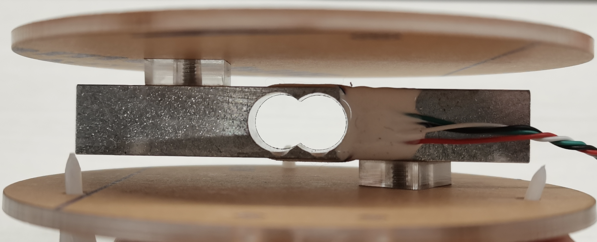
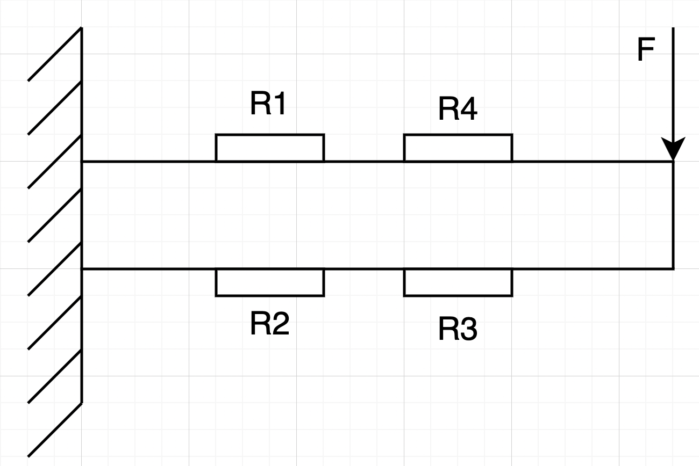
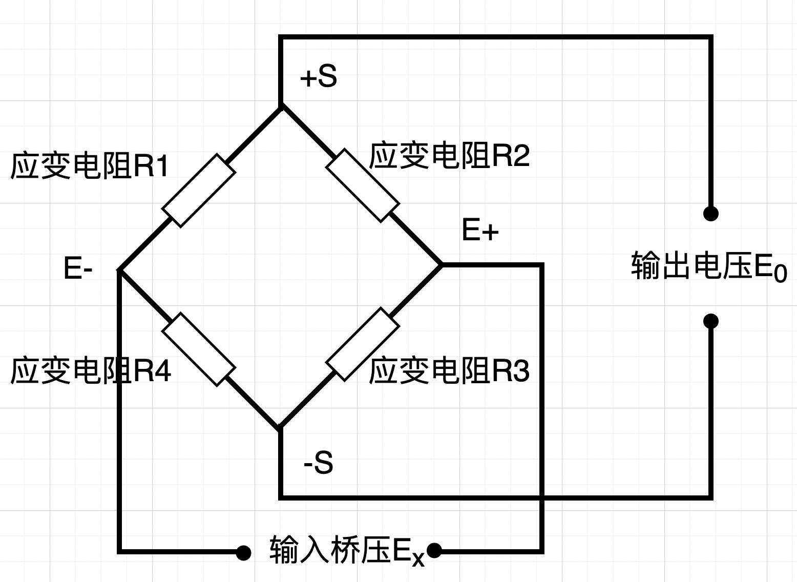
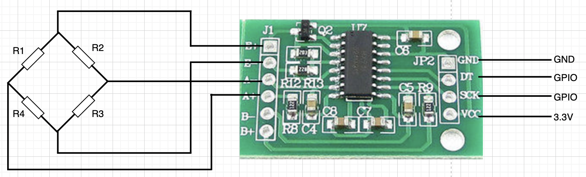

# 称重传感器

## 一、产品简介
下图是一款量程为5kg的称重传感器，采用悬臂梁方式安装。传感器主体结构是一个开孔金属条，金属条上下表面各贴有两个应变电阻，当金属条受力发生变形时时，应变电阻的阻值也会随之发生变化。电子秤的原理便是根据测量到的电阻变化前后电压差信号进而计算出重物的质量。
<div align="center">

</div>

引脚定义：
* VCC：接 3.3V
* DT：接 GPIO
* SCK：接 GPIO
* GND：接 GND

## 二、技术参数：
* 量程：0～5Kg
* 灵敏度：1.0 mv/v
* 精度：24位ADC采样精度

## 三、软件接口
HaaS Python驱动：[下载地址](https://github.com/alibaba/AliOS-Things/tree/master/haas_lib_bundles/python/libraries/ele_scale)
### EleScale(clkDev, dataDev, capValue) - 创建EleScale驱动对象
* 函数原型：
> scaleObj = EleScale(clkDev, dataDev, capValue)

* 参数说明：

|参数|类型|说明|
|-----|----|----|
|clkDev|GPIO|配置为输出引脚，调用此函数前需确保clkDev对象已经处于open状态|
|dataDev|GPIO|配置为输出引脚，调用此函数前需确保dataDev对象已经处于open状态|
|capValue|float|测量系数，理论值为$429.5$，测量值除以capValue的结果为被测物体的质量（克）。由于不同的传感器其特性曲线并非完全相同，因此在测量时可能会出现一定的偏差，建议在初次使用时使用标准砝码对电子秤做一次校准，如果测量值偏大则适当增大capValue，反之，如果测量值偏小就适当调小capValue，直到测量值与砝码重量直接的偏差在误差允许范围为止。|

* 返回值：
EleScale对象创建成功，返回EleScale对象；EleScale对象创建失败，抛出Exception

* 示例代码：

```python
from driver import GPIO
import ele_scale

clkDev = GPIO()
clkDev.open("hx711_clk")
dataDev = GPIO()
dataDev.open("hx711_data")

scaleObj = ele_scale.EleScale(clkDev, dataDev, 430.0)
print("ele_scale inited!")
```

* 输出：
```log
ele_scale inited!
```

### getWeight() - 获取被测物体重量

* 函数功能：
获取被测物体的重量（克）

* 函数原型：
> EleScale.getWeight()

* 参数说明：
无

* 返回值：

|返回值|类型|说明|
|-----|----|----|
|value|float|返回被测物体的重量，单位为克。|

* 示例：

```python
from driver import GPIO
import ele_scale
import utime

clkDev = GPIO()
clkDev.open("hx711_clk")
dataDev = GPIO()
dataDev.open("hx711_data")

scaleObj = ele_scale.EleScale(clkDev, dataDev, 430.0)
print("ele_scale Init!")
while True:
    weight = scaleObj.getWeight()
    print("%.2f g"%weight)
    utime.sleep(1)
```

* 输出：
```log
ele_scale Init!
0.04 g
0.00 g
0.00 g
```

## 四、接口案例
此使用实例在board.json中定义了HX711的data和clock对象。在Python脚本中周期性的获取被测物体质量并打印在日志中。

* 代码：
```python
# board.json配置：
{
  "name": "haasedu",
  "version": "1.0.0",
  "io": {
    "hx711_clk": {
      "type": "GPIO",
      "port": 2,
      "dir": "output",
      "pull": "pullup"
    },
    "hx711_data": {
      "type": "GPIO",
      "port": 3,
      "dir": "input",
      "pull": "pullup"
    }
  },
  "debugLevel": "ERROR",
  "repl": "disable"
}
```
```python
from driver import GPIO
import ele_scale
import utime

clkDev = GPIO()
clkDev.open("hx711_clk")
dataDev = GPIO()
dataDev.open("hx711_data")

scaleObj = ele_scale.EleScale(clkDev, dataDev, 430.0)
print("ele_scale Init!")
while True:
    weight = scaleObj.getWeight()
    print("%.2f g"%weight)
    utime.sleep(1)
```

* 输出：
```log
ele_scale Init!
0.04 g
0.00 g
0.00 g
```

## 五、工作原理
电子秤结构示意图如下：
<div align="center">

</div>
四个电阻组成一个惠斯通电桥，当空载时电桥处于一个平衡状态，即输出电压E0=输入电压Ex，当托盘上放有重物时力F>0，此时金属条会发生一定程度的形变，应变电阻R1～R4阻值发生变化，对应的输出电压E0与输出电压Ex之间就会有一个压差。
<div align="center">

</div>

此称重传感器采用24位高精度的A/D转换器芯片hx711，该芯片专为高精度电子称而设计，具有两路模拟通道输入，内部集成128倍增益可编程放大器，是一款理想的高精度测量模块。hx711模块接线图如下所示：
<div align="center">

</div>

被测物体重量计算公式：

$ m = \frac{ADC_{out} \times M}{128 \times 2^{24} \times 1mv/v} = \frac{1}{429.5} ADC_{out}$

其中：
* m为被测物体重量，单位g
* M为量程此处等于5000，单位g
* $ADC_{out}$为HX711输出的ADC采样数据
* 128表示HX711内部放大增益
* $ 2^{24}$表示24位ADC采样
* $1mv/v$表示电子秤灵敏度，即1kg重物可使测量电路上产生1mv的电压输出

**注：这里的429.5即为capValue参数**

## 参考文献及购买链接
* [1] [购买链接](https://item.taobao.com/item.htm?spm=a1z09.2.0.0.955f2e8dUr5LtB&id=575012000301&_u=qum8ulj3564)
