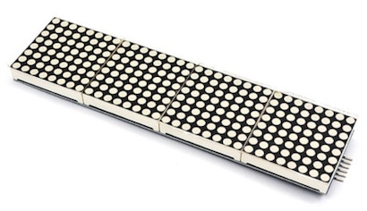
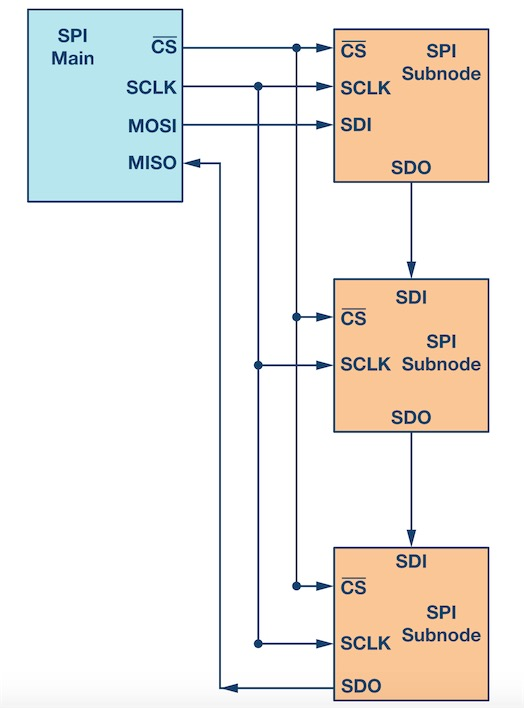

# LED-8 * 32点阵屏显示板 - gc7219

## 一、产品简介
LED-8 * 32点阵屏显示板由 4 块单色 8x8 共阴红色点阵单元组成，通过 SPI 菊花链模式将多块显示屏连接后可以组成更大的分辨率显示屏幕，任意组合分辨率。可用于简单仪表显示、LED显示屏、万年历、数字钟、温度计、计数器、电压表等显示使用。

<div align="center">

</div>

引脚定义：
* VCC：接电源正极（3.3-5V）
* GND：接电源负极
* DIN：SPI MOSI信号
* CS：SPI 片选信号
* CLK：SPI 时钟信号

## 二、技术参数
* 采用常规SPI通讯，支持 16 级亮度调节
* 支持命令模式和数据模式
* 支持 SPI 菊花链接模式，扩展多级 LED 屏幕
* 工作电压：2.4-5.5V
* 工作电流：低亮度30mA，高亮度300mA（5V电压时）
* 尺寸：15.2 x 3.8 厘米

## 三、软件接口

GC7219点阵屏HaaS Python驱动：[下载地址](https://github.com/alibaba/AliOS-Things/tree/master/haas_lib_bundles/python/libraries/gc7219)
<br>

### GC7219(DIN, CS) - 创建 GC7219 驱动对象
* 函数原型：
> drv = GC7219(DIN ,CS)

* 参数说明：

|参数|类型|必选参数？|说明|
|-----|----|:---:|----|
|DIN|SPI|是|调用此函数前需确保 DIN 对象已经处于 open 状态|
|CS|GPIO|是|调用此函数前需确保 CS 对象已经处于 open 状态|

* 返回值：
GC7219 对象成功，返回 GC7219 对象；GC7219 对象创建失败，抛出 Exception

* 示例代码：

```python
import utime   # 延时函数在utime库中
from driver import GPIO
import gc7219

# 初始化 SPI
spi = SPI()
ret = spi.open('SPI_DIN')  # 按照 board.json 中名为 "SPI_DIN" 的设备节点的配置参数
if ret != 0:
    raise Exception('open SPI failed')

# 初始化片选
cs = GPIO()
ret = cs.open('SPI_CS')  # 按照 board.json 中名为 "SPI_CS" 的设备节点的配置参数
if ret != 0:
    raise Exception('open GPIO failed')

# 创建 GC7219 驱动
drv = gc7219.GC7219(spi, cs)
print("GC7219 inited!")
```

* 输出：
```log
GC7219 inited!
```

### flush() - 将驱动的 bitmap 数据刷到 LED 点阵屏幕上

* 函数功能：
将 bitmap 切割成每块8x8 LED 点阵屏数据，并通过 SPI DIN 口将数据刷到 LED 点阵屏幕上

* 函数原型：
> drv.flush()

* 参数说明：
无

* 返回值：
无

* 示例：

```python
# 准备 bitmap 点阵屏数据
# 一共 32x8 宽高的 bitmap，设置第一块 0 0、第二块1 1、第三块2 2、第四块3 3点亮
drv.bitmap.setPixel(0, 0, True)
drv.bitmap.setPixel(8+1, 1, True)
drv.bitmap.setPixel(16+2, 2, True)
drv.bitmap.setPixel(24+3, 3, True)
# 将 bitmap 刷新到 LED 屏幕上
drv.flush()
print("drv.bitmap flush done")
```

* 输出：
```log
drv.bitmap flush done
```

## 四、接口案例
此使用实例在 board.json 中定义了名为 SPI_DIN 的 SPI 类型的对象，以及 SPI_CS 的 GPIO 类型对象。在 Python 脚本中准备好 32x8 点阵屏数据，并通过 flush 接口刷到 LED 点阵屏上。

* 代码：
```python
# board.json配置：
{
    "name": "board-name",
    "version": "1.0.0",
    "io": {
      "SPI_DIN": {
        "type": "SPI",
        "port": 3,
        "mode": "master",
        "freq": 2000000
      },
      "SPI_CS": {
        "type": "GPIO",
        "port": 25,
        "dir": "output",
        "pull": "pullup"
      }
    },
    "debugLevel": "ERROR",
    "repl": "disable"
}

```
```python
# Python代码
import utime   # 延时函数在utime库中
from driver import GPIO
import gc7219

# 初始化 SPI
spi = SPI()
ret = spi.open('SPI_DIN')  # 按照 board.json 中名为 "SPI_DIN" 的设备节点的配置参数
if ret != 0:
    raise Exception('open SPI failed')

# 初始化片选
cs = GPIO()
ret = cs.open('SPI_CS')  # 按照 board.json 中名为 "SPI_CS" 的设备节点的配置参数
if ret != 0:
    raise Exception('open GPIO failed')

# 创建 GC7219 驱动
drv = gc7219.GC7219(spi, cs)
# 一共 32x8 宽高的 bitmap，设置第一块 0 0、第二块1 1、第三块2 2、第四块3 3点亮
drv.bitmap.setPixel(0, 0, True)
drv.bitmap.setPixel(8+1, 1, True)
drv.bitmap.setPixel(16+2, 2, True)
drv.bitmap.setPixel(24+3, 3, True)
# 将 bitmap 刷新到 LED 屏幕上
drv.flush()
print("drv.bitmap flush done")
```

* 输出：
```python
...
drv.bitmap flush done
...

```

## 五、通信协议
主控芯片与LED点阵屏之间使用 SPI 通讯，多块8x8点阵屏使用菊花链模式链接，即通过 SPI 主从串联方式，将一组数据刷新到所有点阵屏上。

## 六、工作原理
LED 控制芯片采用 GC7219，内部拥有 8x8 RAM 存储 64 个 LED 的点亮状态。

MCU 与从设备传输数据时，首先将 CS 片选信号置为低电平，随后通过 MOSI 传输数据存储到从设备的移位寄存器中，当 CS 信号从低电平设置为高电平时，从设备在上升沿将数据锁存，数据生效。

<div align="center">

</div>

## 参考文献及购买链接
[1] [GC7219 Datasheet](http://www.gcore.com.cn/static/upload/file/20210422/1619083553753525.pdf)<br>
[2] [购买链接](https://detail.tmall.com/item.htm?id=560277354488)
