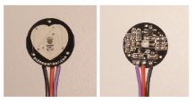
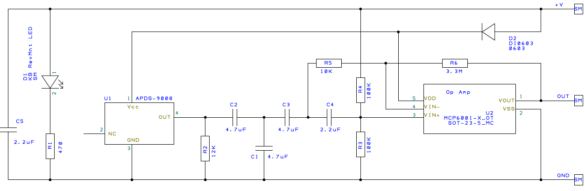

# 心率传感器 - MDL0025

## 一、产品简介
PulseSensor（MDL0025） 是一款用于脉搏心率测量的光电反射式模拟传感器。将其佩戴于手指或耳垂等处，通过导线连接可将采集到的模拟信号传输给HaaS开发版用来转换为数字信号，再通过开发板简单计算后就可以得到心率数值，此外还可将脉搏波形上传到电脑上显示波形。PulseSensor 是一款开源硬件，其适用于心率方面的科学研究和教学演示，也非常适合用于二次开发。

<div align="center">

</div>

引脚定义：
* +：接 3.3V/5V
* -：接 GND
* S：接 ADC

## 二、技术参数
* 工作电压：3.3 V 或 5V DC
* 电路板直径：16mm
* 电路板厚度：1.6mm（普通PCB 板厚度）
* LED 峰值波长：515nm
* 输出信号类型：模拟信号
* 输出信号大小：0～3.3V(3.3V电源) 0~5V(5V电源)

## 三、软件接口

MDL0025心率传感器 HaaS Python驱动：[下载地址](https://github.com/alibaba/AliOS-Things/tree/master/haas_lib_bundles/python/libraries/heartrate)
<br>

### class HEARTBEAT(adcdev[,rled=None,gled=None,bled=None,highBPM=150,lowBPM=100]) - 创建heartbeart驱动对象
* 函数原型：
> heartbeatdev = HEARTBEAT(adcdev=adcobj,rled=gpioobj01,gled=gpioobj02,bled=gpioobj03,highBPM=150,lowBPM=100)

* 参数说明：

|参数|类型|必选参数？|说明|
|-----|----|:---:|----|
|adcdev|ADC|是|调用此函数前需确保 adcdev 对象已经处于 open 状态|
|rled| GPIO|否|调用此函数前需确保 rled 对象已经处于 open 状态|
|gled| GPIO|否|调用此函数前需确保 gled 对象已经处于 open 状态|
|bled| GPIO|否|调用此函数前需确保 bled 对象已经处于 open 状态|
|highBPM| int|否| 心率报警上限 |
|lowBPM| int|否| 心率报警下限 |


* 返回值：
heartbeatdev 对象创建成功，返回 heartbeatdev 对象；heartbeatdev 对象创建失败，抛出 Exception

* 示例代码：

```python
from driver import ADC
from driver import GPIO
import heartbeat

BPM_high=150
BPM_low=100

#初始化ADC类型的设备
adcObj = ADC()
adcObj.open('heartbeat')      # 按照 board.json 中名为 "heartbeat" 的设备节点的配置参数

#初始化GPIO类型的设备
redled = GPIO()
blueled = GPIO()
greenled = GPIO()

redled.open('led_r')          # board.json中led_r节点定义的GPIO，对应esp32外接的的红灯
blueled.open('led_b')         # board.json中led_b节点定义的GPIO，对应esp32外接的上的蓝灯
greenled.open('led_g')        # board.json中led_g节点定义的GPIO，对应esp32外接的上的绿灯

heartbeatdev = HEARTBEAT(adcdev = adcobj, rled=redled, bled=blueled, gled=greenled, highBPM=BPM_high, lowBPM=BPM_low)
print("heartbeat inited!")
```

* 输出：
```log
heartbeat inited!
```

### start - 开始测量心率

* 函数功能：
启动心率传感器开始测量心率

* 函数原型：
> heartbeatdev.start()

* 参数说明：
无

* 返回值
无

* 示例：

```python

from driver import ADC
from driver import GPIO
import heartbeat

BPM_high=150
BPM_low=100

#初始化ADC类型的设备
adcObj = ADC()
adcObj.open('heartbeat')      # 按照 board.json 中名为 "heartbeat" 的设备节点的配置参数

#初始化GPIO类型的设备
redled = GPIO()
blueled = GPIO()
greenled = GPIO()

redled.open('led_r')          # board.json中led_r节点定义的GPIO，对应esp32外接的的红灯
blueled.open('led_b')         # board.json中led_b节点定义的GPIO，对应esp32外接的上的蓝灯
greenled.open('led_g')        # board.json中led_g节点定义的GPIO，对应esp32外接的上的绿灯

heartbeatdev = HEARTBEAT(adcdev = adcobj, rled=redled, bled=blueled, gled=greenled, highBPM=BPM_high, lowBPM=BPM_low)

heartbeatdev.start()

```

* 输出：
```log
无
```


### stop - 停止测量心率

* 函数功能：
停止心率传感器测量心率

* 函数原型：
> heartbeatdev.stop()

* 参数说明：
无

* 返回值
无

* 示例：

```python

from driver import ADC
from driver import GPIO
import heartbeat

BPM_high=150
BPM_low=100

#初始化ADC类型的设备
adcObj = ADC()
adcObj.open('heartbeat')      # 按照 board.json 中名为 "heartbeat" 的设备节点的配置参数

#初始化GPIO类型的设备
redled = GPIO()
blueled = GPIO()
greenled = GPIO()

redled.open('led_r')          # board.json中led_r节点定义的GPIO，对应esp32外接的的红灯
blueled.open('led_b')         # board.json中led_b节点定义的GPIO，对应esp32外接的上的蓝灯
greenled.open('led_g')        # board.json中led_g节点定义的GPIO，对应esp32外接的上的绿灯

heartbeatdev = HEARTBEAT(adcdev = adcobj, rled=redled, bled=blueled, gled=greenled, highBPM=BPM_high, lowBPM=BPM_low)

heartbeatdev.stop()

```

* 输出：
```log
无
```

### getBPM() - 测量心率

* 函数功能：
返回测量的心率值

* 函数原型：
> heartbeatdev.getBPM()

* 参数说明：
无

* 返回值：
返回测量的心率值，单位：次数每分钟（BPM）

* 示例：

```python
from driver import ADC
from driver import GPIO
import heartbeat

BPM_high=150
BPM_low=100

#初始化ADC类型的设备
adcObj = ADC()
adcObj.open('heartbeat')      # 按照 board.json 中名为 "heartbeat" 的设备节点的配置参数

#初始化GPIO类型的设备
redled = GPIO()
blueled = GPIO()
greenled = GPIO()

redled.open('led_r')          # board.json中led_r节点定义的GPIO，对应esp32外接的的红灯
blueled.open('led_b')         # board.json中led_b节点定义的GPIO，对应esp32外接的上的蓝灯
greenled.open('led_g')        # board.json中led_g节点定义的GPIO，对应esp32外接的上的绿灯

heartbeatdev = HEARTBEAT(adcdev = adcobj, rled=redled, bled=blueled, gled=greenled, highBPM=BPM_high, lowBPM=BPM_low)
heartbeatdev.start()

heartrate=heartbeatdev.getBPM()
print("heartrate is ", heartrate, "BPM")

```

* 输出：
```log
heartrate is 80 BPM
```


## 四、接口案例
此使用实例在 board.json 中定义了名为 heartbeat 的 ADC 类型的对象。名为led_b, led_g, led_r的GPIO对象。
在 Python 脚本中周期性的检查当前噪音值结果并打印在日志中。

注： leb_b, led_g, led_r 分别对应蓝色，绿色，红色三色LED灯，如果这三个LED灯设备存在并且在心率传感器驱动初始化时作为参数传入，则心率传感器驱动会根据心率值让不同颜色的LED灯闪烁：心率值大于上限值时，红灯按实测心率为频率闪烁； 心率在上限和下限之间时，绿灯按照实测心率为频率闪烁；心率低于下限值时，蓝灯按实测心率为频率闪烁。

* 代码：
```python
# board.json配置：{
    "name": "haasedu",
    "version": "1.0.0",
    "io": {

      "led_b": {
        "type": "GPIO",
        "port": 19,
        "dir": "output",
        "pull": "pullup"
      },

      "led_g": {
        "type": "GPIO",
        "port": 18,
        "dir": "output",
        "pull": "pullup"
      },

      "led_r": {
        "type": "GPIO",
        "port": 17,
        "dir": "output",
        "pull": "pullup"
      },

      "heartbeat": {
        "type": "ADC",
        "port": 0,
        "sampling": 12000000,
        "atten": 3,
        "width": 3
      }
    },
    "debugLevel": "ERROR",
    "repl": "disable"
  }

```
```python
# Python代码
import utime
from driver import ADC                           # ADC类，通过微处理器的ADC模块读取ADC通道输入电压
from driver import GPIO

BPM_high=150
BPM_low=100
redled = GPIO()
blueled = GPIO()
greenled = GPIO()

redled.open('led_r')          # board.json中led_r节点定义的GPIO，对应esp32外接的的红灯
blueled.open('led_b')         # board.json中led_b节点定义的GPIO，对应esp32外接的上的蓝灯
greenled.open('led_g')        # board.json中led_g节点定义的GPIO，对应esp32外接的上的绿灯

adcobj = ADC()
adcobj.open("heartbeat")

heartbeatdev = HEARTBEAT(adcdev = adcobj, rled=redled, bled=blueled, gled=greenled, highBPM=BPM_high, lowBPM=BPM_low)
heartbeatdev.start()
for i in range(100):
    print ("heart rate is: ", heartbeatdev.BPM)
    utime.sleep(0.5)
heartbeatdev.stop()
```

* 输出：
```python
...
heart rate is:  80
heart rate is:  88
heart rate is:  99
heart rate is:  100
...

```

## 五、通信协议
主控芯片和心率测量传感器之间通信为 ADC 通讯，获取电压值 mV

## 六、工作原理
如下图所示，传感器利用人体组织在血管搏动时造成透光率不同，将透光率转化为电信号来进行脉搏测量的。

光的透光率发生改变，此时光感受器接收经人体组织反射光线，转变为电信号并将其放大输出。

<div align="center">

</div>

传感器电路原理图如下：

<div align="center">

</div>

## 参考文献及购买链接
* [购买链接](https://item.taobao.com/item.htm?id=35657755876)
