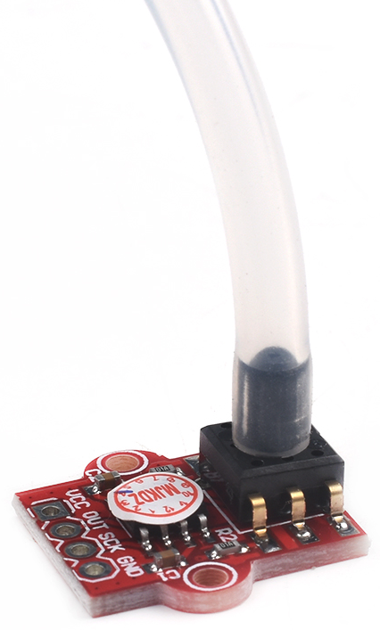

# 24位A/D转换器-HX710

## 一、产品简介
HX710是一款专为高精度电子秤而设计的24位A/D转换器芯片。该芯片具有集成度高、响应速度快、抗干扰性强等优点。除了可以设计电子秤，也可以用作气压和水压的测量开发。

<div align="center">

</div>

引脚定义：
* VCC：接 3.3V <br>
* OUT：接 GPIO <br>
* SCK：接 GPIO <br>
* GND：接 GND <br>

## 二、技术参数
* 工作电压：3.3V-5V DC <br>
* 压力：0-40KPa（目前不支持压力换算）<br>
* 精度：24位 <br>
* 规格尺寸：19mm * 18mm <br>

## 三、软件接口
24位A/D转换器的HaaS Python驱动：[下载地址](https://github.com/alibaba/AliOS-Things/tree/master/haas_lib_bundles/python/libraries/hx710)
### HX710(clkObj,dataObj) - 创建HX710驱动对象
* 函数原型：
> hx710Obj = HX710(clkObj,dataObj)

* 参数说明：

|参数|类型|说明|
|-----|----|----|
|clkObj|GPIO|GPIO配置输出，触发引脚，调用此函数前需确保clkObj对象已经处于open状态|
|dataObj|GPIO|GPIO配置输出，触发引脚，调用此函数前需确保dataObj对象已经处于open状态|


* 返回值：
HX710对象创建成功，返回HX710对象；HX710对象创建失败，抛出Exception

* 示例代码：

```python
from driver import GPIO
import hx710

clkObj = GPIO()
clkObj.open("hx710_clk")

dataObj = GPIO()
dataObj.open("hx710_data")

hx710Obj = hx710.HX710(clkObj, dataObj)
print("hx710 inited!")
```

* 输出：
```log
hx710 inited!
```

### getValue() - 获取HX710的ADC转换数值

* 函数功能：
获取HX710的ADC转换数值

* 函数原型：
> HX710.getValue()

* 参数说明：
无

* 返回值：

|返回值|类型|说明|
|-----|----|----|
|value|整型|返回HX710的ADC转换数值。|

* 示例：

```python
from driver import GPIO
import hx710
import utime

clkObj = GPIO()
clkObj.open("hx710_clk")

dataObj = GPIO()
dataObj.open("hx710_data")

hx710Obj = hx710.HX710(clkObj, dataObj)
print("hx710 Init!")
while True:
    value = hx710Obj.getValue()
    print(value)
    utime.sleep(1)
```

* 输出：
```log
hx710 Init!
8388607
13711882
13711895
13711945
```

## 四、接口案例
此使用实例在board.json中定义了名为HX710的data和clock对象。在Python脚本中周期性的获取HX710的ADC转换数值并打印在日志中。

* 代码：
```python
# board.json配置：
{
    "name": "board-name",
    "version": "1.0.0",
    "io": {
      "hx710_clk": {
        "type": "GPIO",
        "port": 14,
        "dir": "output",
        "pull": "pullup"
      },
      "hx710_data": {
        "type": "GPIO",
        "port": 12,
        "dir": "input",
        "pull": "pullup"
      }
    },
    "debugLevel": "ERROR",
    "repl": "disable"
}

```
```python
# Python代码
from driver import GPIO
import hx710
import utime

clkObj = GPIO()
clkObj.open("hx710_clk")

dataObj = GPIO()
dataObj.open("hx710_data")

hx710Obj = hx710.HX710(clkObj, dataObj)
print("hx710 Init!")
while True:
    value = hx710Obj.getValue()
    print(value)
    utime.sleep(1)
```

* 输出：
```log
hx710 Init!
8388607
13711882
13711895
13711945
```

## 参考文献及购买链接
* [1] [购买链接](https://detail.tmall.com/item.htm?spm=a1z10.3-b-s.w4011-23941273512.41.70cf6dcbBal5tB&id=627540143212&rn=6c17e68fa2c732f8b564f08bc0edb6e3&abbucket=15)
