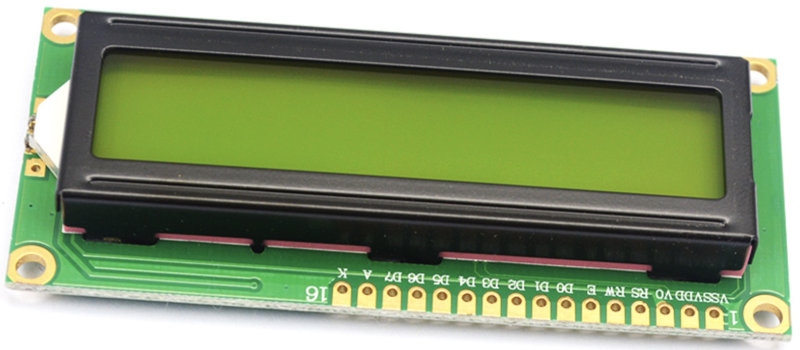
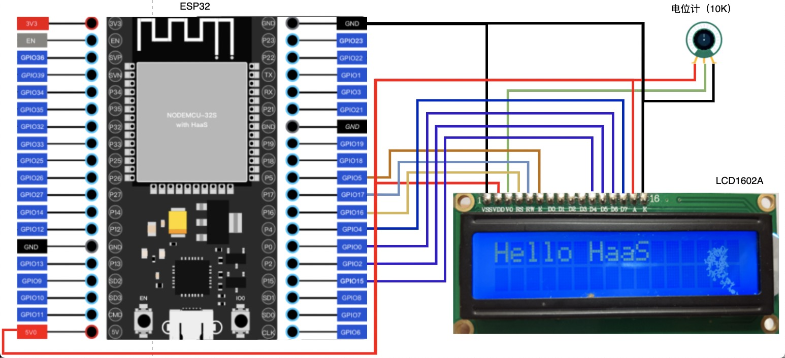
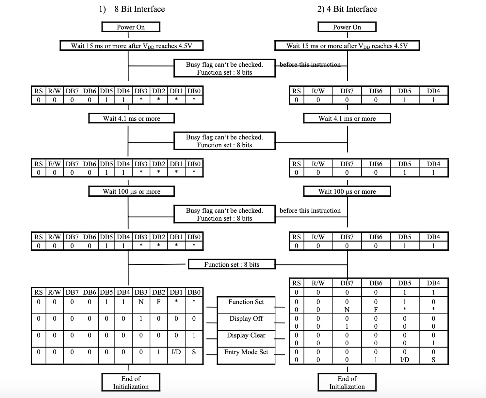
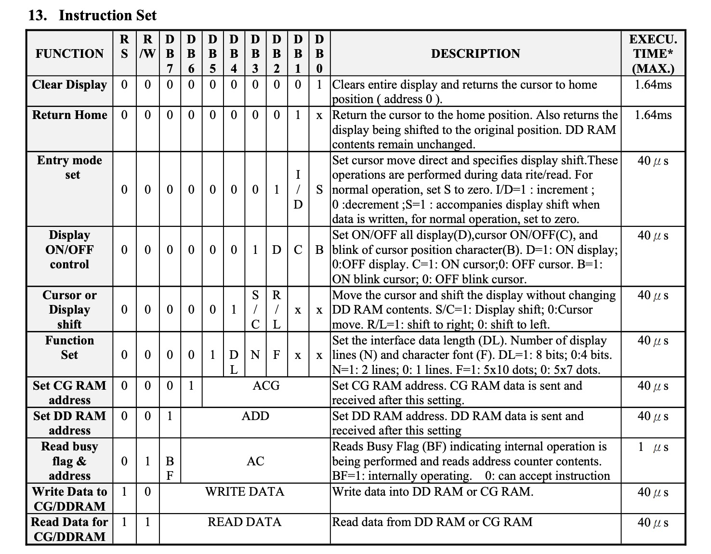
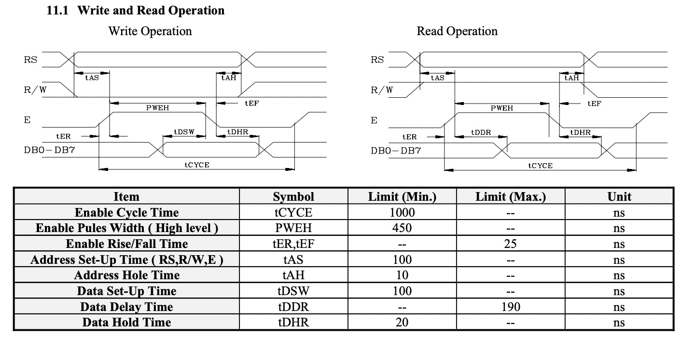

# LCD1602液晶屏 - LCD1602

## 一、产品简介
LCD1602 字符型液晶显示模块是专门用于显示字母、数字、符号等的点阵型液晶显示模块。分4位和8位数据传输方式。提供5x7点阵+游标的显示模式。提供显示数据缓冲区 DDRAM、字符发生器CGROM和字符发生器CGRAM，可以使用CGRAM来存储自己定义的最多8个5x8点阵的图形字符的字模数据。提供了丰富的指令设置：清显示；游标回原点；显示开/关；游标开/关；显示字符闪烁；游标移位；显示移位等。提供内部上电自动复位电路，当外加电源电压超过+4.5V时，自动对模块进行初始化操作，将模块设置为默认的显示工作状态。
<div align="center">

</div>

引脚定义：
* VSS：电源地
* VDD：电源+5V
* VO：液晶显示偏压，接电位计VO
* RS：数据/命令选择
* RW：读/写选择
* E：使能信号，用于数据传输
* D0-D3：数据，暂未用
* D4-D7：数据，接入 GPIO
* A：背光源正极，接电源+5V
* S：背光源负极，接电源地

接线示意图：
<div align="center">

</div>

## 二、技术参数
* 显示容量：16×2个字符
* 芯片工作电压：4.5—5.5V
* 工作电流：2.0mA（5.0V）
* 模块最佳工作电压：5.0V
* 字符尺寸：2.95×4.35（W×H）mm

## 三、软件接口

### LCD1602(...) - 创建 LCD1602 驱动对象
* 函数原型：
> drv = LCD1602(RS, RW, E, D4, D5, D6, D7)

* 参数说明：

|参数|类型|必选参数？|说明|
|-----|----|:---:|----|
|RS|GPIO|是|调用此函数前需确保 GPIO 对象已经处于 open 状态|
|RW|GPIO|是|调用此函数前需确保 GPIO 对象已经处于 open 状态|
|E|GPIO|是|调用此函数前需确保 GPIO 对象已经处于 open 状态|
|D4|GPIO|是|调用此函数前需确保 GPIO 对象已经处于 open 状态|
|D5|GPIO|是|调用此函数前需确保 GPIO 对象已经处于 open 状态|
|D6|GPIO|是|调用此函数前需确保 GPIO 对象已经处于 open 状态|
|D7|GPIO|是|调用此函数前需确保 GPIO 对象已经处于 open 状态|

* 返回值：
LCD1602 对象成功，返回 LCD1602 对象；LCD1602 对象创建失败，抛出 Exception

* 示例代码：

```python
import utime   # 延时函数在utime库中
from driver import GPIO
import lcd1602

# 初始化 LCD 的各个 GPIO 管脚
print('GPIO init begin')
# 按照 board.json 中名为 "RS" 的设备节点的配置参数，如下以此类推
RS = GPIO(); RS.open('RS')
RW = GPIO(); RW.open('RW')
E = GPIO(); E.open('E')
D4 = GPIO(); D4.open('D4')
D5 = GPIO(); D5.open('D5')
D6 = GPIO(); D6.open('D6')
D7 = GPIO(); D7.open('D7')
print('GPIO init done')

drv = LCD1602(RS, RW, E, D4, D5, D6, D7)
print('LCD inited!')
```

* 输出：
```log
GPIO init begin
GPIO init done
noise inited!
```

### displayString(row, col, text) - 向 LCD 屏幕指定行列打印字符

* 函数功能：
先设置光标到指定行列偏移位置，然后打印字符，其中行列偏移为字符偏移而非点阵偏移，共2行16列

* 函数原型：
> drv.displayString(1, 0, 'Hello')

* 参数说明：
    * row 表示行偏移，范围是 0-1 表示 行1-行2
    * col 表示列偏移，范围是 0-15 表示 列1-列16
    * text 待打印的字符串

* 返回值：
成功打印的字符数量

* 示例：

```python
# 在第二行，第一列打印字符 Hello
drv.displayString(1, 0, 'Hello')
print('LCD printed')
```

* 输出：
```log
LCD printed
```

## 四、接口案例
此使用实例在 board.json 中定义了名为 RS, RW, E, D4, D5, D6, D7 的 GPIO 类型的对象。在 Python 脚本中初始化这些 GPIO 管脚并创建 LCD1602 驱动后，通过驱动控制屏幕初始化以及打印字符

* 代码：
```python
# board.json配置：
{
    "name": "board-name",
    "version": "1.0.0",
    "io": {
      "RS": { "type": "GPIO", "port": 16, "dir": "output", "pull": "pullup" },
      "RW": { "type": "GPIO", "port": 17, "dir": "output", "pull": "pullup" },
      "E": { "type": "GPIO", "port": 5, "dir": "output", "pull": "pullup" },

      "D4": { "type": "GPIO", "port": 15, "dir": "output", "pull": "pullup" },
      "D5": { "type": "GPIO", "port": 2, "dir": "output", "pull": "pullup" },
      "D6": { "type": "GPIO", "port": 0, "dir": "output", "pull": "pullup" },
      "D7": { "type": "GPIO", "port": 4, "dir": "output", "pull": "pullup" }
    },
    "debugLevel": "ERROR",
    "repl": "disable"
}

```
```python
# Python代码
import utime   # 延时函数在utime库中
from driver import GPIO
import lcd1602

if __name__ == '__main__':
    # 初始化 LCD 的各个 GPIO 管脚
    print('GPIO init begin')
    # 按照 board.json 中名为 "RS" 的设备节点的配置参数，如下以此类推
    RS = GPIO(); RS.open('RS')
    RW = GPIO(); RW.open('RW')
    E = GPIO(); E.open('E')
    D4 = GPIO(); D4.open('D4')
    D5 = GPIO(); D5.open('D5')
    D6 = GPIO(); D6.open('D6')
    D7 = GPIO(); D7.open('D7')
    print('GPIO init done')

    drv = LCD1602(RS, RW, E, D4, D5, D6, D7)
    print('LCD inited!')
    drv.displayString(0, 0, 'Hello world')
    print('LCD printed')
```

* 输出：
```python
...
GPIO init begin
GPIO init done
LCD inited!
LCD printed
...

```

## 五、通信协议
主控芯片和 LCD1602 控制器之间通信为 GPIO 通讯，分为初始化阶段以及指令通讯阶段。
* 初始化阶段
    * 通过三次发送 0x03，向 LCD 控制器发起初始化请求，每次间隔不同；
    * 初始化后立即设置数据/命令传输模式为 4bits 模式；
    * 然后进行功能、显示模式、打印项模式的设置，均为指令通讯方式；

<div align="center">

</div>

* 指令通讯阶段
    * 通过 RS=0，选择 LCD 控制器的指令寄存器，随后通过D4-D7发送指令内容，可实现：清显示；游标回原点；显示开/关；游标开/关；显示字符闪烁；游标移位；显示移位等。
    * 通过 RS=1，选择 LCD 控制器的数据寄存器，随后通过D4-D7发送数据内容，可实现向 LCD 屏幕打印字符的功能；

<div align="center">

</div>

* 4线传输机制
    * 指令和数据每次传输均为 8bits，因此分为两次传输，每次传输4bits
    * 传输时序：
        * RS=0/1 先稳定寄存器显示选择
        * 因为目前我们仅用到写，因此 RW=0 同时保持拉低
        * 随即准备数据到 D4-D7 管脚，准备通知 LCD 读取
        * 控制 E 管脚产生下降沿，其中高电平保持需要>450ns
        * 因为 LCD 控制器获得下降沿时需要读取数据并执行指令，因此再保持一个命令执行的时间稳定，时间为 40us

<div align="center">

</div>

## 六、工作原理
从如下实物图可以看到液晶显示屏，并从 LCD 控制器引出 16 个管脚用于控制指令/数据输入，通过 GPIO 控制。
* VSS 为地电源
* VDD 接5V正电源
* VO 为液晶显示器对比度调整端，接正电源时对比度最弱，接地时对比度最高，对比度过高时会产生“鬼影”现象，使用时可以通过一个10k欧姆的电位器调整其对比度。
* RS 为寄存器选择脚，高电平时选择数据寄存器、低电平时选择指令寄存器。
* RW 为读/写信号线，高电平时进行读操作，低电平时进行写操作。当RS和RW共同为低电平时可以写入指令或显示地址；当RS为低电平，RW为高电平时，可以读忙信号；当RS为高电平，RW为低电平时，可以写入数据。
* E 端为使能端，当E端由高电平跳变为低电平时，液晶模块读取 D0-D7 数据执行命令。
* D0-D7 为8位双向数据线。
* A 背光源正极。
* K 背光源负极。

<div align="center">

</div>

## 参考文献及购买链接
[1] [DOT MATRIX LIQUID CRYSTAL DISPLAY MODULE](http://hades.mech.northwestern.edu/images/f/f7/LCD16x2_HJ1602A.pdf)
[2] [LCD1602系列](https://www.waveshare.com/datasheet/LCD_en_PDF/LCD1602.pdf)<br>
[3] [商品链接]()
