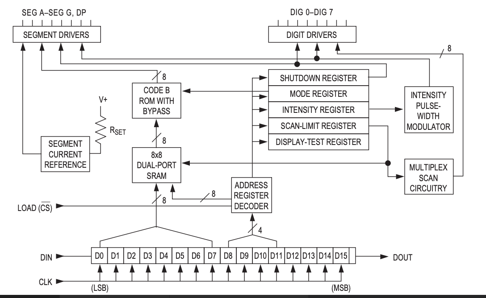
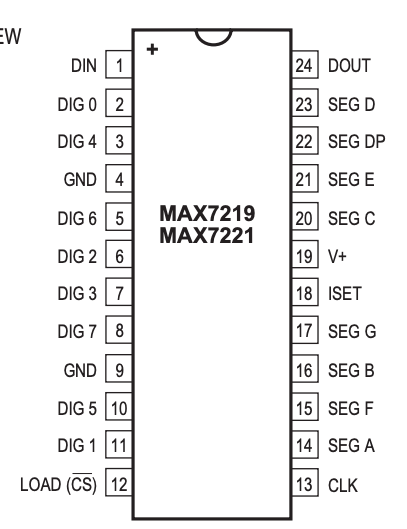

# 数码管点阵屏驱动芯片 - MAX7219

## 一、产品简介
MAX7219是MAXIM出品的专门驱动7-段数码管、点阵屏的一款芯片，它内置有BCD code-B 译码器、多路扫描电路、段和点阵驱动电路、以及一个8x8的静态ram来存储输出数字，主要用于工业数码屏、点阵屏的显示场景。
* 数码管
<div align="center">

</div>

* 点阵屏
<div align="center">

</div>

### 引脚定义
* VCC: 5V
* CLK: host GPIO
* CS:  host GPIO
* DIN: host GPIO
* GND: GND

## 二、技术参数
* 温度范围:0摄氏度 - +70摄氏度
* 扫描范围:1-8 数码管

## 三、软件接口

MAX7219数码管点阵屏HaaS Python驱动：[下载地址](https://github.com/alibaba/AliOS-Things/tree/master/haas_lib_bundles/python/libraries/max7219)
<br>

### MAX7219(clk, cs, din) - 创建MAX7219驱动对象
* 函数原型:
> displayDev = MAX7219(clk, cs, din)

* 参数说明:

|参数|类型|必选参数？|说明|
|-----|----|:---:|----|
|clk|GPIO|是|调用此函数前需确保clk对象已经处于open状态|
|cs|GPIO|是|调用此函数前需确保cs对象已经处于open状态|
|din|GPIO|是|调用此函数前需确保din对象已经处于open状态|
* 返回值:
MAX7219对象成功，返回MAX7219对象；MAX7219对象创建失败，抛出Exception

* 示例代码:

```python
from driver import GPIO               # 驱动库
from max7219 import *                        # MAX7219驱动库

clk = GPIO()
clk.open("max7219_clk")
cs = GPIO()
cs.open("max7219_cs")
din = GPIO()
din.open("max7219_din")

displayDev = MAX7219(clk, clk, din)
```

* 输出:
无

### outSegmentDigit - 输出数码管数字

* 函数功能:
输出数码管数字

* 函数原型:
> MAX7219.outSegmentDigit(position, digit)

* 参数说明:
position: 数码管的位置，从0开始
digit: 数字，0x0-0xf
* 返回值:
无

### outMatrixChar - 输出点阵屏字符

* 函数功能:
输出数码管数字

* 函数原型:
> MAX7219.outMatrixChar(charactor)

* 参数说明:
charactor: 要输出的字符，支持0-9，A-Z
* 返回值:
无

### initSegmentLed - 初始化数码管

* 函数功能:
初始化数码管

* 函数原型:
> MAX7219.initSegmentLed()

* 参数说明:
无
* 返回值:
无

### initMatrixLed - 初始化点阵屏

* 函数功能:
初始化点阵屏

* 函数原型:
> MAX7219.initMatrixLed()

* 参数说明:
无
* 返回值:
无
### 示例:

```python
clk = GPIO()
clk.open("max7219_clk")
cs = GPIO()
cs.open("max7219_cs")
din = GPIO()
din.open("max7219_din")

displayDev = MAX7219(clk, cs, din)

displayDev.initSegmentLed()

displayDev.outSegmentDigit(0, 8)
displayDev.outSegmentDigit(1, 7)
displayDev.outSegmentDigit(2, 6)
displayDev.outSegmentDigit(3, 5)
displayDev.outSegmentDigit(4, 4)
displayDev.outSegmentDigit(5, 3)
displayDev.outSegmentDigit(6, 2)
displayDev.outSegmentDigit(7, 1)
```
* 输出:
无

## 四、接口案例
此使用实例在board.json中定义了名为max5219的GPIO类型的对象。在数码管中输出12345678这个数字。

* 代码：
```json
# board.json配置：
{
    "name": "board-name",
    "version": "1.0.0",
    "io": {
      "max7219_clk": {
        "type": "GPIO",
        "port": 19,
        "dir": "output",
        "pull": "pullup"
      },

      "max7219_cs": {
        "type": "GPIO",
        "port": 27,
        "dir": "output",
        "pull": "pullup"
      },

      "max7219_din": {
        "type": "GPIO",
        "port": 0,
        "dir": "output",
        "pull": "pullup"
      }
    },
    "debugLevel": "ERROR",
    "repl": "disable"
}

```
```python
clk = GPIO()
clk.open("max7219_clk")
cs = GPIO()
cs.open("max7219_cs")
din = GPIO()
din.open("max7219_din")

displayDev = MAX7219(clk, cs, din)

displayDev.initSegmentLed()

displayDev.outSegmentDigit(0, 8)
displayDev.outSegmentDigit(1, 7)
displayDev.outSegmentDigit(2, 6)
displayDev.outSegmentDigit(3, 5)
displayDev.outSegmentDigit(4, 4)
displayDev.outSegmentDigit(5, 3)
displayDev.outSegmentDigit(6, 2)
displayDev.outSegmentDigit(7, 1)
clk.close()
cs.close()
din.close()
del displayDev
```

* 输出：无

<br>

## 五、通信协议
主控芯片和MAX5219之间通信所用命令字如下表所示：
|序号|功能说明|命令字宏定义|
|:-:|:-|:-|
|1|CS pin输出低电平|CMD_WRITE_CS_LOW|
|2|CLK pin输出低电平|CMD_WRITE_CLK_LOW|
|3|DIN 输出数据bit8|CMD_WRITE_DATA_BIT8|
|4|CLK pin输出高电平|CMD_WRITE_CLK_HIGH|
|5|CLK pin输出低电平|CMD_WRITE_CLK_LOW|
|6|DIN 输出数据bit7|CMD_WRITE_DATA_BIT7|
|7|CLK pin输出高电平|CMD_WRITE_CLK_HIGH|
|...|...|...|
|23|CLK pin输出低电平|CMD_WRITE_CLK_LOW|
|24|DIN 输出数据bit1|CMD_WRITE_DATA_BIT1|
|25|CLK pin输出高电平|CMD_WRITE_CLK_HIGH|
|1|CS pin输出高电平|CMD_WRITE_CS_HIGH|
</br>

输出数字流程
```python
按照主控芯片和MAX7219的通信协议控制CLK、CS和DIN，即可在数码管上显示出对应数字。
```

## 六、工作原理
从如下方框图可以看到 MAX7219 内部集成了数码管段驱动电路、多路扫描电路、8x8 静态ram等。
<div align="center">

</div>

引脚分布如下，DIG0-DIG7一般数码管的段，是输出管脚，CLK，CS，DIN是输入管脚。

<div align="center">

</div>

## 参考文献及购买链接
[1] [MAX7219数码管驱动芯片](https://datasheets.maximintegrated.com/en/ds/MAX7219-MAX7221.pdf)

