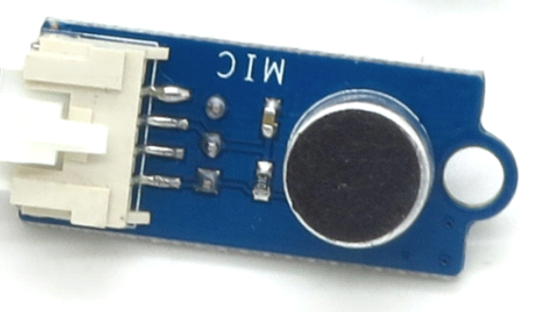
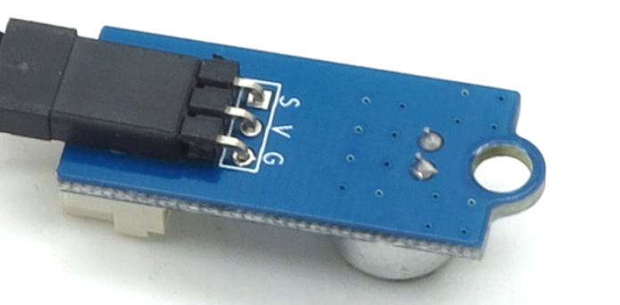
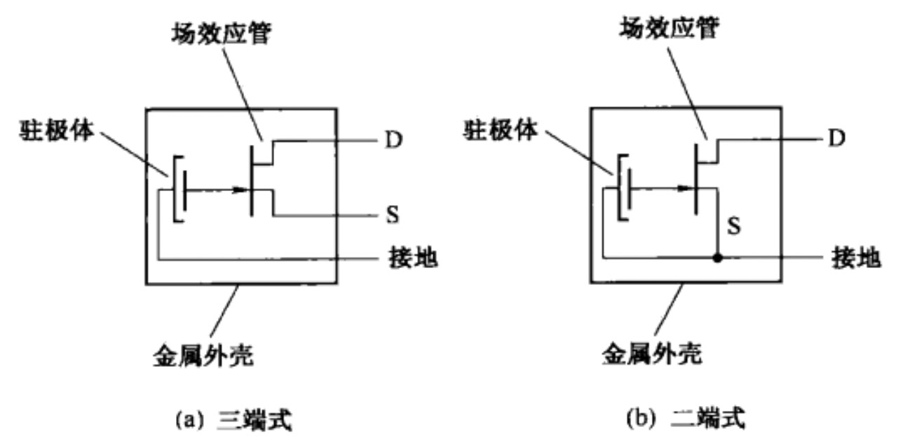
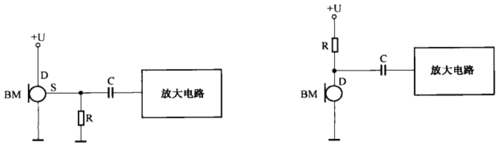

# 麦克风噪音测量传感器 - Noise

## 一、产品简介
麦克风噪音测量传感器，通过单片机对信号的简单处理，可实环境音检测、声控开关这样的有趣实验。传感器模块仅占用一个IO口，通过电压强度（mV）来判断音量大小。注：该模块仅能测量到音量变化，无法判断音色、音频。

<div align="center">

</div>

引脚定义：
* V：接 3.3V/5V
* G：接 GND
* S：接 ADC

## 二、技术参数
* 工作电压：5V DC
* 操作电压：5V DC
* 规格尺寸：33.0mm * 14.0mm * 1.6mm
* 小工作电压：4.5V DC
* 大工作电压：5.5V DC
* 工作电流：260 ｕA
* 频率范围：100 - 10000Hz
* 灵敏度：-50dB
* 兼容接口：2.54 间距的三针接口和 Grove 的四针接口

## 三、软件接口

### Noise(adcObj) - 创建 Noise 驱动对象
* 函数原型：
> drv = Noise(adcObj)

* 参数说明：

|参数|类型|必选参数？|说明|
|-----|----|:---:|----|
|adcObj|ADC|是|调用此函数前需确保 adcObj 对象已经处于 open 状态|

* 返回值：
Noise 对象成功，返回 Noise 对象；Noise 对象创建失败，抛出 Exception

* 示例代码：

```python
import utime   # 延时函数在utime库中
from driver import ADC
import noise

# 初始化 ADC 类型的设备
adcObj = ADC()
adcObj.open('noise_adc')   # 按照 board.json 中名为 "noise_adc" 的设备节点的配置参数
print("noise inited!")
drv = noise.Noise(adcObj)
```

* 输出：
```log
noise inited!
```

### getVoltage - 获取当前噪音对应的电压值，单位 mV

* 函数功能：
通过 ADC 控制器获取传感器电压值 mV 并返回

* 函数原型：
> drv.getVoltage()

* 参数说明：
无

* 返回值
voltage（数据类型：整型；单位：mv）

* 示例：

```python
voltage = drv.getVoltage()
print("voltage is", voltage, "mV")
```

* 输出：
```log
voltage is 1014 mV
```

### checkNoise(voltage, threshold) - 检查噪音值是否超过阈值

* 函数功能：
通过 ADC 控制器获取传感器电压值 mV，通过与一段时间的平滑均值作比较，判断当前值是否超过阈值（默认400），并返回 changed, voltage

* 函数原型：
> drv.checkNoise(voltage, 400)

* 参数说明：
无

* 返回值：
changed（数据类型：布尔值）

* 示例：

```python
voltage = drv.getVoltage()
changed = drv.checkNoise(voltage, 400)
if changed:
    print("volume changed, voltage is", voltage, "mV")
else:
    print('volume not changed, voltage is', voltage, 'mV')
```

* 输出：
```log
volume not changed, voltage is 1014 mV
```


## 四、接口案例
此使用实例在 board.json 中定义了名为 noise_adc 的 ADC 类型的对象。在 Python 脚本中周期性的检查当前噪音值结果并打印在日志中。

* 代码：
```python
# board.json配置：
{
    "name": "board-name",
    "version": "1.0.0",
    "io": {
      "noise_adc": {
        "type": "ADC",
        "port": 6,
        "sampling": 12000000,
        "atten": 3,
        "width": 3
      }
    },
    "debugLevel": "ERROR",
    "repl": "disable"
}

```
```python
# Python代码
import utime   # 延时函数在utime库中
from driver import ADC
import noise

if __name__ == '__main__':
    # 初始化 ADC 设备
    adcObj = ADC()
    # 按照 board.json 中名为 "noise_adc" 的设备节点的配置参数，初始化 ADC 类型设备对象
    ret = adcObj.open('noise_adc')
    if ret != 0:
        raise Exception('open device failed %s' % ret)

    # 初始化 Noise 传感器
    drv = noise.Noise(adcObj)

    print('watch, doing...')
    while True:      # 无限循环
        voltage = drv.getVoltage()  # 获取当前噪音值 mV
        changed = drv.checkNoise(voltage, 400)  # 检查噪音值是否有变化，阈值为400mV（默认）
        if changed:
            print('got change %s' % voltage)
        utime.sleep_ms(30)

    adcObj.close()  # 关闭 ADC 设备
```

* 输出：
```python
...
got change 1963
got change 1010
got change 1675
got change 2138
...

```

## 五、通信协议
主控芯片和噪音测量传感器之间通信为 ADC 通讯，获取电压值 mV

## 六、工作原理
从如下实物图可以看到传感器内部集成了 MIC 输入，信号通过 S 口输出，主控端通过 ADC 控制器采样读取电压值。

<div align="center">

</div>

MIC工作原理

话筒使用较多的为动圈式话筒和驻极体话筒，我们使用的这款硬件是驻极体话筒，属于电容式话筒的一种，其内部包含有一个场效应管作放大用，因此拾音灵敏度较高，输出音频信号较大。由于内部是场效应管，因此驻极体话筒可以用于直流电压工作。驻极体话筒分为三端式（源极输出）和二端式（漏极输出）两种：
<div align="center">

</div>

接线方式：
* 三端式驻极话筒的应用电路如左图所示，漏极 D 接电源正极，输出信号自源极 S 取出并经电容 C 耦合至放大电路，R 是源极 S 的负载电阻。
* 二端式驻极话筒的应用电路如右图所示，漏极 D 经负载电阻 R 接电源正极，输出信号自漏极 D 取出并经电容 C 耦合至放大电路。
<div align="center">

</div>

## 参考文献及购买链接
* [1] [购买链接](https://detail.tmall.com/item.htm?id=520364372142)

