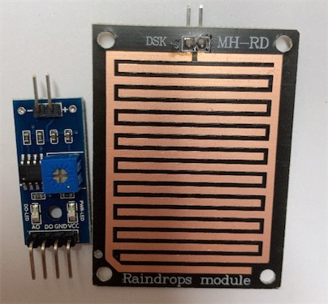

# 雨滴感应传感器 - Raindrops

## 一、产品简介
雨滴传感器主要用于检测是否下雨及雨量的大小，并广泛应用于汽车自动刮水系统、智能灯光系统和智能天窗系统等。该雨滴传感器可用于各种天气状况的监测，并转成数字信号DO和模拟信号AO输出。

<div align="center">

</div>

引脚定义：
* VCC：接电源正极（3.3-5V）
* GND：接电源负极
* DO：TTL开关信号输出
* AO：模拟信号输出

## 二、技术参数
* 传感器面积5.0x4.0CM，表面采用镀镍处理，具有较好的抗氧化、导电性、耐用性；
* 采用LM393比较器输出，信号无噪音，波形好，驱动能力强，大于15mA；
* 配合电位器可调节灵敏度；
* 工作电压：3.3V - 5V
* 输出形式：数字开关量输出（0和1），模拟量AO电压输出；
* PCB尺寸：3.2CM x 1.4CM

## 三、软件接口

雨滴感应传感器HaaS Python驱动：[下载地址](https://github.com/alibaba/AliOS-Things/tree/master/haas_lib_bundles/python/libraries/raindrops)
<br>

### Raindrops(DO) - 创建 Raindrops 驱动对象
* 函数原型：
> drv = Raindrops(DO)

* 参数说明：

|参数|类型|必选参数？|说明|
|-----|----|:---:|----|
|DO|GPIO|是|调用此函数前需确保 DO 对象已经处于 open 状态|

* 返回值：
Raindrops 对象成功，返回 Raindrops 对象；Raindrops 对象创建失败，抛出 Exception

* 示例代码：

```python
import utime   # 延时函数在utime库中
from driver import GPIO
import raindrops

# 初始化 GPIO
DO = GPIO()
DO.open('LM393_DO')   # 按照 board.json 中名为 "LM393_DO" 的设备节点的配置参数
drv = raindrops.Raindrops(DO)
print("raindrops inited!")
```

* 输出：
```log
raindrops inited!
```

### raindropDetect() - 检测当前是否有雨滴

* 函数功能：
通过 GPIO 读取数字开关量，无雨滴为高电平 1，有雨滴时为低电平 0

* 函数原型：
> drv.raindropDetect()

* 参数说明：
无

* 返回值
开关量（数据类型：整型）

* 示例：

```python
detected = drv.raindropDetect()
if detected == 0:
    print("raindrop is detected")
else:
    print('no raindrop detected')
```

* 输出：
```log
raindrop is detected
```

## 四、接口案例
此使用实例在 board.json 中定义了名为 LM393_DO 的 GPIO 类型的对象。在 Python 脚本中周期性的检查当前雨滴检测值结果并打印在日志中。在传感器表面有雨滴时，会获得开关量值，移除表面雨滴时，开关量消失。

* 代码：
```python
# board.json配置：
{
    "name": "board-name",
    "version": "1.0.0",
    "io": {
      "LM393_DO": {
        "type": "GPIO",
        "port": 25,
        "dir": "input",
        "pull": "pullup"
      }
    },
    "debugLevel": "ERROR",
    "repl": "disable"
}

```
```python
# Python代码
import utime   # 延时函数在utime库中
from driver import GPIO
import raindrops

if __name__ == '__main__':
    # 初始化 GPIO
    DO = GPIO()
    DO.open('LM393_DO')   # 按照 board.json 中名为 "LM393_DO" 的设备节点的配置参数
    if ret != 0:
        raise Exception('open device failed %s' % ret)
    drv = raindrops.Raindrops(DO)
    print("raindrops inited!")

    while True:      # 无限循环
        detected = drv.raindropDetect()  # 周期性检查噪音值
        if detected == 0:
            print("raindrop is detected")
        else:
            print('no raindrop detected')
        utime.sleep_ms(30)

    DO.close()  # 关闭 GPIO 设备
```

* 输出：
```python
...
no raindrop detected
no raindrop detected
raindrop is detected
raindrop is detected
...

```

## 五、通信协议
主控芯片与雨滴感应传感器之间使用 GPIO 通讯，雨滴传感器通过 LM393 比较器对模拟信号电压进行比较，当达到阈值则输出对应开关量。

使用时感应板上没有水滴时，DO 输出高电平，感应板上滴上雨滴时，DO 输出低电平。擦掉干硬盘雨滴时，DO又恢复到高电平状态。DO TTL 数字开关量可以方便检测是否有雨状态。

## 六、工作原理
如下是原理图，雨滴感应板输出电压到 LM393 的 INA+ 口（U1），INA- 口接电位器，因此感应板与 R1 电阻产生分压电路输出一路电压到 INA+，二电位器产生参考电压到 INA-。

LM393 的原理是：
* 当电压输入 INA- 大于 INA+ 时输出 OUTA 与地接通（低电平）
* 当电压输入 INA- 小于 INA+ 时输出 OUTA 开路（上拉电阻高电平）

因为 OUT 引脚有一颗 R5（10K）上拉电阻，因此在开路的情况下为高电平，与地接通时时为低电平。

我们以 VCC 为 3.3V为例，当感应板无雨滴时，INA+为3.3V，INA-通过电位器输出电压假设为2V，那么 INA- < INA+，OUTA 为开路，输出高电平 1，反之输出低电平。

<div align="center">

</div>

## 参考文献及购买链接
[1] [LM393 DataSheet](https://www.ti.com/lit/ds/symlink/lm393-n.pdf)<br>
[2] [购买链接](https://detail.tmall.com/item.htm?id=41266204564)
