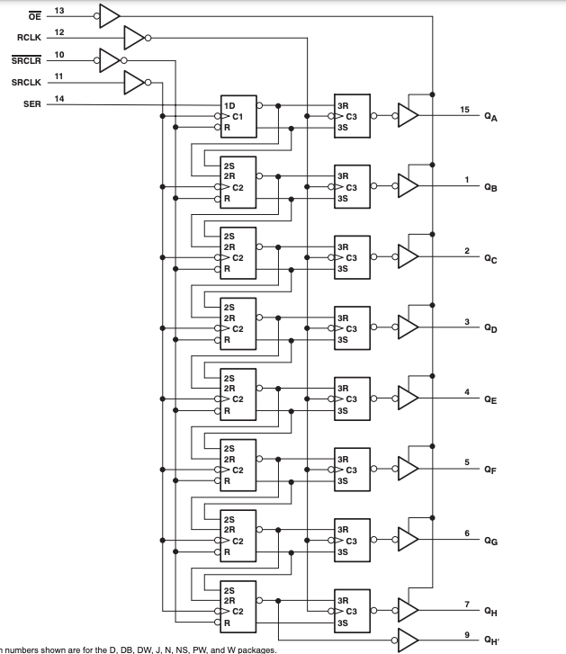
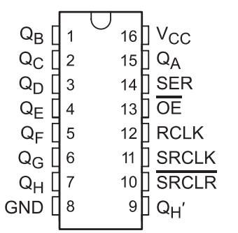

# 数码管驱动芯片 - SN74HC595

## 一、产品简介
SN74HC595是TI出品的一种能将串行信号转为并行信号芯片，常用在各种数码管或点阵屏的驱动芯片，使用SN74HC595可以节约单片机的IO资源，用3个io就可以控制8个数码管的管脚，它还具有一定的驱动能力，可以免掉三极管等放大电路。

<div align="center">

</div>

### 引脚定义
* VCC:  5V
* SCLK: host GPIO
* RCLK: host GPIO
* DIO:  host GPIO
* GND:  GND

## 二、技术参数
* 供电电压:2V~6V
* 驱动能力:6mA(5V)
* 3-bit串行数据转换成8-bit并行数据

## 三、软件接口

SN74HC595数码管驱动芯片HaaS Python驱动：[下载地址](https://github.com/alibaba/AliOS-Things/tree/master/haas_lib_bundles/python/libraries/sn74hc595)
<br>

### SN74HC595(rclk, sclk, dio) - 创建SN74HC595驱动对象
* 函数原型:
> displayDev = SN74HC595(rclk, sclk, dio)

* 参数说明:

|参数|类型|必选参数？|说明|
|-----|----|:---:|----|
|rclk|GPIO|是|调用此函数前需确保rclk对象已经处于open状态|
|sclk|GPIO|是|调用此函数前需确保sclk对象已经处于open状态|
|dio|GPIO|是|调用此函数前需确保dio对象已经处于open状态|
* 返回值:
SN74HC595对象成功，返回SN74HC595对象；SN74HC595对象创建失败，抛出Exception

* 示例代码:

```python
from driver import GPIO               # 驱动库
form sn74hc595 import *                        # SN74HC595驱动库

rclk = GPIO()
rclk.open("sn74hc595_rclk")
sclk = GPIO()
sclk.open("sn74hc595_sclk")
dio = GPIO()
dio.open("sn74hc595_dio")
displayDev = SN74HC595(rclk, sclk, dio)
```

* 输出:
无

### outSegmentDigit - 输出数码管数字

* 函数功能:
输出数码管数字

* 函数原型:
> SN74HC595.outSegmentDigit(position, digit)

* 参数说明:
position: 数码管的位置，从0开始
digit: 数字，0x0-0xf
* 返回值:
无

* 示例:

```python
from sn74hc595 import *
rclk = GPIO()
rclk.open("sn74hc595_rclk")
sclk = GPIO()
sclk.open("sn74hc595_sclk")
dio = GPIO()
dio.open("sn74hc595_dio")
displayDev = SN74HC595(rclk, sclk, dio)

displayDev.outSegmentDigit(0, 6)
sleep_ms(1000)

rclk.close()
sclk.close()
dio.close()
del displayDev
```
* 输出:无

## 四、接口案例
此使用实例在board.json中定义了名为sn74hc595的GPIO类型的对象。在Python脚本中依次在四个数码管上输出
0-f数字。

* 代码:
```json
# board.json配置：
{
    "name": "board-name",
    "version": "1.0.0",
    "io": {
      "sn74hc595_rclk": {
        "type": "GPIO",
        "port": 19,
        "dir": "output",
        "pull": "pullup"
      },

      "sn74hc595_sclk": {
        "type": "GPIO",
        "port": 27,
        "dir": "output",
        "pull": "pullup"
      },

      "sn74hc595_dio": {
        "type": "GPIO",
        "port": 0,
        "dir": "output",
        "pull": "pullup"
      }
    },
    "debugLevel": "ERROR",
    "repl": "disable"
}

```
```python
from sn74hc595 import *
rclk = GPIO()
rclk.open("sn74hc595_rclk")
sclk = GPIO()
sclk.open("sn74hc595_sclk")
dio = GPIO()
dio.open("sn74hc595_dio")
displayDev = SN74HC595(rclk, sclk, dio)

for i in range(4):
    for j in range(0x10):
        displayDev.out_digit(i, j)
        sleep_ms(1000)

rclk.close()
sclk.close()
dio.close()
del displayDev
```

* 输出:无

<br>

## 五、通信协议
主控芯片和SN74HC595之间通信所用命令字如下表所示：
|序号|功能说明|命令字宏定义|
|:-:|:-|:-|
|1|SER pin输出数据bit8|CMD_WRITE_DATA_BIT8|
|2|SRCLK pin输出低电平|CMD_WRITE_SRCLK_LOW|
|3|SRCLK pin输出高电平|CMD_WRITE_SRCLK HIGH|
|4|SER pin输出数据bit7|CMD_WRITE_DATA_BIT7|
|5|SRCLK pin输出低电平|CMD_WRITE_SRCLK_LOW|
|6|SRCLK pin输出高电平|CMD_WRITE_SRCLK HIGH|
|7|SER pin输出数据bit6|CMD_WRITE_DATA_BIT6|
|8|SRCLK pin输出低电平|CMD_WRITE_SRCLK_LOW|
|9|SRCLK pin输出高电平|CMD_WRITE_SRCLK HIGH|
|...|...|...|
|22|SER pin输出数据bit1|CMD_WRITE_DATA_BIT1|
|23|SRCLK pin输出低电平|CMD_WRITE_SRCLK_LOW|
|24|SRCLK pin输出高电平|CMD_WRITE_SRCLK HIGH|
|25|RCLK pin输出低电平|CMD_WRITE_RCLK_LOW|
|26|SRCLK pin输出高电平|CMD_WRITE_RCLK_HIGH|
</br>

* 输出数字流程
```python
对数字进行编码，按照主控芯片和SN74HC595的通信协议控制SER、SRCLK和RCLK，即可在数码管上显示出对应数字。
```

## 六、工作原理
从如下方框图可以看到 SN74HC595 内部集成了一个8-bit 移位寄存器和一个8-bit D-type 锁存寄存器，8-bit 移位寄存器输出到8-bit D-type锁存寄存器，通过移位寄存器可以将串行数据转换成并行数据，并且通过锁存寄存器可以将输出的数字锁存下来，所以使用SN74HC595要同时显示多个数字需要利用余晖效应。
<div align="center">

</div>

引脚分布如下，QA-QH一般数码管的段，RCLK，SRCLK，SER分别是锁存clock，移位clock，和数据输入。

<div align="center">

</div>

## 参考文献及购买链接
[1] [SN74HC595数码管驱动芯片](https://www.ti.com/product/SN74HC595)<br>
[2] [购买链接](https://detail.tmall.com/item.htm?id=42113080264)


