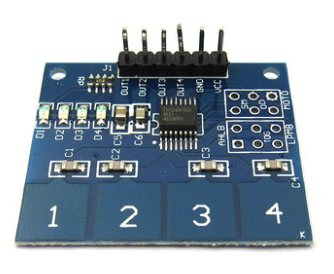

# 4路触摸电容模块-TTP224

## 一、产品简介
板载TTP224电容式4键触摸感应IC，开发者通过触摸该电容模块获取对应的高低电平状态，可以广泛应用于灯光控制、玩具、家用电器等产品中。

<div align="center">

</div>

引脚定义：
* VCC：接 3.3V
* GND：接 GND
* OUT1：接 GPIO
* OUT2：接 GPIO
* OUT3：接 GPIO
* OUT4：接 GPIO

## 二、技术参数
* 工作电压：2.3V-5.5V DC
* TTP224电流（3V）：2.5uA-9.0uA
* 板载4路电平状态指示灯
* 模式：设置输出模式、键输出模式、上限输出时间和快速/低功耗选择
* 规格尺寸：35mm * 29mm

## 三、软件接口
4路触摸电容模块HaaS Python驱动：[下载地址](https://github.com/alibaba/AliOS-Things/tree/master/haas_lib_bundles/python/libraries/ttp224)
### TTP224(ttp01Obj,ttp02Obj,ttp03Obj,ttp04Obj) - 创建TTP224驱动对象
* 函数原型：
> ttp224Obj = TTP224(ttp01Obj,ttp02Obj,ttp03Obj,ttp04Obj)

* 参数说明：

|参数|类型|必选参数？|说明|
|-----|----|:---:|----|
|ttp01Obj|GPIO|否||
|ttp02Obj|GPIO|否||
|ttp03Obj|GPIO|否||
|ttp04Obj|GPIO|否||

* 返回值：
TTP224对象创建成功，返回TTP224对象；TTP224对象创建失败，抛出Exception

* 示例代码：

```python
import ttp224
from driver import GPIO

ttp01Dev = GPIO()
ttp01Dev.open("ttp01")
ttp02Dev = GPIO()
ttp02Dev.open("ttp02")
ttp03Dev = GPIO()
ttp03Dev.open("ttp03")
ttp04Dev = GPIO()
ttp04Dev.open("ttp04")
ttp = ttp224.TTP224(ttp01Dev,None,ttp03Dev)
print("ttp224 inited!")
```

* 输出：
```log
ttp224 inited!
```

### getStatus() - 获取TTP224的电容触摸状态值

* 函数功能：
获取TTP224的电容触摸状态值

* 函数原型：
> TTP224.getStatus()

* 参数说明：
无

* 返回值：

|返回值|类型|说明|
|-----|----|----|
|cntobj|整型|返回创建了几路TTP对象，0-没有创建对象|
|ttp01|整型|None-该路未创建，0-未触摸，1-触摸|
|ttp02|整型|None-该路未创建，0-未触摸，1-触摸|
|ttp03|整型|None-该路未创建，0-未触摸，1-触摸|
|ttp04|整型|None-该路未创建，0-未触摸，1-触摸|

* 示例：

```python
import ttp224
from driver import GPIO
import utime

ttp01Dev = GPIO()
ttp01Dev.open("ttp01")
ttp02Dev = GPIO()
ttp02Dev.open("ttp02")
ttp03Dev = GPIO()
ttp03Dev.open("ttp03")
ttp04Dev = GPIO()
ttp04Dev.open("ttp04")
ttp = ttp224.TTP224(ttp01Dev,None,ttp03Dev)
print("ttp224 Init!")
while True:             # 无限循环
    cnt,ttp01,ttp02,ttp03,ttp04 = ttp.getStatus()
    print(cnt,ttp01,ttp02,ttp03,ttp04)
    utime.sleep(1)
```

* 输出：
```log
ttp224 Init!
2 0 None 0 None
2 0 None 0 None
2 0 None 0 None
2 0 None 0 None
2 0 None 0 None
2 1 None 0 None
2 1 None 0 None
2 0 None 0 None
2 0 None 1 None
2 1 None 1 None
2 0 None 0 None
2 0 None 0 None
2 0 None 0 None
```

## 四、接口案例
此使用实例在board.json中定义了名为tTTP224的I2C类型的对象。在Python脚本中周期性的获取TTP224各路触摸电容的状态并打印在日志中。

* 代码：
```python
# board.json配置：
{
    "name": "board-name",
    "version": "1.0.0",
    "io": {
      "ttp01": {
        "type": "GPIO",
        "port": 2,
        "dir": "input",
        "pull": "pullup"
      },
      "ttp02": {
        "type": "GPIO",
        "port": 12,
        "dir": "input",
        "pull": "pullup"
      },
      "ttp03": {
        "type": "GPIO",
        "port": 13,
        "dir": "input",
        "pull": "pullup"
      },
      "ttp04": {
        "type": "GPIO",
        "port": 14,
        "dir": "input",
        "pull": "pullup"
      }
    },
    "debugLevel": "ERROR",
    "repl": "disable"
}

```
```python
# Python代码
import ttp224
from driver import GPIO
import utime

ttp01Dev = GPIO()
ttp01Dev.open("ttp01")
ttp02Dev = GPIO()
ttp02Dev.open("ttp02")
ttp03Dev = GPIO()
ttp03Dev.open("ttp03")
ttp04Dev = GPIO()
ttp04Dev.open("ttp04")
ttp = ttp224.TTP224(ttp01Dev,ttp02Dev,ttp03Dev,ttp04Dev)
print("ttp224 Init!")
while True:             # 无限循环
    cnt,ttp01,ttp02,ttp03,ttp04 = ttp.getStatus()
    print(cnt,ttp01,ttp02,ttp03,ttp04)
    utime.sleep(1)
```

* 输出：
```log
ttp224 Init!
4 0 0 0 0
4 0 0 0 0
4 0 0 0 0
4 0 0 0 0
4 1 0 0 0
4 1 1 0 0
4 0 0 1 0
```

## 参考文献及购买链接
* [1] [购买链接](https://detail.tmall.com/item.htm?spm=a230r.1.14.28.40773072fvDTR3&id=522587058105&ns=1&abbucket=17)

