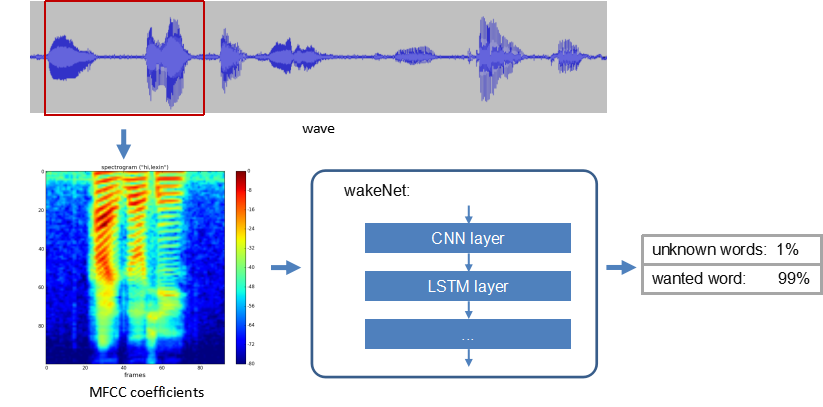

# WakeNet [[中文]](./README_cn.md)

WakeNet, which is a wake word engine built upon neural network, is specially designed for low-power embedded MCUs. Now, the WakeNet model supports up to 5 wake words.

## Overview

Please see the flow diagram of WakeNet below:

<center>

</center>

- Speech Feature:  
  The WakeNet uses [MFCC](https://en.wikipedia.org/wiki/Mel-frequency_cepstrum) to obtain the features of the input audio clip (16 KHz, 16 bit, single track). The window width and step width of each frame of the audio clip are both 30 ms. 
      
- Neural Network:  
  Now, the neural network structure has been updated to the sixth edition, among which,  
  - WakeNet1 and WakeNet2 had been out of use.
  - WakeNet3 and WakeNet4 are built upon the [CRNN](https://arxiv.org/abs/1703.05390) structure.
  - WakeNet5(WakeNet5X2,WakeNetX3) and WakeNet6 are built upon the [Dilated Convolution](https://arxiv.org/pdf/1609.03499.pdf) structure. 
  Note that，The network structure of WakeNet5,WakeNet5X2 and WakeNet5X3 is same, but the parameter of WakeNetX2 and WakeNetX3 is more than WakeNet5. Please refer to [Resource Occupancy](#performance-test) for details.

         
- Keyword Triggering Method  
  For continuous audio stream, we calculate the average recognition results (M) for several frames and generate a smoothing prediction result, to improve the accuracy of keyword triggering. Only when the M value is larger than the set threshold, a triggering command is sent.  


## API Introduction

- How to select the WakeNet model  
  
  1. Go to `make menuconfig`, navigate to `Component config` >> `ESP Speech Recognition` >> `Wake word engine`. See below:  
  
     <center>  </center>    
     
  2. WakeNet6 is divided into two tasks， task1 is used to calculate speech recognition， the task2 is used to calculate neural network model. The ESP32 core used to calculate task2 can be selected by `Component config` >> `ESP Speech Recognition` >> `ESP32 core to run WakeNet6`    

  
  

- How to select the wake words   
  Go to `make menuconfig`, and navigate to `Component config` >> `ESP Speech Recognition` >> `Wake words list`. See below:  

  <center>
  
  </center>

  Note that, the `customized word` option only supports WakeNet5 and WakeNet6. WakeNet3 and WakeNet4 are only compatible with earlier versions. If you want to use your own wake words, please overwrite existing models in `wake_word_engine` directory with your own words model.

- How to set the triggering threshold  
  1. The triggering threshold (0, 0.9999) for wake word can be set to adjust the accuracy of the wake words model. The threshold can be configured separately for each wake words if there are more than one words supported in a model. 
  2. The smaller the triggering threshold is, the higher the risk of false triggering is (and vice versa). Please configure your threshold according to your applications.   
  3. The wake word engine predefines two thresholds for each wake word during the initialization. See below:
  
    ```
    typedef enum {
	    DET_MODE_90 = 0,  //Normal, response accuracy rate about 90%
	    DET_MODE_95       //Aggressive, response accuracy rate about 95%
    } det_mode_t;
    ```
    
  4. Use the `set_det_threshold()` function to configure the thresholds for different wake words after the initialization.
  
- How to get the sampling rate and frame size.
  - Use `get_samp_rate` to get the sampling rate of the audio stream to be recognized.
  - Use `get_samp_chunksize` to get the sampling point of each frame. The encoding of audio data is `signed 16-bit int`.
  
## Performance Test

### 1. Resource Occupancy(ESP32)

|Model Type|Parameter Num|RAM|Average Running Time per Frame| Frame Length|
|:---:|:---:|:---:|:---:|:---:|
|Quantized WakeNet3|26 K|20 KB|29 ms|90 ms|
|Quantised WakeNet4|53 K|22 KB|48 ms|90 ms|
|Quantised WakeNet5|41 K|15 KB|5.5 ms|30 ms|
|Quantised WakeNet5X2|165 K|20 KB|10.5 ms|30 ms|
|Quantised WakeNet5X3|371 K|24 KB|18 ms|30 ms|
|Quantised WakeNet6|378 K|45 KB|4ms(task1) + 25 ms(task2)|30 ms|  

**Note**: Quantised WakeNet6 is split into two tasks, task1 is used to calculate speech features and task2 is used to calculate neural network model.

### 2. Performance

|Distance| Quiet | Stationary Noise (SNR = 5 dB)| Speech Noise (SNR = 5 dB)| AEC Interruption (-10 dB)|
|:---:|:---:|:---:|:---:|:---:|
|1 m|95%|88%|85%|89%|
|3 m|90%|80%|75%|80%|

False triggering rate: 1 time in 12 hours
  
**Note**: We use the ESP32-LyraT-Mini development board and the WakeNet5X2(hilexin) model in our test. The performance is limited because ESP32-LyraT-Mini only has one microphone. We expect a better recognition performance when more microphones are involved in the test.

## Wake Word Customization

For details on how to customize your wake words, please see [Espressif Speech Wake Word Customization Process](ESP_Wake_Words_Customization.md).
