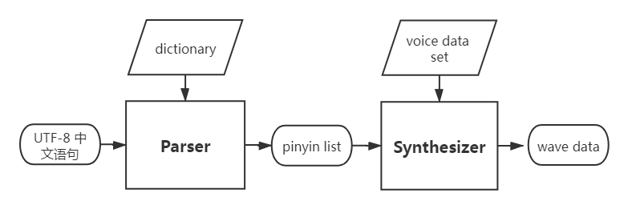

# ESP Chinese TTS [[English]](./README_en.md) 

乐鑫中文语音合成是一个为嵌入式系统设计的轻量化语音合成系统。

## Overview

乐鑫语音合成当前版本基于拼接法，系统框图如下：



- Parser: 根据字典与语法规则，将输入文本转换为拼音列表, 输入文本编码为UTF-8。
- Synthesizer: 根据Parser输出的拼音列表，结合预定义的声音集，合成波形文件。默认输出格式为单声道， 16bit@16000Hz。

#### Features：

- [x] UTF-8编码输入

- [x] 流式输出，减少延时

- [x] 多音词发音自动识别

- [x] 可调节合成语速

- [x] 数字播报优化

- [ ] 自定义声音集


## Performance Test

#### Resource Occupancy

Flash image size： 2.2 MB

RAM runtime: 20 KB

CPU loading test（基于ESP32 @ 240MHz测试 ）:

| speech rate                 |  0   |  1   |  2   |  3   |  4   |  5   |
| --------------------------- | :--: | :--: | :--: | :--: | :--: | :--: |
| times faster than real time | 4.5  | 3.2  |  2.9 | 2.5  | 2.2  | 1.8  |

#### Samples

- 欢迎使用乐鑫语音合成, &nbsp; &nbsp; [voice=小乐,speed=0](./samples/S1_xiaole_speed0.wav), &nbsp; &nbsp;  [voice=小乐,speed=2](./samples/S1_xiaole_speed2.wav) 

- 支付宝收款 1111.11 元, &nbsp; &nbsp;  [voice=小乐,speed=0](./samples/S1_xiaole_speed0.wav), &nbsp; &nbsp;  [voice=小乐,speed=2](./samples/S2_xiaole_speed2.wav) 

- 空调制热模式已打开，并调节到25度, &nbsp; &nbsp;  [voice=小乐,speed=0](./samples/S3_xiaole_speed0.wav), &nbsp; &nbsp;   [voice=小乐,speed=4](./samples/S3_xiaole_speed4.wav) 

   

## User Guide

```c
#include "esp_tts.h"
#include "esp_tts_voice_female.h"
#include "esp_partition.h"

/*** 1. create esp tts handle  ***/

//// Method1: use pre-define xiaole voice lib.
//// This method is not recommended because the method may make app bin exceed the limit of esp32
// esp_tts_handle_t *tts_handle=esp_tts_create(esp_tts_voice_female);

  
// method2: initial voice set from separate voice data partition

const esp_partition_t* part=esp_partition_find_first(ESP_PARTITION_TYPE_DATA, ESP_PARTITION_SUBTYPE_DATA_FAT, "voice_data");
if (part==0) printf("Couldn't find voice data partition!\n");
spi_flash_mmap_handle_t mmap;
uint16_t* voicedata;
esp_err_t err=esp_partition_mmap(part, 0, 3*1024*1024, SPI_FLASH_MMAP_DATA, (const void**)&voicedata, &mmap);
esp_tts_voice_t *voice=esp_tts_voice_set_init(&esp_tts_voice_template, voicedata); 

// 2. parse text and synthesis wave data
char *text="欢迎使用乐鑫语音合成";	
if (esp_tts_parse_chinese(tts_handle, text)) {  // parse text into pinyin list
	int len[1]={0};
	do {
		short *data=esp_tts_stream_play(tts_handle, len, 4); // streaming synthesis
		i2s_audio_play(data, len[0]*2, portMAX_DELAY);  // i2s output             
	} while(len[0]>0);
	i2s_zero_dma_buffer(0);
}

```

更多请参考[esp_tts.h](./esp_tts_chinese/include/esp_tts.h)查看API定义, 或参考esp-skainet中[chinese_tts](../../examples/chinese_tts)示例.
