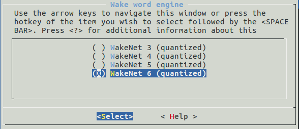
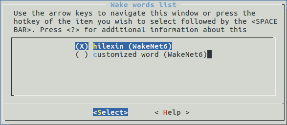

# WakeNet [[English]](./README.md)

WakeNet是一个基于神经网络，为低功耗嵌入式MCU设计的的唤醒词模型，目前支持5个以内的唤醒词识别。

## Overview

WakeNet的流程图如下：
<center>

</center>


- speech features：  
  我们使用[MFCC](https://en.wikipedia.org/wiki/Mel-frequency_cepstrum)方法提取语音频谱特征。输入的音频文件采样率为16KHz，单声道，编码方式为signed 16-bit。每帧窗宽和步长均为30ms。    

- neural network：  
  神经网络结构已经更新到第6版，其中：  
  - wakeNet1和wakeNet2已经停止使用。
  - wakeNet3和wakeNet4基于[CRNN](https://arxiv.org/abs/1703.05390)结构。
  - WakeNet5(WakeNet5X2,WakeNetX3) 和 WakeNet6 基于 the [Dilated Convolution](https://arxiv.org/pdf/1609.03499.pdf) 结构。
  
  注意，WakeNet5,WakeNet5X2 和 WakeNet5X3 的网络结构一致，但是 WakeNet5X2 和 WakeNet5X3 的参数比 WakeNet5 要多。请参考 [性能测试](#性能测试) 来获取更多细节。
         
- keyword trigger method：  
  对连续的音频流，为准确判断关键词的触发，我们通过计算若干帧内识别结果的平均值M，来判断触发。当M大于大于指定阈值，发出触发的命令。


## API introduction

- WakeNet模型选择  
  1. 使用make menuconfig，选择Component config >> ESP Speech Recognition >> Wake Word Engine,如下图  
  
   <center>
   
   </center>

  2. 不同与WakeNet5，WakeNet6被拆分成两个task，task1计算speech features，task2计算neural network model。task2使用的ESP32核心，可以通过Component config >> ESP Speech Recognition >> ESP32 core to run WakeNet6选择，默认使用core1。  

- 唤醒词选择  
  使用make menuconfig，选择Component config >> ESP Speech Recognition >> Wake word list进行选择，如下图
  <center>
  
  </center>

   对于自定义的唤醒词，请选择`customized wake word`，目前唤醒词定制只支持WakeNet5和WakeNet6，WakeNet3和WakeNet4只对之前版本保持兼容，具体可参考《乐鑫唤醒词定制流程》。

- 阈值设定  
  1.唤醒词模型通过设定触发阈值，来调整唤醒灵敏度,阈值范围为0~0.9999，对于包含多个唤醒词的模型，每个唤醒词的阈值相互独立。     
  2.调整阈值时，当阈值减小，唤醒识别率增高同时误触发的风险也变大，反之唤醒识别率降低，误触发也减小。实际使用需要根据具体应用场景选择合适的阈值。   
  3.每个唤醒词在模型内部预定义两个阈值，在模型初始化时使用，其中  
    ```
    typedef enum {
	    DET_MODE_90 = 0,  //Normal, response accuracy rate about 90%
	    DET_MODE_95       //Aggressive, response accuracy rate about 95%
    } det_mode_t;
    ```
  4.初始化后，可以使用`set_det_threshold()`对不同唤醒词阈值进行重新设定。  

- 采样率与每帧长度
  使用函数`get_samp_rate`获取识别所需音频数据的采样率
  使用函数`get_samp_chunksize`获取每帧所需采样点，语言编码方式为unsigned 16-bit int


## 性能测试

### 1.资源占用  

|模型|参数量|RAM|平均每帧时间消耗|每帧时长|
|:---:|:---:|:---:|:---:|:---:|
|Quantized WakeNet3|26 K|20 KB|29 ms|90 ms|
|Quantised WakeNet4|53 K|22 KB|48 ms|90 ms|
|Quantised WakeNet5|41 K|15 KB|5.5 ms|30 ms|
|Quantised WakeNet5X2|165 K|20 KB|10.5 ms|30 ms|
|Quantised WakeNet5X3|371 K|24 KB|18 ms|30 ms|
|Quantised WakeNet6|378 K|45 KB|4ms(task1)+25ms(task2)|30 ms|  

**注**：Quantised WakeNet6被拆分成两个task，其中task1用于计算speech features，另一个task2用于计算神经网络。

### 2.识别性能  
|距离|安静环境|平稳噪声(SNR=0~10dB)|语音噪声(SNR=0~10dB)|AEC打断唤醒(-5~-15dB)|
|:---:|:---:|:---:|:---:|:---:|
|1 m|95%|88%|85%|89%|
|3 m|90%|80%|75%|80%|

误唤醒率：1 次/ 12 小时  
**注**：以上测试基于 WakeNet5X2(hilexin) 模型，使用lyrat-mini开发板测试。该板为单颗麦克风拾音，若使用多麦拾音的开发板，可预料在远场场景会有更好的识别性能。

## 唤醒词定制

如果需要定制唤醒词，请参考[乐鑫语音唤醒词定制流程](乐鑫语音唤醒词定制流程.md)。

