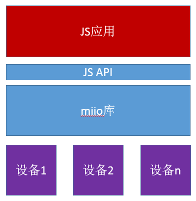

# 小米智能设备接入及场景联动演示程序
本程序设计旨在给开发者展示如何通过 miio 接入小米的智能设备，如何编写场景联动程序

## 基本原理
TinyEngine 为接入小米设备，在TinyEngine的 Native 层，实现了小米设备 miio 通信协议，并向上提供了 JS 调用接口。Native miio 库实现数据传输通道（包括会话建立、加密发送数据、解密接收数据等）和事件转发，具体的设备模型（属性、接口、事件）在JS应用层可见。



## MIIO JS 对象接口说明 ##

* 创建设备
    * `miio.createDevice(host, token)`
        * host - 设备的ip地址
        * token - 设备对应的token
        * return - 设备标识
* 注册设备事件监听器
    * `miio.deviceOnEvent(device, cb)`
        * device - miio.createDevice创建的设备
        * cb - function (event) {} 类型的回调函数
        * return - 无
* 控制设备
    * `miio.deviceControl(device, method, args, sid)`
        * device - miio.createDevice创建的设备
        * method - 设备控制接口，如：set\_power
        * args - 设备控制接口参数，如：["on"]，["off"]等
        * sid - 子设备标识，控制device下的子设备时才会用到，其他情况不用填写
        * return - 设备返回子符串

    __注：__该接口为同步接口，最长等待时间为2秒
* IP自发现
    * miio.discover(timeout, cb)
        * timeout - 单位为秒
        * cb - function(host, deviceId) {} 类型的回调函数

## 对接流程 ##

miio设备接入分为两类，一类 WIFI接入设备，可以连接WIFI AP，能直接被控制；另一类是非 wifi 接入，它需要通过小米网关（Zigbee）才能被控制。

不管哪一类都需要知道设备的控制接口以及对应的参数，如何知道设备的控制接口以及对应的参数？ 

* 一种方法是参看home-assistant和miio源码；

* 一种方法是安装一个android虚拟机，在android虚拟机上安装一个米家app，然后在米家app上对设备进行操作，同时抓取操作包，再通过miio工具解包，详细请[参看](https://github.com/aholstenson/miio/blob/master/docs/protocol.md)。

针对wifi设备，首先需要获取设备的ip和token:

* 可以使用miio这个npm工具包（他只能获取开放的设备token），详细[参见](https://github.com/aholstenson/miio/blob/master/docs/management.md)；
* 也可参见[小米设备token的获取方法](https://bbs.hassbian.com/thread-1446-1-1.html)
   
### 网关子设备 ###

* 获取网关ip和token
* 调用miio.createDevice创建设备
* 通过miio.deviceControl接口获取子设备列表，具体为var res = miio.deviceControl(gateway, 'get_device_prop', '["lumi.0","device_list"]');
* 调用miio.deviceOnEvent注册事件监听器
* 调用miio.deviceControl对子设备进行控制


### WIFI直接控制设备 ###

* 获取设备ip和token
* 调用miio.createDevice创建设备
* 调用miio.deviceControl对设备进行控制

## 示例说明
### 所需硬件配置
* ESP32-DevkitC
* STM32-developkit
* TinyEngine 虚拟设备

### 设备组网图


### 实现代码实例

```
var lightDevice;

// 控制开灯
function lightOn() {
  console.log("lightOn");
  if (lightDevice) {
    miio.deviceControl(lightDevice, "set_power", '["on"]');
  }
}

// 控制开关
function lightOff() {
  console.log("lightOff");
  if (lightDevice) {
    miio.deviceControl(lightDevice, "set_power", '["off"]');
  }
}

function setupLight(host) {
  // 创建小米灯设备，如何获取小米设备的token，
  //其具体方法和步骤请见：https://lark.alipay.com/tinyenginedev/developer-documentation/wbm6d5
  lightDevice = miio.createDevice(
    host,
    "ae65d127852df5c2b86f38b6878e8706"
  );

  // 初次启动时，第一次关闭小米灯
  lightOff();
}

function setupGateway(host) {
  // 创建小米 Zigbee 网关设备：如何获取小米设备的token，
  //其具体方法和步骤请见：https://lark.alipay.com/tinyenginedev/developer-documentation/wbm6d5
  var gatewayDevice = miio.createDevice(
    host,
    "0a7b7e5af0fc0b1b4877b0907834f9a7"
  );

  var motionSensorId = null;
  var timeout = null;
  // 注册监听事件，回调函数
  miio.deviceOnEvent(gatewayDevice, function(event) {
    console.log("gateway receive event");

    var obj = JSON.parse(event);
    var open = false;

    if (obj.data) {
      open = JSON.parse(obj.data).status === "motion";
    }
    //如果人体感应器检测到人，则开灯，如果一分钟没有感应到人存在，则关灯
    if (obj.cmd === "report" && obj.sid === motionSensorId && open) {
      lightOn();
      if (timeout) {
        clearTimeout(timeout);
        timeout = null;
      }
      //每分钟接收一次
      timeout = setTimeout(function() {
        lightOff();
      }, 60 * 1000);
    }
  });

  // 获取小米网关的设备列表
  var device_list = miio.deviceControl(
    gatewayDevice,
    "get_device_prop",
    '["lumi.0","device_list"]'
  );
  console.log("device list: " + device_list);

  // 从小米网关下挂的设备列表中，找到人体感应设备，网关下的其他设备可以按照类似的方法
  var deviceList = JSON.parse(device_list);
  for (var i = 0; i < deviceList.result.length; i++) {
    if (deviceList.result[i + 1] === 2) {
      motionSensorId = deviceList.result[i].substring(5);
      console.log("motion sensor id: " + motionSensorId);
      break;
    }
  }
}

miio.discover(20, function(host, deviceId) {
  console.log('discovered device, host: ' + host + ', deviceId: ' + deviceId);
  if (deviceId === 61632282) {
    setupLight(host);
  } else if (deviceId === 78463041) {
    setupGateway(host);
  }
});
```

### 示例所需设备清单

* 米家多功能网关
https://www.mi.com/wangguan/?cfrom=search

* 米家人体传感器
https://item.mi.com/1164900028.html?cfrom=search

* 飞利浦智睿球泡灯
https://item.mi.com/1172100033.html?cfrom=search
