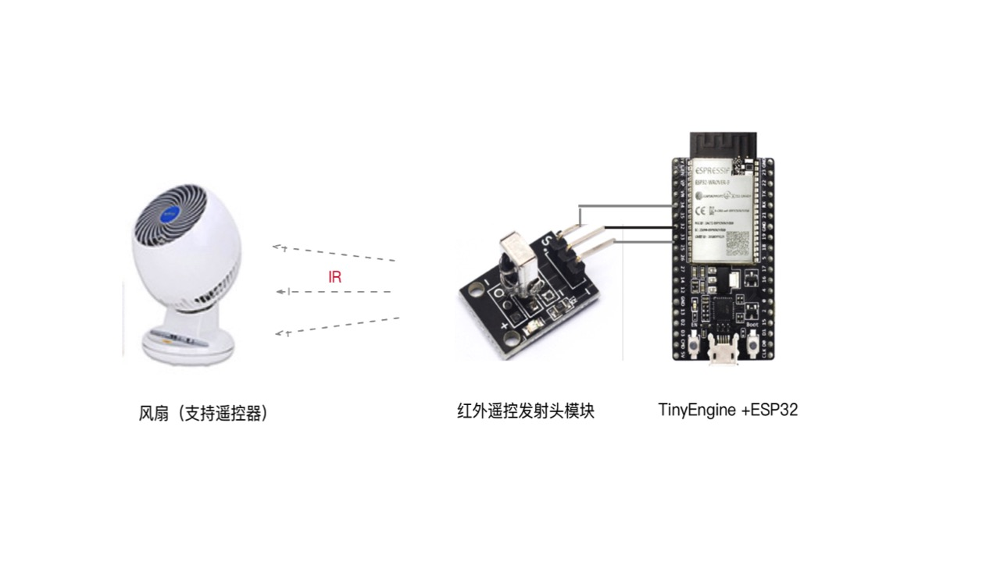
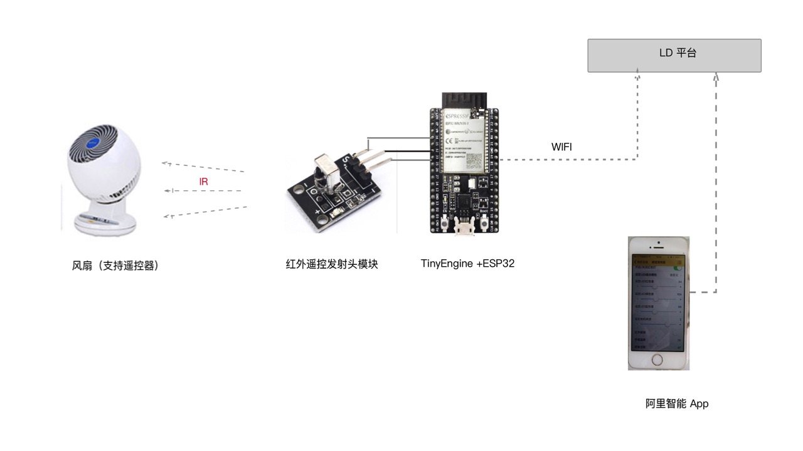

## smart-fan-with-app-ctrl 应用说明
本程序旨在给开发者展示如何编写 TinyEngine 的 Javascript 应用程序来控制外设（风扇），让开发者在了解如何开发TinyEngine应用的同时，也可以基于此应用，扩展适合自己需求的应用或产品，演示程序没有版权限制。

### 演示示意图及相关说明



* TinyEngine 预先通过红外接收头学习电风扇的遥控器，把遥控码放到 ir-code 模块遥控表中，并标注每个遥控码表对应一个遥控键，如：

```
PowerOn: 
[
0x30,0x03,0x52,0x47,0x00,0x34,0x15,0x01,0x2D,0x02,0x21,0x00,0x23,0x00,0x65,0x00,0x24,0x00,0x03,0x0A,0x24,0x00,0x88,0x00,0x33,0x02,0x00,0x00,0x21,0x00,0xFF,0xFF,0xFF,0xFF,0xFF,0xFF,0xFF,0xFF,0x01,0x11,0x11,0x11,0x21,0x22,0x22,0x12,0x21,0x11,0x11,
0x11,0x12,0x22,0x22,0x22,0x23,0x45,0xF0,0x00,0x00,0x00,0x00,0x00,0x00,0x00,0x00,0x00,0x00,0x00,0x04,0x76,0x3E,0xA0
],

```
* TinyEngine根据用户命令，从遥控码表取相同的遥控码序列，通过红外发射发射出去；
* 电风扇接收到遥控码之后，执行相应的操作；

### 扩展功能说明
本遥控器应用还可以结合上云模块（cloudClient）或 deviceShadow 与 LD 平台对接，在 LD 工作台创建相应的风扇产品，利用移动App工作台自动生成一个手机 APP，安装到手机上，由手机来控制风扇。




### ESP32硬件和红外摄像头管脚连接说明


其他参考板也可以采用类似的方式,结合硬件规格，适当配置相应的管脚。

### 板级管脚配置说明
board.json 配置文件的配置如下：

```

  "hxd019.sda":{
    "type":"GPIO",
    "port":26,
    "dir": 3,
    "pull": 1
  },
  "hxd019.scl":{
    "type":"GPIO",
    "port":25,
    "dir": 3,
    "pull": 1
  },
  "hxd019.busy":{
    "type":"GPIO",
    "port":21,
    "dir": 1,
    "pull": 1
  }
}

```

### 主控逻辑代码示例

```
var hxd019 = require("hxd019/src/index.js");
var IRcode = require("ir-code/src/index.js");
var deviceShadow = require("device-shadow/src/index.js");

console.log("=================================");
console.log("             demo-fan            ");
console.log("=================================");

//设备三元组
var device = {
  productKey: "",
  deviceName: "",
  deviceSecret: "",
  domain: "",
  port: 
};

//创建红外遥控器对象
var hxdHandle = new hxd019("hxd019.scl", "hxd019.sda", "hxd019.busy");

// 初始化 deviceShadow
function initDeviceShadow() {
  deviceShadow.bindDevID(device);
  deviceShadow.start(deviceShadowInitCB);
}

// 设备初始化的回调函数，在初始化成功时，会注册云端属性控制函数
function deviceShadowInitCB(err) {
  if (err) {
    console.log("连接 LD 失败, err = " + err);
    // 再次重连
    setTimeout(initDeviceShadow, 2000);
  } else {
    console.log(" 连接 LD 成功 ");
    registAllCloudNotify();
  }
}

// 注册所有云端控制设备端属性的处理函数
function registAllCloudNotify() {
  deviceShadow.addDevSetPropertyNotify("powerFanOnOrOff", powerFanOnOrOff);
  deviceShadow.addDevSetPropertyNotify("weakFanWind", weakFanWind);
  deviceShadow.addDevSetPropertyNotify("strongFanWind", strongFanWind);
  deviceShadow.addDevSetPropertyNotify("swingFanLOrR", swingFanLeftOrRight);
  deviceShadow.addDevSetPropertyNotify("swingFanUOrD", swingFanUpOrDown);
}

// 风扇 开/关
function powerFanOnOrOff() {
  hxdHandle.send(IRcode.Switch);
  console.log("let fan on or off");
}

// 减弱风速
function weakFanWind() {
  hxdHandle.send(IRcode.LowLevel);
  console.log("减弱风扇风速");
}

// 加大风速
function strongFanWind() {
  hxdHandle.send(IRcode.HighLevel);
  console.log("加大风扇风速");
}

// 左右摆动
function swingFanLeftOrRight() {
  hxdHandle.send(IRcode.LRShake);
  console.log("风扇左右摆动");
}

// 上下摆动
function swingFanUpOrDown() {
  hxdHandle.send(IRcode.UDShake);
  console.log("风扇上下摆动");
}

// 周期行判断网络是否准备好，如果准备好，则连接LD，并注册本地处理函数
var t1 = setInterval(function() {
  //每秒检测一次网卡是否连上网络？
  var ip = WIFI.getip();
  if (ip != null) {
    clearInterval(t1);
    process.nextTick(initDeviceShadow);
  }
}, 1000);
```
### 整个源代码目录结构

```
├── README.MD
├── board.json
├── index.js
├── node_modules
│   ├── device-shadow
│   │   ├── README.md
│   │   ├── package.json
│   │   ├── src
│   │   └── test
│   ├── hxd019
│   │   ├── driver.json
│   │   ├── package.json
│   │   ├── readme.md
│   │   ├── src
│   │   └── test
│   └── ir-code
│       ├── README.md
│       ├── package.json
│       └── src
└── package.json
```

### 应用延伸
   Hxd019 是支持发送和接收的红外遥控头，还可以用来做遥控器学习。在hxd019 驱动模块中，已经支持遥控学习的接口函数，可以编写主控应用来学习各种不同的遥控器，然后把这些学习到的遥控器码保存到不同的数组中，当需要控制设备时，CPU 发送相应的遥控码。

开发者还可以把这些学习了到的遥控器键值表，上传到git库，云端，分享给其他开发者或者用户，供他们使用。


学习多种不同的遥控器，可以用做万能遥控器。如果一应用可以控制多个设备，如电视，灯，电风扇，空调，甚至可以开发家庭联动场景应用！

### 硬件配置清单
IRIS OHYAMA - IRIS OHYAMAPCF-C18TC
