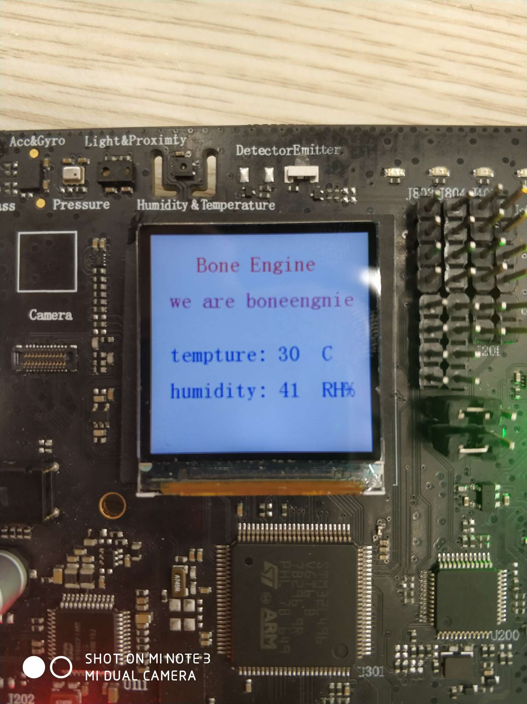
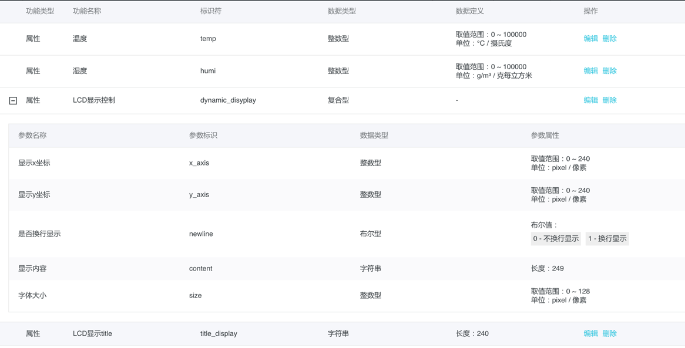
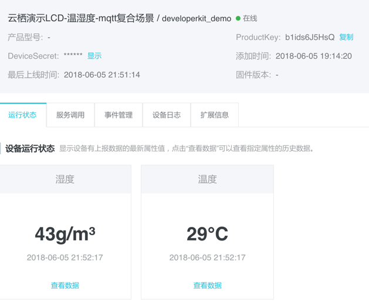

## 温湿度传感器+LCD显示+MQTT上云 示例

###说明

本例子基于alios-things developerkit开发板演示 板载的温湿度传感器+LCD显示+MQTT上云的一个例子，

实现了 当前温湿度在LCD显示，同时在一站式开发平台linkdeveloper上web显示，同时可以在一站式开发平台

实时下发字符串在LCD上动态显示。

**阿里云内部演示账号**：电子书测试账号002  **密码**：个人域账号|个人域密码

效果图：

##如何在一站式开发平台创建设备

* 首先申请账号，登陆阿里云一站式开发平台：https://linkdevelop.aliyun.com/

* 然后在设备-》产品开发-〉新增产品-》

  注意：所属分类选择 其他，节点类型 选择 设备，通讯方式选择 WiFi ，数据格式选择Alink。

* 然后 产品详情-》功能定义中 设置设备的属性。如下设置，这里的标识符必须完全按照如下设置：

  

  

## 设备连接mqtt上云后上报温湿度的云端效果

如下：

## 如何在云端下发 字符串 到LCD上实时显示

本例子程序支持在云端下发字符串实时到LCD上显示，用户需进入一站式开发平台，点击自己创建的设备-》调试。这里注意到是 需确保自己的设备当前处于在线状态，即设备已经通过mqtt上云。

然后在调试栏里面 选择 设置，输入对应属性即可。

这里设置lcd显示的属性是一个json对象，格式如：{"dynamic_disyplay":{"x_axis":20,"y_axis":60,"content":"this is boneengine","newline":0,"size":24}} .

## 最终效果

最终，设备连接上云后，LCD实时显示当前温度湿度，同时一站式开发平台云端也同步显示温度湿度，同时通过云端下发指令，“this is boneengine” 这个字符串在LCD上实时更新显示。