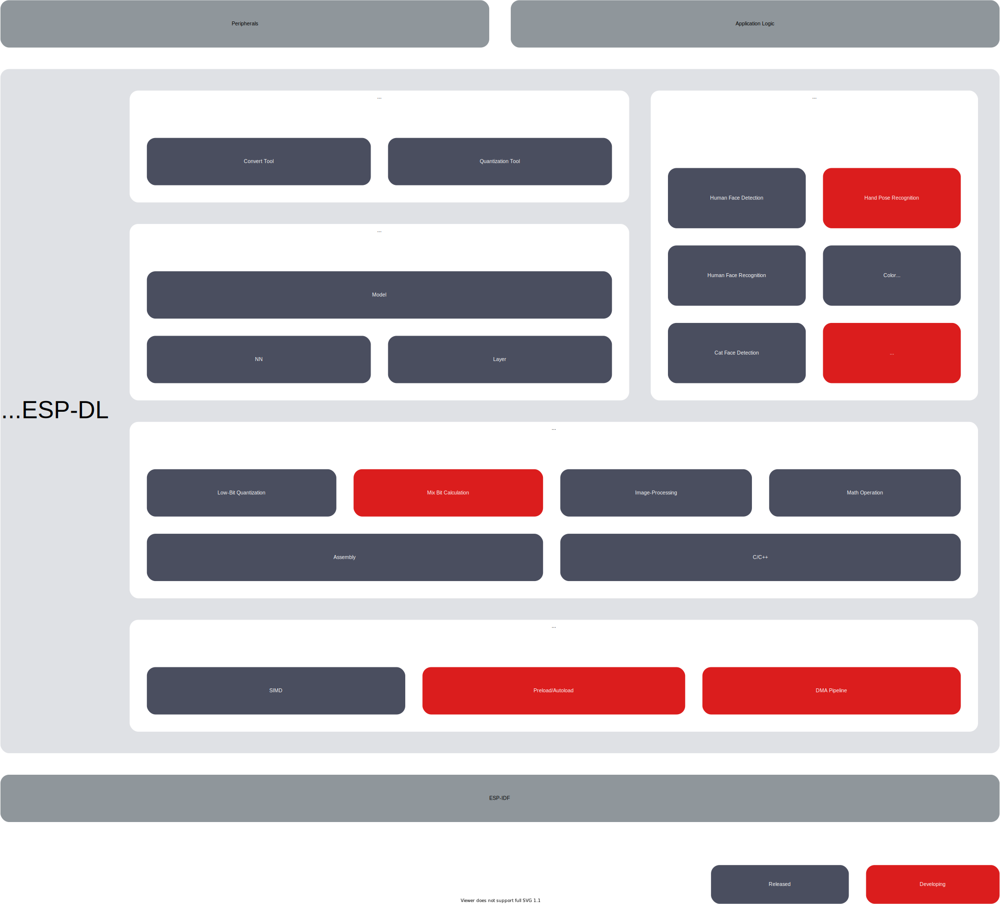

# ESP-DL [[中文]](./README_cn.md)

ESP-DL is a library for high-performance deep learning resources dedicated to [ESP32](https://www.espressif.com/en/products/socs/esp32), [ESP32-S2](https://www.espressif.com/en/products/socs/esp32-s2), [ESP32-S3](https://www.espressif.com/en/products/socs/esp32-s3) and [ESP32-C3](https://www.espressif.com/en/products/socs/esp32-c3).

## Overview

ESP-DL provides APIs for **Neural Network (NN) Inference**, **Image Processing**, **Math Operations** and some **Deep Learning Models**. With ESP-DL, you can use Espressif's SoCs for AI applications easily and fast.

As ESP-DL does not need any peripherals, it can be used as a component of some projects. For example, you can use it as a component of **[ESP-WHO](https://github.com/espressif/esp-who)**, which contains several project-level examples of image application. The figure below shows what ESP-DL consists of and how ESP-DL is implemented as a component in a project.

     

## Get Started with ESP-DL

For setup instructions to get started with ESP-DL, please read [Get Started](./docs/en/get_started.md).

> Please use the [release/v4.4](https://github.com/espressif/esp-idf/tree/release/v4.4) ESP-IDF on master branch.

## Try Models in the Model Zoo

ESP-DL provides some model APIs in the [Model Zoo](./include/model_zoo), such as Human Face Detection, Human Face Recognition, Cat Face Detection, etc. You can use these models in the table below out of box.

| Name                 | API Example                                                  |
| :-------------------- | :------------------------------------------------------------ |
| Human Face Detection | [ESP-DL/examples/human_face_detect](examples/human_face_detect) |
| Human Face Recognition | [ESP-DL/examples/face_recognition](examples/face_recognition)  |
| Cat Face Detection | [ESP-DL/examples/cat_face_detect](examples/cat_face_detect)  |

## Customize a Model

To customize a model, please proceed to [How to Customize a Model Step by Step](./tutorial), where the instructions with a runnable example will quickly help you design your model.

When you read the instructions, the following materials might be helpful:

- DL API
    * [About Variables and Constants](./docs/en/about_type_define.md): information about
        - variable: tensors
        - constants: filters, biases, and activations
    * [Customize a Layer Step by Step](./docs/en/implement_custom_layer.md): instructions on how to customize a layer.
    * [API Documentation](./include): guides to provided API about Layer, Neural Network (NN), Math and tools.

        > For API documentation, please refer to annotations in header files for the moment.

- Platform Conversion
    - Quantization Toolkit: a tool for quantizing floating-point models and evaluating quantized models on ESP SoCs
        * Toolkit: see [Quantization Toolkit](./tools/quantization_tool/README.md)
        * Toolkit API: see [Quantization Toolkit API](./tools/quantization_tool/quantization_tool_api.md)
    - Convert Tool: the tool and configuration file for floating-point quantization on coefficient.npy
        * config.json: see [Specification of config.json](./tools/convert_tool/specification_of_config_json.md)
        * convert.py: see [Usage of convert.py](./tools/convert_tool/README.md)

        > convert.py requires Python 3.7 or versions higher.

- Software and Hardware Boost
  
    * [Quantization Specification](./docs/en/quantization_specification.md): rules of floating-point quantization

## Feedback

[Q&A](./docs/en/Q&A.md) lists answers to frequently asked questions.

For feature requests or bug reports, please submit an [issue](https://github.com/espressif/esp-dl/issues). We will prioritize the most anticipated features.
