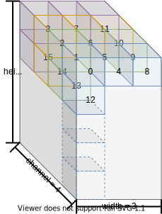

# About Variables and Constants [[中文]](../zh_CN/about_type_define.md)

ESP-DL has the following variable and constants:

- **Variable**: [tensors](../../include/typedef/dl_variable.hpp/#15) whose values can be changed
- **Constants**: [filters](../../include/typedef/dl_constant.hpp/#33), [biases](../../include/typedef/dl_constant.hpp/#55), and [activations](../../include/typedef/dl_constant.hpp/#67) whose values are fixed

## Tensor

A tensor is a generalization of matrices to N dimensions. In other words, it could be:

- 0-dimensional, represented as a scalar
- 1-dimensional, represented as a vector
- 2-dimensional, represented as a matrix
- a higher-dimensional structure that is harder to visualize

The number of dimensions and the size of each dimension is known as the shape of a tensor. In ESP-DL, a tensor is the primary data structure. Every input and output of a layer is a tensor.

### Dimension Order in 2D operations

In 2D operations, the input tensor and output tensor of a layer is 3D. Tensor dimensions are ordered in a fixed manner, namely [height, width, channel].

Suppose we have the following shape [5, 3, 4], and the elements of this tensor would be arranged as follows:

   

     
   

## Filter, Bias and Activation

Unlike a tensor, the order of a filter, bias, and activation is flexible according to specific operations.

For more details, please refer to [`dl_constant.hpp`](../../include/typedef/dl_constant.hpp) or API documentation.
