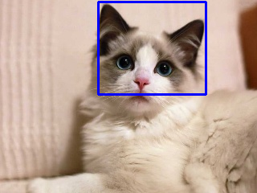

# 猫脸检测 [[English]](./README.md)

本项目为猫脸检测接口的示例。猫脸检测接口的输入图片为静态图片，检测结果的置信度分数和坐标值可显示在终端中，检测结果的图片可通过工具显示在 PC 屏上。

项目所在文件夹结构如下：

```shell
cat_face_detect/
├── CMakeLists.txt
├── image.jpg
├── main
│   ├── app_main.cpp
│   ├── CMakeLists.txt
│   └── image.hpp
├── README.md
├── README_cn.md
└── result.png
```


## 运行示例

1. 打开终端，进入猫脸检测示例所在文件夹 esp-dl/examples/cat_face_detect：

    ```shell
    cd ~/esp-dl/examples/cat_face_detect
    ```

2. 设定目标芯片：

    ```shell
    idf.py set-target [SoC]
    ```
    将 [SoC] 替换为您的目标芯片，如 esp32、esp32s2、esp32s3。

3. 烧录程序，运行 IDF 监视器获取检测结果的分数值和坐标值：

   ```shell
   idf.py flash monitor
   
   ... ...
   
   [0] score: 1.709961, box: [122, 2, 256, 117]
   ```

4. 存放在 [examples/tool/](../tool/) 目录下的显示工具 `display_image.py`，可方便您更直观地查看检测结果的图片。根据[工具](../tool/README_cn.md)介绍使用显示工具，运行如下命令：

   ```shell
   python display_image.py -i ../cat_face_detect/image.jpg -b "(122, 2, 256, 117)"
   ```
   PC 屏上会显示当前示例检测结果的图片，如下图所示：

   <p align="center">
     
   </p>
   

## 自定义输入图片

示例中 [./main/image.hpp](./main/image.hpp) 是预设的输入图片。您可根据[工具](../tool/README_cn.md)介绍，使用存放在 [example/tool/](../tool/) 目录下的转换工具 `convert_to_u8.py`，将自定义图片转换成 C/C++ 的形式，替换预设图片。

1. 将自定义图片存放至 ./examples/cat_face_detect 目录下，使用 [examples/tool/convert_to_u8.py](../tool/convert_to_u8.py) 把图片转换为 hpp 格式：

   ```shell
   # 假设当前仍在目录 cat_face_detect 下

   python ../tool/convert_to_u8.py -i ./image.jpg -o ./main/image.hpp
   ```

2. 参考[运行示例](#运行示例)中的步骤，烧录固件，打印检测结果的置信度分数和坐标值，显示检测结果的图片。


## 延时情况

|   芯片   |       耗时 |
| :------: | ---------: |
|  ESP32   | 149,765 us |
| ESP32-S2 | 416,590 us |
| ESP32-S3 |  18,909 us |

> 以上数据基于示例的默认配置。

