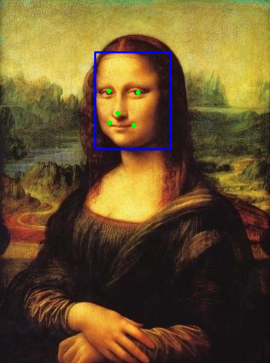

# 人脸检测 [[English]](./README.md)

本项目为人脸检测接口的示例。人脸识别接口的输入图片为静态图片，检测结果的置信度分数和坐标值可显示在终端中，检测结果的图片可通过工具显示在 PC 屏上。

项目所在文件夹结构如下：

```shell
human_face_detect/
├── CMakeLists.txt
├── image.jpg
├── main
│   ├── app_main.cpp
│   ├── CMakeLists.txt
│   └── image.hpp
├── partitions.csv
├── README.md
├── README_cn.md
└── result.png
```


## 运行示例

1. 打开终端，进入人脸检测示例所在文件夹 esp-dl/examples/human_face_detect：

    ```shell
    cd ~/esp-dl/examples/human_face_detect
    ```

2. 设定目标芯片：

    ```shell
    idf.py set-target [SoC]
    ```
    将 [SoC] 替换为您的目标芯片，如 esp32、esp32s2、esp32s3。

3. 烧录固件，打印检测结果的分数值和坐标值：

   ```shell
   idf.py flash monitor
   
   ... ...
   
   [0] score: 0.987580, box: [137, 75, 246, 215]
       left eye: (157, 131), right eye: (199, 133)
        nose: (170, 163)
        mouth left: (158, 177), mouth right: (193, 180)
   ```

4. 存放在 [example/tool/](../tool/) 目录下的显示工具 `display_image.py`，可方便您更直观地查看检测结果的图片。根据[工具](../tool/README_cn.md)介绍使用显示工具，运行如下命令：

   ```shell
   python display_image.py -i ../human_face_detect/image.jpg -b "(137, 75, 246, 215)" -k "(157, 131, 199, 133, 170, 163, 158, 177, 193, 180)"
   ```
   PC 屏上会显示当前示例检测结果的图片，如下图所示：
   
    <p align="center">
     
    </p>


## 其他设置

[./main/app_main.cpp](./main/app_main.cpp) 开头处的宏定义 `TWO_STAGE`，可定义目标检测的算法。如注释所述：

- `TWO_STAGE` = 1：检测器为 two-stage（两阶段），检测结果更加精确（支持人脸关键点），但速度较慢。
- `TWO_STAGE` = 0：检测器为 one-stage（单阶段），检测结果精确度稍差（不支持人脸关键点），但速度较快。

您可自行体验两者差异。


## 自定义输入图片

示例中 [./main/image.hpp](./main/image.hpp) 是预设的输入图片。您可根据[工具](../tool/README_cn.md)介绍，使用存放在 [example/tool/](../tool/) 目录下的转换工具 `convert_to_u8.py`，将自定义图片转换成 C/C++ 的形式，替换预设图片。

1. 将自定义图片存放至 ./examples/human_face_detect 目录下，使用 [examples/tool/convert_to_u8.py](../tool/convert_to_u8.py) 把图片转换为 hpp 格式：

   ```shell
   # 假设当前仍在目录 human_face_detect 下

   python ../tool/convert_to_u8.py -i ./image.jpg -o ./main/image.hpp
   ```

2. 参考[运行示例](#运行示例)中的步骤，烧录固件，打印检测结果的置信度分数和坐标值，显示检测结果的图片。


## 延时情况

|   芯片   | `TWO_STAGE` = 1 | `TWO_STAGE` = 0 |
| :------: | --------------: | --------------: |
|  ESP32   |      415,246 us |      154,687 us |
| ESP32-S2 |    1,052,363 us |      309,159 us |
| ESP32-S3 |       56,303 us |       16,614 us |

> 以上数据基于示例的默认配置。
