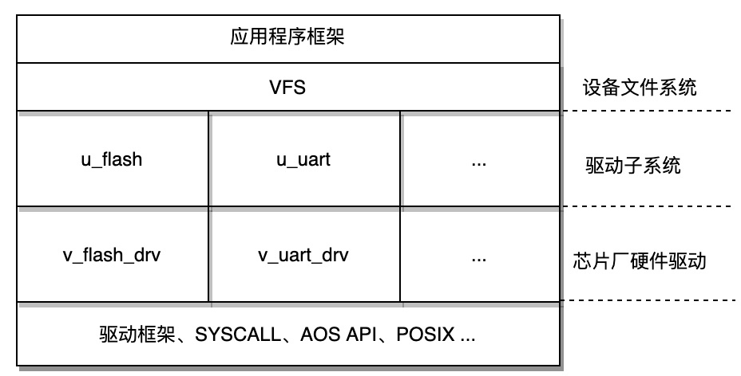

# 介绍
本应用程序是用户态驱动开发的示范程序。

目前用户态驱动在各进程中的分布情况如下：

|驱动|进程|说明|
|---|---|---|
|flash|procmgmt|-|
|Wi-Fi|ulwip_service|-|
|PWM|main_driver|-|
|I2C|main_driver|-|
|SPI|main_driver|-|
|ADC|main_driver|-|
|GPIO|main_driver|-|

# 特性
用户态驱动程序主要有以下5部分组成
1. 应用程序框架：用户态驱动程序运行在AliOS Things应用程序框架的基础之上
2. 驱动对外提供设备文件系统服务访问接口：如"/dev/pwm0", "/dev/gpio0", ...
3. 驱动子系统：连接驱动框架及芯片厂硬件HAL实现层的作用
4. 驱动框架：连接驱动子系统和VFS作用并对系统中的整体设备提供全局视角
5. 操作系统基础服务：SYSCALL, AOS API, POSIX等基础组件



AliOS Things的设计理念是”一切皆组件“。所以需要将一个硬件的驱动程序放到用户态，只需按照驱动框架提供的方法实现新驱动或微调原有驱动，设定好驱动的依赖关系，并在此应用中选择目标驱动程序编译选项，便可以将其放入用户态执行。

# 目录
```sh
main_driver/
├── aos.mk             #AliOS Things makefile文件
├── Config.in          #AliOS Things menuconfig配置文件
├── include            #应用的头文件
│   ├── u_api.h
│   └── u_config.h
├── README.md
└── src                #应用程序框架及业务层源代码
    ├── app.c          #应用程序框架及业务层源代码
    ├── entry_bin.c    #应用程序框架代码，请勿修改
    └── entry_elf.c    #应用程序框架代码，请勿修改
```

# 依赖
 - vfs
 - irq
 - libc
 - udriver
 - uplatform
 - devicevfs
 - usyscall
 - uspace_aos
 - uspace_rpc
 - uspace_parcel

# 使用

## 驱动程序组件命名建议(aos.mk, Config.in)
芯片厂硬件驱动设备驱动以v_xxx_drv的形式命名
* 如果是GPIO驱动则为v_gpio_drv
* 如果是FLASH驱动则为v_flash_drv

芯片厂驱动需编译成功能独立，固定名称的lib, 如下
* GPIO驱动HAL API实现模块中的aos.mk中NAME设定为v_gpio_drv，对应的Config.in中组件编译选项设置为AOS_BOARD_V_GPIO_DRV或AOS_MCU_V_GPIO_DRV
* FLASH驱动HAL API实现模块中的aos.mk中NAME设定为v_flash_drv，对应的Config.in中组件编译选项设置为AOS_BOARD_V_FLASH_DRV或AOS_MCU_V_FLASH_DRV
* 至于使用AOS_MCU_还是AOS_BOARD_为前缀，以此模块源代码所处位置为依据，如果位于vendor/<project>/mcu，则以AOS_MCU_为前缀；如果位于vendor/<project>/board下则以AOS_BOARD_为前缀


* GPIO驱动模块中的aos.mk
```
NAME := v_gpio_drv

$(NAME)_MBINS_TYPE := share
$(NAME)_VERSION    := 1.0.1
$(NAME)_SUMMARY    := configuration for board haas100
MODULE             := gpio
...
```
* Config.in
```
config AOS_MCU_V_GPIO_DRV
    select AOS_MCU_V_COMMON_DRV
    select AOS_MCU_V_REG_DRV
    select AOS_BOARD_V_PARTITION_DRV
    bool "aos_mcu_v_gpio_drv"
    help
        gpio haas1000.
...
```

## 如何将一个驱动（以GPIO为例）放入到用户态中运行
需要将GPIO驱动放到用户态的时候只需要在本进程的Config.in中选择AOS_MCU_V_GPIO_DRV和AOS_COMP_U_GPIO即可

```
config AOS_APP_MAIN_DRIVER
    bool "main_driver"
    ...
    select AOS_MCU_V_GPIO_DRV
    select AOS_COMP_U_GPIO
    ...
```

## 编译指令
aos make main_driver@haas100-mk -c config && aos make MBINS=app MBINS_APP=driver

## 运行用户态驱动
方式1: 只要名称为main_driver@haas100-mk.app.bin的应用程序被打包的/data分区中，系统启动的时候会去被自动加载
* 打包指令
```
aos make main_driver@haas100-mk -c config && aos make MBINS=app MBINS_APP=driver

cp ./out/main_driver@haas100-mkapp/binary/main_driver@haas100-mk.app.bin vendor/haas/mcu/prebuild/data

aos make alios_kernel@haas100-mk -c config && aos make MBINS=kernel
```
方式2: 如果没有采用“方式1”将其打包到/data目录，则可以手动加载，假设名称为main_driver.bin ，在文件中系统中存放路径为：/system/，系统启动之后，命令行中输入如下指令
```
loadm /system/main_driver.bin
```

# 参考
关于驱动框架及驱动程序的应遵循的规则，可以参考components/drivers/README.md


